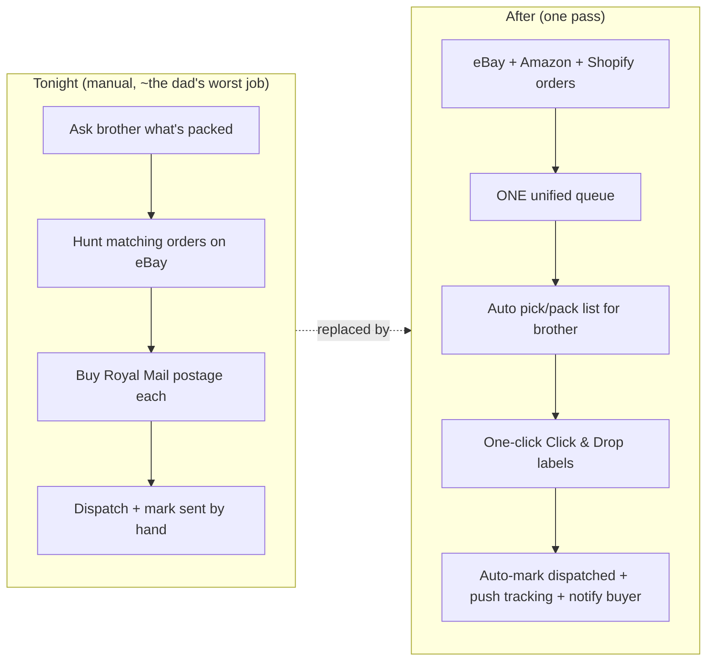

# North Star & Pitch

The single source of truth for why this project exists, what "done" looks like in 7 weeks, and the deal it all builds toward.

> [!info] In 7 weeks Dylan builds a REAL, order-taking proof-of-concept on a small postable stand-in product that mirrors the dad's fulfilment, aims for genuine sales, and proves a system that makes the dad's nightly dispatch grind ~10x faster — then pitches a 25/75 net-profit split where Dylan runs and automates the dad's screw/fastener business and the dad keeps 75% for doing far less. Every other note in this vault serves this one goal.

## The mission (one paragraph)

Dylan (17, UK, solo, lean budget) has a 7-week window to walk into a pitch with his girlfriend's dad holding *proof, not a promise*. The dad runs a small fastener business: he buys individual screws/fasteners from a supplier, his brother packs them into bundles (buy ~£20, sell ~£40-45), they sell on eBay and Amazon, and every night the dad manually works out what's packed, hunts the matching orders, buys Royal Mail postage and dispatches — for ~£2k/month. He won't grow it himself and won't give up his supplier or marketplace accounts. Dylan's plan: build a **real, can-actually-take-orders** Shopify-fronted system on a stand-in product that mirrors the dad's exact fulfilment shape, wire up the unified order → pack → label → notify engine that makes the nightly grind roughly 10x faster, get real sales on the demo if at all possible, and then offer the dad a deal he'd be daft to refuse — Dylan runs and automates the whole operation for **25% of net profit**, the dad keeps **75%** and does far less work.

## Definition of Done (the 7-week bar)

The project is "done" when Dylan can demonstrate ALL of the following on the day of the pitch. These map to live deliverables, not slides:

- [ ] A **live Shopify storefront** (the existing Basic-plan store, branded and no longer blank) selling a real, small, postable stand-in product — a stranger can land on it and buy. (See [[02-shopify-store]].)
- [ ] **Real orders flow end-to-end**: an order on any channel lands in ONE unified Supabase `orders` table (idempotent dedupe on `channel` + `channel_order_id`), generates a pick/pack list, produces a Royal Mail Click & Drop label in one click, auto-marks dispatched, and pushes tracking + a buyer notification back out. (See [[03-order-fulfilment-automation-n8n]].)
- [ ] The **ops dashboard** is live on Vercel showing the orders queue, pick/pack view, dispatch/labels, inventory, revenue/margin, and the headline **time-saved metric**, behind proper auth. (See [[04-ops-dashboard]].)
- [ ] **At least one real sale** has gone through the demo product (ideally several), with a tracked, dispatched, delivered order as evidence. (Targets in [[07-metrics-and-proof]].)
- [ ] A **content engine** has shipped real lo-fi demo TikTok/Reels with UTM tracking back to Shopify, proving Dylan can drive traffic, not just build plumbing. (See [[05-content-and-ads-engine]].)
- [ ] The build is **production-grade**: one canonical Supabase schema file, proper auth on every endpoint, safe error handling (no raw exceptions in 5xx), and pytest + a CI workflow green from week 1. (See [[01-system-architecture]] and [[10-claude-code-handoff]].)
- [ ] A **pitch pack** exists: the deal terms, the before/after of the dad's night, the time-saved number, and objection handling — ready to present. (See [[09-the-pitch-pack]].)

> [!tip] "Done" is measured in **proof**, not features. One real dispatched sale plus a working 10x ops loop the dad can watch happen beats a beautiful half-built platform. Bias every week toward "can a real order go through, tonight?"

## The dad's business and the nightly pain (concrete)

The dad's operation today, in his own rhythm:

- **Sourcing** — buys individual screws/fasteners from an existing supplier he trusts.
- **Packing** — his brother assembles them into bundles (cost ~£20, sells for ~£40-45).
- **Selling** — listed on **eBay** (and **Amazon**), the marketplaces where the buyers already are.
- **The nightly grind** — every night the dad: asks his brother what's been packed → hunts down the matching orders across eBay → buys Royal Mail postage for each → dispatches. Manual, repetitive, error-prone, and the bottleneck that caps the whole thing at ~£2k/month.

The manual loop vs the target loop, side by side:

This is the pain the pitch removes: four fiddly manual steps, nightly, collapsed into one pass. Full engine design in [[03-order-fulfilment-automation-n8n]].

## Why the dad says yes

The offer is engineered to be all upside for him:

- **He keeps 75%** of the net profit for materially less work.
- **He does far less** — the nightly grind (the part he hates) is automated away; Dylan owns operations and growth.
- **Zero downside / risk-reversal** — Dylan builds it; the dad isn't fronting the cost of an unproven idea. (Exact terms in [[09-the-pitch-pack]].)
- **He keeps his supplier** — no forced supply-chain change; the relationship he relies on stays his.
- **He keeps his marketplace accounts** — eBay and Amazon stay as-is and keep selling. **Day 1 is syncing orders FROM them, not migrating off them.** His existing channels and reputation are untouched; Shopify is *added* as the owned brand home, not a replacement.

The emotional core of the yes: *"You keep three-quarters of the money, your worst nightly job disappears, nothing you depend on changes, and I've already proven it works."*

## The 25/75 deal at a glance

- Dylan **runs and automates** the dad's fastener business: storefront, order ingestion from all channels, fulfilment automation, customer comms, content/ads, reporting.
- Dylan takes **25% of NET profit** (net, not revenue — defined precisely, with the revenue-vs-profit trade-off shown, in [[09-the-pitch-pack]]).
- The dad keeps **75%** for doing far less, retaining his supplier and his eBay/Amazon accounts.
- Risk-reversal protects the dad so saying yes costs him nothing to try.

> [!warning] This is a real revenue deal handling real orders and real cash, not a portfolio mock-up. The build must be production-grade from week 1 (auth, safe error handling, one canonical schema, pytest + CI) per [[01-system-architecture]] and [[10-claude-code-handoff]]. Do not inherit the old L&D platform's bugs (split schema, stale CLAUDE.md, leaked exceptions, inconsistent auth, no tests).

## Proof-of-concept strategy

The whole 7-week effort is one bet: **make the system real on a stand-in product that mirrors the dad's fulfilment, so the pitch is a demonstration, not a promise.**

- **Build it REAL** — a working Shopify checkout that can take genuine orders and genuinely dispatch them via Royal Mail Click & Drop. Not a clickable prototype.
- **Mirror his fulfilment** — the stand-in must be a **small, postable item** with the same order → pack → label → post shape as his fastener bundles, so everything proven on the demo transfers 1:1 to his business. (Product selection criteria in [[02-shopify-store]].)
- **Aim for real sales** — drive real traffic via the content engine and land actual dispatched orders. Real money through the till is the strongest possible proof.
- **Prove the 10x** — the headline isn't the storefront, it's the **unified order → pack → label → notify loop** replacing his four-step nightly grind (full design in [[03-order-fulfilment-automation-n8n]]).

> [!warning] The **bulky steam cleaner is RETIRED** — Dylan's first stand-in idea is dead and must not reappear in any plan. It does not mirror the dad's fulfilment (postable, small-parcel) and is explicitly off the table. The stand-in MUST be a small, postable item.

## North-star KPIs (what the pitch hinges on)

These are the numbers Dylan walks in with. Full definitions, instrumentation and targets live in [[07-metrics-and-proof]] — do not duplicate them here; this is the orientation:

- **Time saved per night** — the headline. Manual nightly minutes vs automated minutes; the basis of the "~10x faster" claim.
- **Real sales on the demo** — count of genuine, dispatched, delivered orders through the stand-in product.
- **Order-to-dispatch cycle time** — how fast an incoming order becomes a printed label and a notified buyer.
- **Fulfilment accuracy / error rate** — mismatched or mis-shipped orders eliminated vs the manual loop.
- **Traffic → conversion** — content/ads driving real visitors (UTM-tracked) into real checkouts.
- **Margin per order** — revenue minus product, postage and fees, to make the 25% of *net* concrete and honest.

> [!tip] If only one number lands, make it **time saved per night** — it *is* the pitch. Capture a real before/after timing of the dad's actual nightly process early so the comparison is credible, not estimated.

## How the rest of this vault serves the north star

Every sibling note exists to make the Definition of Done above achievable — link out, don't repeat:

- [[01-system-architecture]] — the full stack, data flow, reuse-vs-net-new, hosting and security the build stands on.
- [[02-shopify-store]] — the owned storefront, the stand-in product page, SKUs, CRO and payments.
- [[03-order-fulfilment-automation-n8n]] — the 10x order → pack → label → notify engine; the heart of the pitch.
- [[04-ops-dashboard]] — the control panel that makes orders, pick/pack, dispatch and the time-saved metric visible.
- [[05-content-and-ads-engine]] — the TikTok/Reels formula + Higgsfield pipeline + UTM tracking that drives real sales.
- [[06-agents]] — the focused automation roster (Order-Sync, Dispatch/Label, Customer-Comms, Listing/Content, Analytics, Health) on the APScheduler + safety pattern.
- [[07-metrics-and-proof]] — exactly what to measure and the targets that turn the KPIs above into evidence.
- [[08-seven-week-timeline]] — the week-by-week milestones and critical path to hit the Definition of Done.
- [[09-the-pitch-pack]] — the deck, the precise net-profit deal terms, risk-reversal, objection handling and the close.
- [[10-claude-code-handoff]] — repo layout, build order, env and the first-session prompt that kicks off the build.

## Acceptance criteria

This note is complete and correct when:

- [ ] The mission is stated in one tight paragraph grounded only in the the system inventory (17, UK, solo, 7 weeks, screws/fasteners, ~£20 → £40-45, eBay/Amazon, ~£2k/mo, 25/75 net).
- [ ] A concrete, checkable **Definition of Done** for the 7 weeks is present and maps to live deliverables, including the production-grade build bar (canonical schema, auth, safe errors, pytest + CI).
- [ ] The dad's business and nightly pain are described concretely (source → pack → sell → nightly match/post) with the manual-vs-target loop shown.
- [ ] The "why he says yes" reasons are explicit: keeps 75%, far less work, zero downside/risk-reversal, keeps supplier, keeps marketplace accounts (sync FROM, don't migrate).
- [ ] The 25/75 deal is summarised at a glance with full terms deferred to [[09-the-pitch-pack]].
- [ ] The proof-of-concept strategy mandates a REAL build on a small postable stand-in mirroring his fulfilment, aims for real sales, and **explicitly retires the steam cleaner**.
- [ ] North-star KPIs are listed with detail deferred to [[07-metrics-and-proof]].
- [ ] All ten sibling notes are linked via correct wikilinks and no sibling content is duplicated.
