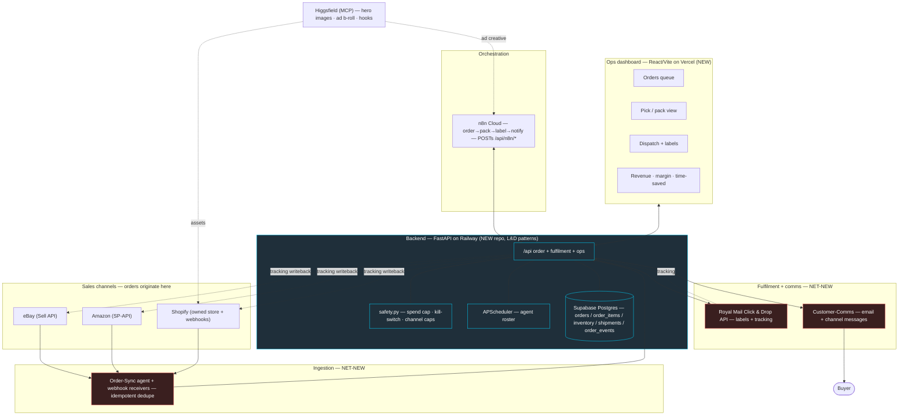
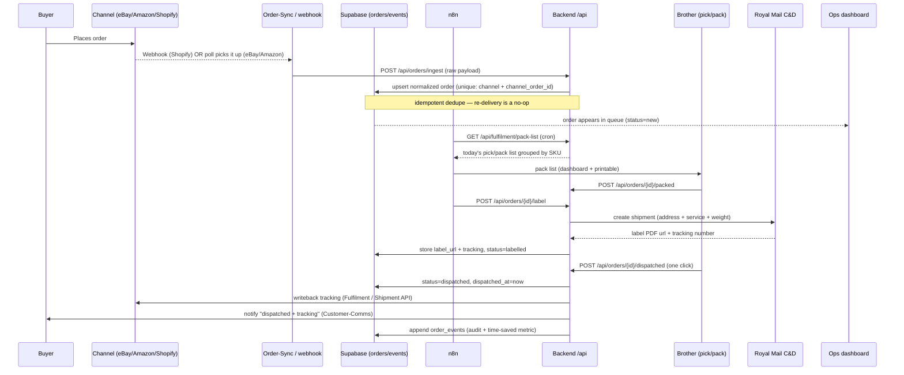
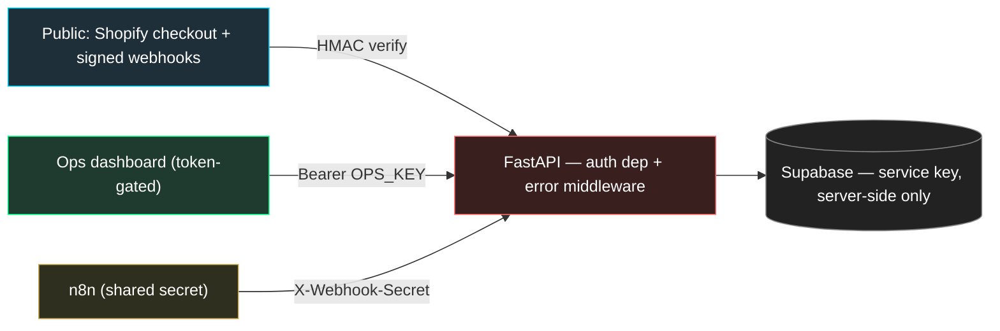

# System Architecture

How every part of the screw-fulfilment proof-of-concept fits together: the channels, the backend, the data, the automation, and the proof.

> [!info]
> One unified order spine. Marketplace + Shopify orders flow into a single normalized `orders` table in Supabase; a FastAPI backend exposes the ops API; n8n orchestrates the nightly order → pick → label → notify loop; a React dashboard is the control panel; and Royal Mail Click & Drop prints the labels. We lift the L&D *stack patterns* (FastAPI + httpx/PostgREST + APScheduler + `safety.py` + the `/api/n8n/*` convention); we build the e-commerce logic net-new. See [[00-north-star-and-pitch]] for why this matters; this note is the how.

## The whole system at a glance

> [!warning] Everything in the red/dashed blocks is **net-new**. The screw business is greenfield — zero code, zero credentials on the machine. eBay Sell API, Amazon SP-API, Royal Mail Click & Drop, and **all** order/inventory/SKU/shipping-label/fulfilment code + the DB schema do not exist yet and must be built. The blue blocks are L&D *patterns* we copy, never L&D business logic we import.

Per-component deep dives live in their own notes — this note links, it does not duplicate:
- Channels + storefront → [[02-shopify-store]]
- The order → label → notify engine → [[03-order-fulfilment-automation-n8n]]
- The control panel → [[04-ops-dashboard]]
- Content / ad creative → [[05-content-and-ads-engine]]
- The agent roster + safety → [[06-agents]]
- What we measure for the pitch → [[07-metrics-and-proof]]

## End-to-end data flow for ONE order

The heartbeat of the pitch: replacing the manual nightly loop (ask the brother what's packed → hunt orders on eBay → buy Royal Mail postage → dispatch) with a single automated spine.

Order lifecycle — the single source of truth for `orders.status`:

`new` → `paid` → `packed` → `labelled` → `dispatched` → `delivered`
Side states: `on_hold` (address / stock problem), `cancelled`, `refunded`.

> [!tip] Week-1 fallback if the live Click & Drop API slips: export `labelled` orders as a **Click & Drop CSV bulk import**, print in their portal, and re-ingest the tracking CSV. Same `orders` table, same dashboard — only the label step is manual. The demo can take real orders before the API is signed off. Detail in [[03-order-fulfilment-automation-n8n]].

## Canonical schema (the one file)

One canonical schema file builds a fresh Supabase DB — no split, no missing tables (this is bug (a) below). Field-level detail and the migration live in [[10-claude-code-handoff]]; the shape:

| Table | Key fields | Purpose |
|---|---|---|
| `orders` | `id`, `channel`, `channel_order_id`, `status`, `buyer_name`, `ship_address` (jsonb), `total_gbp`, `placed_at`, `dispatched_at`, `label_url`, `tracking_number`, `created_at` | One row per order, any channel. **`UNIQUE(channel, channel_order_id)`** is the dedupe key. |
| `order_items` | `id`, `order_id`→orders, `sku`, `qty`, `unit_price_gbp` | Line items; drives the SKU-grouped pack list. |
| `inventory` | `sku`, `title`, `qty_on_hand`, `weight_g`, `cost_gbp`, `reorder_level` | Stock + the weight Royal Mail needs and the cost margin needs. |
| `shipments` | `id`, `order_id`→orders, `carrier`, `service`, `tracking_number`, `label_url`, `cost_gbp`, `created_at` | One row per Royal Mail label; **`UNIQUE(order_id)`** stops double-buying postage. |
| `order_events` | `id`, `order_id`→orders, `event` (e.g. `packed`,`labelled`,`dispatched`), `actor`, `meta` (jsonb), `created_at` | Append-only audit trail; feeds the time-saved proof in [[07-metrics-and-proof]]. |
| `spend_log` | `id`, `agent`, `category`, `amount_gbp`, `created_at` | What `safety.py` reads for the daily spend cap (LLM, postage, ad credit). |

## Component responsibilities

| Component | Tech | Responsibility | Detail note |
|---|---|---|---|
| Sales channels | eBay Sell API, Amazon SP-API, Shopify | Where buyers actually order. Marketplaces stay as-is; Shopify is the owned brand home. | [[02-shopify-store]] |
| Ingestion | Shopify webhooks + Order-Sync poller | Receive/pull new orders, normalize to one schema, dedupe by `channel + channel_order_id`. | [[03-order-fulfilment-automation-n8n]] |
| Backend API | FastAPI (Py 3.11) on Railway | The order/fulfilment/ops API; owns business logic, auth, and all external API calls (eBay/Amazon/Royal Mail). | [[10-claude-code-handoff]] |
| Database | Supabase Postgres via httpx/PostgREST | Single normalized store (the six tables above). | [[10-claude-code-handoff]] |
| Safety layer | `safety.py` (pattern lifted) | Spend cap + kill-switch + per-channel send caps so automation can't quietly cost money or spam buyers. | [[06-agents]] |
| Scheduler | APScheduler (pattern lifted) | Runs the agent roster on a clock (order sync, label retries, comms, reporting, health). | [[06-agents]] |
| Orchestration | n8n Cloud | Visual order → pack → label → notify flows; POSTs `/api/n8n/*` on a cron. Dylan wants n8n; keeps logic tweakable. | [[03-order-fulfilment-automation-n8n]] |
| Ops dashboard | React 18 + Vite 5 on Vercel | Control panel: queue, pick/pack, dispatch, inventory, revenue/margin, time-saved, content, health. | [[04-ops-dashboard]] |
| Fulfilment | Royal Mail Click & Drop API | Buy postage / print labels / get tracking. CSV bulk import as fallback. | [[03-order-fulfilment-automation-n8n]] |
| Customer comms | Email (+ channel messaging) | "Order received" / "dispatched + tracking" notifications; writeback tracking to the channel. | [[06-agents]] |
| Content engine | Higgsfield (MCP) | Hero images, ad b-roll, hooks for the demo-led TikTok/Reels formula; organic-first then paid. | [[05-content-and-ads-engine]] |
| Payments | Stripe (pattern lifted) | Checkout + signature-verified webhooks for the Shopify product-order path. | [[02-shopify-store]] |

## Reuse vs net-new map

Grounded strictly in the verified system inventory: lift the *patterns*, never the L&D business logic.

| Area | Verdict | What we do |
|---|---|---|
| Backend framework | ♻️ **Reuse pattern** | FastAPI (Py 3.11), routers under `/api`, scheduler started in the lifespan. Proven, deployed. |
| DB client | ♻️ **Reuse pattern** | The hand-rolled httpx PostgREST client over Supabase (`.table().select().eq().execute()`). Do **not** swap for `supabase-py`. |
| Safety guardrails | ♻️ **Reuse pattern** | `safety.py`: `guarded(job_name)`, `can_send(channel)`, `record_spend(...)` — repointed at postage/comms/ad spend instead of outreach. |
| Scheduler | ♻️ **Reuse pattern** | APScheduler started in the FastAPI lifespan. |
| n8n integration shape | ♻️ **Reuse pattern** | The real `/api/n8n/*` convention: POST action endpoints n8n calls on a cron, GET read endpoints feed the dashboard. |
| Auth | ♻️ **Reuse pattern** | L&D's `ops_key_resolved` (OPS_KEY, falling back to SECRET_KEY) bearer-key check, made a single global dependency (see below). |
| Stripe | ♻️ **Reuse pattern** | Checkout + signature-verified webhook flow, recreated for product orders. |
| React/Vite shell | ♻️ **Reuse shell** | The SPA scaffold + shared axios client, deployed on Vercel. |
| Hosting | ♻️ **Reuse** | Railway (backend), Vercel (frontend), Supabase (Postgres) — all proven. |
| Shopify store | ♻️ **Reuse asset** | The existing blank Basic-plan store ("My Store", GBP, UK) + Shopify MCP + dev skill set. |
| n8n | ♻️ **Revive** | Installed but dormant. Use n8n **Cloud (fresh)** for the ops flows; the local `~/.n8n` sqlite (6 stopped workflows) is legacy — don't restart it. |
| eBay Sell API | 🆕 **Net-new** | OAuth, order pull, tracking writeback. Nothing exists. |
| Amazon SP-API | 🆕 **Net-new** | LWA auth, order pull, shipment confirmation. Nothing exists. |
| Royal Mail Click & Drop | 🆕 **Net-new** | Label creation + tracking. Nothing exists. |
| Orders / inventory / SKU / shipping / fulfilment code | 🆕 **Net-new** | All of it, plus the DB schema. |
| Canonical schema file | 🆕 **Net-new** | ONE schema file (see bug note below). |
| Tests + CI | 🆕 **Net-new** | pytest + a CI workflow from week 1 — this handles real money. |

> [!warning] **Do not inherit the old platform's bugs.** (a) The old repo split its schema and a fresh DB build errored → keep **one canonical schema file** (the table above). (b) A stale auto-loading `CLAUDE.md` misled sessions → write a fresh, accurate one for the new repo. (c) The old backend leaked raw exceptions in 500s and had inconsistent auth on ops endpoints → the new build needs a global auth dependency + safe error handling (next section). And: the OpenClaw / "Baz" / WhatsApp-agent stack is **removed** — do not plan around it.

## Tech stack & hosting — and why each

| Layer | Choice | Why this, here |
|---|---|---|
| Backend | **FastAPI + Railway** | The stack Dylan already shipped; Railway start (`uvicorn main:app --host 0.0.0.0 --port $PORT`) is known-good. Fast to stand up, easy env vars. |
| Database | **Supabase Postgres** | Real relational store for orders/inventory; PostgREST gives an instant HTTP API the lifted client already speaks. Free tier covers POC volume. |
| DB access | **httpx PostgREST client** | Already written and battle-tested; avoids the `supabase-py` dependency the the system inventory warn against. |
| Orchestration | **n8n Cloud (fresh)** | Dylan *wants* n8n; visual flows make the nightly loop tweakable without code; Cloud avoids babysitting the dormant local instance. |
| Frontend | **React 18 + Vite 5 + Vercel** | Reuse the L&D shell + axios client; Vercel deploy is proven and free. |
| Payments | **Stripe** | Lift the existing checkout + webhook pattern; mature UK/GBP support. |
| Fulfilment | **Royal Mail Click & Drop** | The dad already posts via Royal Mail; mirrors his real workflow → the 10x story is credible. CSV import gives a same-week manual path. |
| Content | **Higgsfield (MCP)** | Already connected; credit-lean AI image/video for demo creative without a separate pipeline. Start with one preview credit. |
| Dev box | Crostini Linux container | **Dev only, never production.** All real workloads run on Railway / Vercel / Supabase. |

## Security, auth & safe error handling

The old platform's two sins were leaking raw exceptions in 500s and inconsistent auth on ops endpoints. This system touches **real orders and money**, so the new build closes both at the framework level — not per-handler.

**Auth model**
- [ ] **Ops / dashboard endpoints** require a `Bearer` token (`OPS_KEY`, falling back to `SECRET_KEY` — mirroring L&D's `settings.ops_key_resolved`) on **every** state-changing route, applied as a single FastAPI dependency on the router — not per-handler — so no endpoint can be forgotten. Return `503` if the key is unconfigured server-side, `401` if it's wrong.
- [ ] **n8n → backend** calls carry a shared `X-Webhook-Secret` header verified by a dependency; reject with `401` if absent or wrong.
- [ ] **Inbound provider webhooks** (Shopify, Stripe, eBay, Amazon) verify the provider's **HMAC signature** against the **raw request body** before any processing — unsigned/forged payloads never reach business logic.
- [ ] **Secrets live only in Railway / Vercel env vars**, loaded via a single pydantic `Settings` (as in L&D's `config.py`). The Supabase **service key is server-side only** — never shipped to the React bundle; the SPA talks only to our `/api`.

**Safe error handling**
- [ ] A global FastAPI **exception handler** returns a generic `{"error": "...", "request_id": "..."}` with the correct status code and **logs the stack trace server-side** — raw exceptions and tracebacks never appear in HTTP responses.
- [ ] Validation errors return tidy `422`s (Pydantic models on every request body); auth failures return `401/403`; not-found returns `404`. No `500` ever carries internal detail.
- [ ] External API failures (eBay / Amazon / Royal Mail) are caught, retried where safe, and surfaced as a clear order state (`on_hold`) — never a crash that strands an order.
- [ ] Money/comms-spending jobs are wrapped with `safety.guarded(...)`; sends check `safety.can_send(channel)` first, and every spend is logged via `safety.record_spend(...)`. (See [[06-agents]].)

> [!tip] Idempotency is a safety feature here too: every ingest upserts on `UNIQUE(channel, channel_order_id)`, and label creation is keyed on `shipments.UNIQUE(order_id)`, so a retried webhook or a re-run n8n node can never double-create an order or buy a second postage label.

## Acceptance criteria

- [ ] A single FastAPI service deploys to Railway and serves `/api/*` plus an auto-generated `/docs`.
- [ ] An order placed on **each** channel (eBay, Amazon, Shopify) lands once in the `orders` table with normalized fields and correct `channel` + `channel_order_id`; re-delivering the same webhook creates **no** duplicate.
- [ ] The full lifecycle works end-to-end for one real test order: `new → packed → labelled → dispatched`, with a Royal Mail label retrievable, tracking stored, tracking written back to the channel, and the buyer notified.
- [ ] The ops dashboard (Vercel) shows the live queue, pick/pack list, dispatch action, and the time-saved metric — reading only from `/api`, with the Supabase key never exposed client-side.
- [ ] n8n Cloud runs the order → pack → label → notify flow against `/api/n8n/*` using the shared `X-Webhook-Secret`.
- [ ] **No** endpoint returns a raw stack trace; ops/state-changing routes reject calls lacking a valid `OPS_KEY`; all inbound provider webhooks verify HMAC signatures.
- [ ] `pytest` covers ingestion dedupe, the lifecycle transitions, and auth/error handling, and runs green in CI.
- [ ] One canonical schema file builds a fresh Supabase DB with no missing tables.

For the build order, repo layout, env vars, and the first-session prompt that turns this architecture into code, see [[10-claude-code-handoff]]. For where it sits in the 7-week plan, see [[08-seven-week-timeline]].
