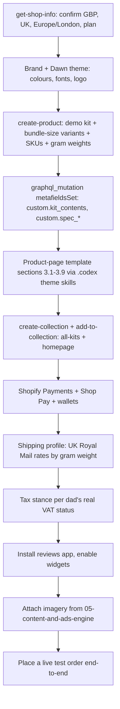

# Shopify Store

The owned storefront: turning the existing Basic GBP "My Store" into a converting fastener-kit shop that takes real orders for the proof-of-concept.

> [!info]
> Build the brand home and cleanest checkout on the Shopify store we already have, using a high-converting product-page template for fastener bundles. Catalogue, SKUs, payments (Shopify Payments, GBP) and Royal Mail checkout rates are configured here. eBay + Amazon stay the **primary** order source for the 7 weeks; Shopify's Day-1 job is to be a real, polished, can-take-orders brand home. Orders from all three channels flow into the unified queue in [[01-system-architecture]] and [[03-order-fulfilment-automation-n8n]].

## Scope and boundaries

This note covers the **storefront and checkout only**: brand, product page, catalogue/SKUs, payments, checkout shipping rates, tax, apps, and the MCP build path.

- Order ingestion, Shopify order webhooks, the normalized `orders` table and dedupe live in [[01-system-architecture]] and [[03-order-fulfilment-automation-n8n]].
- Shipping **label** creation (Royal Mail Click & Drop) lives in [[03-order-fulfilment-automation-n8n]]. Here we only set the **rates the customer sees at checkout**.
- All product photography, hero shots, lifestyle b-roll and ad creative are generated in [[05-content-and-ads-engine]] (Higgsfield). This note specifies *what image each page slot needs*; that note produces them.
- Cross-channel SKU/inventory sync is owned by [[03-order-fulfilment-automation-n8n]]. Margin / revenue / time-saved proof lives in [[07-metrics-and-proof]].

> [!warning] Marketplaces first. eBay + Amazon remain the primary sales channels for the 7 weeks. Shopify's Day-1 job is to be a **real, polished, can-take-orders brand home** — proof the dad's product sells direct, with the cleanest checkout and best margin. Do **not** pause marketplace listings to chase Shopify traffic.

---

## 1. Use the existing store (do not create a new one)

The Basic-plan store ("My Store", GBP, UK, currently blank) is the canonical storefront. We brand and build on it — we do **not** spin up a new store.

> [!tip] Basic plan is enough for the PoC: Shopify Payments, unlimited products, one storefront, manual + carrier-calculated shipping rates, metafields, and the apps below. Don't upgrade for the demo — keep budget for ad credits ([[05-content-and-ads-engine]]).

Confirm the live state with the MCP read tool **before** changing anything (see §8), then set:

- [ ] **Settings → Store details** → currency = GBP, default weight unit = grams, address = UK.
- [ ] **Settings → General / Standards & formats** → timezone Europe/London, metric units.
- [ ] **Settings → Brand** → store name, logo, brand colours (§2), social handles (link the TikTok from [[05-content-and-ads-engine]]).
- [ ] **Settings → Markets** → single market: United Kingdom only (no international shipping for the PoC — avoids customs/duty complexity).
- [ ] **Settings → Checkout** → customer accounts optional, require email, collect a shipping phone (Royal Mail tracked dispatch SMS needs it), enable the hosted order-status / tracking page.
- [ ] **Settings → Policies** → generate refund, shipping, privacy and terms from Shopify's templates; edit refund text to match the guarantee in §3.7 and the VAT stance in §6.3.

---

## 2. Brand and positioning

The stand-in demo product is a **small, postable fastener-kit item** that mirrors the dad's fulfilment (individual screws/fasteners → packed bundles → posted Royal Mail). The brand must read as a *specialist trade-grade fastener-kit shop*, not a generic dropship store.

**Positioning line (working):** _"The right fixings — counted, sorted and posted next working day, so you're not stood at the merchant's counter."_

| Pillar | What it signals | Where it shows up |
|---|---|---|
| **Sorted for you** | counted, bagged, labelled by size/type | hero, kit-contents table, pack shots |
| **Trade-grade** | proper spec, not bargain-bin | spec table, badges |
| **Posted fast** | next-day Royal Mail, tracked | shipping band, dispatch cutoff, footer |
| **No-faff guarantee** | wrong/short → sorted, no quibble | guarantee block, refund policy |

- [ ] Pick a short, ownable, fastener/kit-themed store name; set it in **Brand**.
- [ ] Define a tight palette (one strong accent + neutral + a "trade" dark) and a clean sans pairing; capture as Dawn theme settings. Use the `ui-ux-pro-max` skill (palettes + font pairings) to choose.
- [ ] Logo: simple wordmark + a fastener glyph — generate via the `design` skill (logo generator) or Higgsfield ([[05-content-and-ads-engine]]).
- [ ] Theme: use the free **Dawn** theme; customise colours/fonts/sections rather than buying a paid theme.

---

## 3. The converting product-page anatomy (fastener bundles)

The highest-leverage page. Build it once as a reusable template, then clone per product. Section order top-to-bottom **is** the build spec:

### 3.1 Hero / above-the-fold
- Title states the job + count, e.g. _"Decking Screw Kit — 200 pcs, Sorted by Size"_.
- 4–6 image gallery: (1) hero pack shot, (2) contents flat-lay (every size visible), (3) in-hand for scale, (4) labelled-bag detail, (5) optional short looping video. Slots specified here, **produced in [[05-content-and-ads-engine]]**.
- Price (GBP) + bundle-size variant selector (§4).
- One-line value prop under price: _"Counted, sorted by size, posted next working day."_
- Primary CTA **Add to basket** (high-contrast accent); sticky add-to-basket on mobile.
- Micro-trust row under the CTA: Tracked Royal Mail · UK dispatch · No-faff returns.

### 3.2 Kit contents ("what's in the bag")
- Explicit table: each size/type → quantity. The #1 conversion driver for fastener bundles — buyers need the exact breakdown.
- Total piece count as a headline number.
- Store as a product **metafield** `custom.kit_contents` (type *rich_text_field* or *multi_line_text_field*) so it renders in a dedicated theme block and stays structured per product/variant.

### 3.3 Benefits (not features)
- 3–4 icon blocks: _"No more counting at the bench"_, _"One bag per size — grab and go"_, _"Right spec, every time"_, _"Through your door, tracked"_.

### 3.4 Spec table
- Material, coating/finish, head type, drive, length range, compliance note if any. Store as metafields (`custom.spec_material`, `custom.spec_finish`, `custom.spec_drive`, …) so it's structured and reusable.

### 3.5 Social proof / reviews
- Star rating in the hero (from the reviews app, §7) + a reviews section lower down.
- Seed with **genuine** early reviews from real first orders/testers ([[07-metrics-and-proof]]). Never fabricate reviews.

> [!warning] Net-new: reviews don't exist on Day 1. The reviews block stays empty until first sales land. Treat "first 3 verified reviews" as a milestone in [[08-seven-week-timeline]]; until then lean on the guarantee and trust badges, never fake star counts.

### 3.6 Trust badges
- Tasteful inline row: Royal Mail Tracked, Secure checkout (Shopify Payments / card icons), UK business, money-back guarantee. Small SVG icons, not a wall of stock badges.

### 3.7 Guarantee
- Bold, plain-English block: _"Wrong size or short on count? Message us and we'll sort it — replacement or refund, no quibble."_ Mirror this **exactly** in the refund policy (§1).

### 3.8 Urgency / dispatch cutoff
- Dynamic line: _"Order before 3pm → posted today, tracked."_ Match the cutoff to the real nightly dispatch in [[03-order-fulfilment-automation-n8n]].
- Low-stock nudge ("Only X left") **only when true**, driven by real inventory (§5).

### 3.9 FAQ + footer
- 4–6 FAQs: delivery time, what's included, returns, bulk/trade pricing, VAT (§6.3).
- Footer: contact, policies, tracking link, social.

**Acceptance criteria — product page**
- [ ] A cold buyer can grasp exactly what's in the kit (full size/qty breakdown), see price + delivery promise, and check out in under ~60s on mobile.
- [ ] Bundle-size variants change price **and** the displayed contents/total count correctly.
- [ ] Hero, contents table, guarantee, trust row and dispatch cutoff all render correctly on mobile.
- [ ] No fabricated reviews and no false scarcity; low-stock and "posted today" lines reflect real data.

---

## 4. Catalogue, SKUs and bundle-size variants

Keep the catalogue **deliberately small**: one hero demo product done brilliantly beats ten thin ones.

### Product & variant model
- One Shopify **Product** = one fastener-kit type.
- **Variants = bundle size** (e.g. 100 / 200 / 500 pcs). Each variant carries its own price, SKU, **gram weight** (Royal Mail needs accurate weight for the right service/rate) and barcode if available.
- Variant prices reflect the dad's real economics (buy ~£20 → sell ~£40–45 per bundle); set the demo price band similarly so the margin proof is realistic ([[07-metrics-and-proof]]).

### SKU convention
Human-readable and **channel-stable** — the *same SKU* must match across Shopify, eBay and Amazon so the unified queue and inventory in [[01-system-architecture]] / [[03-order-fulfilment-automation-n8n]] can dedupe and reconcile:

```
LDF-<TYPE>-<SIZE>
e.g.  LDF-DECK-200   (Decking screw kit, 200 pcs)
      LDF-DECK-500
      LDF-WOOD-100
```

- [ ] Lock the SKU scheme now and **reuse the identical SKUs on the eBay & Amazon listings** — this is the join key for order/inventory sync.

### Collections
- [ ] `all-kits` — automated collection (condition: product type = `Fastener Kit`).
- [ ] One collection per fastener family as the range grows (`decking`, `woodscrews`, `fixings`) — by tag.
- [ ] `bestsellers` — automated (sort by sales) once data exists; used on the homepage.

### Homepage
- [ ] Hero banner → demo product · featured collection (`all-kits`) · trust/USP band (sorted / tracked / guarantee) · a short "how it works" strip · one social-proof strip once reviews land.

**Acceptance criteria — catalogue**
- [ ] Demo product live with ≥2 bundle-size variants, each with correct GBP price, gram weight and the agreed SKU.
- [ ] SKUs are byte-identical to the eBay/Amazon listings for the same items.
- [ ] `all-kits` populated and shown on the homepage.

---

## 5. Inventory

- [ ] Enable Shopify inventory tracking per variant ("track quantity"); set "continue selling when out of stock" = **off** (real scarcity, never oversell).
- [ ] Single fulfilment **location** = the brother's/dad's packing address.

> [!warning] Net-new: cross-channel stock sync. Because the **same SKU** sells on eBay, Amazon and Shopify, Shopify will happily sell a unit eBay just sold. Real-time multi-channel inventory is **net-new work owned by [[03-order-fulfilment-automation-n8n]]** — Shopify's own marketplace channels are **not** relied upon for it. Week-1 stop-gap: keep Shopify stock conservative (buffer) and reconcile counts at the nightly dispatch pass.

---

## 6. Payments, checkout shipping rates, VAT

### 6.1 Payments
- [ ] Activate **Shopify Payments** (GBP) — lowest friction, native, no third-party transaction fee. Needs business/owner bank + ID (the dad's once the deal lands; a founder stand-in for the PoC).
- [ ] Enable **Shop Pay** + express wallets (Apple Pay / Google Pay) — big mobile-conversion lift, free with Shopify Payments.

> [!warning] The product storefront uses Shopify's **native hosted checkout** — that is the canonical buyer payment path. The Stripe pattern in the the system inventory and [[01-system-architecture]] is the **reuse reference for any backend-driven payment flow**, not a replacement for Shopify checkout. Do not build a custom Stripe checkout on the storefront.

### 6.2 Checkout shipping rates (Royal Mail)
Checkout shows the **rate**; the **label** is created downstream ([[03-order-fulfilment-automation-n8n]]).

- [ ] Single shipping zone: **United Kingdom**.
- [ ] Rates aligned to real Royal Mail small-parcel / large-letter services:
  - Small/light kits → **Tracked 48** (offer **Tracked 24** as a paid upgrade).
  - Set bands so the rate the buyer pays roughly matches true postage for the variant's **gram weight**.
- [ ] Optional **free delivery over £X** to lift AOV — only if the maths still leaves margin ([[07-metrics-and-proof]]).
- [ ] Accurate per-variant gram weights — they drive both the displayed rate **and** the correct Royal Mail service downstream.

> [!tip] Week 1: 1–2 flat rates ("Tracked 48 — £X", "Tracked 24 — £Y") beat a complex weight matrix. Refine to weight-banded rates once real parcels are weighed.

### 6.3 VAT / tax

> [!warning] VAT is a real-money decision — confirm the dad's actual VAT status **before** going live; never guess on the live store. Document the chosen stance once in [[00-north-star-and-pitch]] / [[09-the-pitch-pack]] so the profit maths in [[07-metrics-and-proof]] uses the right gross-vs-net figures.

- The dad's business is ~£2k/month (~£24k/yr) → almost certainly **below the UK VAT registration threshold (£90k)** → probably **not VAT-registered**. If so:
  - [ ] **Settings → Taxes & duties** → do **not** charge VAT; price is simply the price (no VAT line).
  - [ ] Ensure invoices/policies don't imply a VAT number that doesn't exist.
- If the dad **is** (or becomes) VAT-registered:
  - [ ] Set the store to **prices include tax** (UK norm — VAT-inclusive display), configure 20% standard rate, surface VAT on the order summary.
  - [ ] Add the VAT number to store details and policies.

**Acceptance criteria — payments / shipping / tax**
- [ ] A test order completes end-to-end with Shopify Payments in GBP (card + ≥1 express wallet).
- [ ] Checkout shows a Royal Mail UK rate consistent with the product's gram weight.
- [ ] Tax behaviour matches the dad's real VAT status and is reflected in policies and the margin model.

---

## 7. Apps (lean — free/cheap first)

Default to free or low-cost; every paid app must justify its monthly cost against a ~£2k/mo business on a lean budget.

| Need | Pick (free/cheap first) | Notes |
|---|---|---|
| **Reviews** | **Judge.me** (generous free tier) or Shopify's native review block | Free tier covers the PoC. Show stars on product + collection. Import nothing fake. |
| **Bundles / kits** | **Variants-as-bundles** (preferred — no app) or Shopify's native **Bundles** app (free) | Modelling bundle size as **variants** (§4) avoids an app entirely. Add a bundles app only for mix-and-match kits. |
| **Trust / urgency** | Theme-native sections + metafields | Build the dispatch-cutoff and trust row into the theme; avoid bloated "urgency" apps. |
| **Email** | **Shopify Email** (free allowance) | Abandoned-checkout + order emails. **Dispatch/tracking** buyer notifications are handled by the comms flow in [[03-order-fulfilment-automation-n8n]], not here. |
| **Analytics / UTM** | Native Shopify analytics + UTM links from ads | UTM scheme detailed in [[05-content-and-ads-engine]]. |

> [!tip] Fewer apps = faster store, fewer monthly fees, fewer things to break before the pitch. Cap at **≤2 paid apps** for the 7 weeks.

- [ ] Install reviews app (free tier); enable product + homepage review widgets.
- [ ] Decide bundles approach (default: variants, no app) and document it.
- [ ] Enable Shopify Email + abandoned-checkout recovery.

---

## 8. Build path — Shopify MCP + `~/.codex` skills

Build the store programmatically and repeatably (not click-by-click) so it's reproducible and fast.

> [!info] Two tool sets exist: the **Shopify MCP connector** (`mcp__Shopify__*` — products, collections, inventory, discounts, GraphQL Admin API, plus `search_docs_chunks` for correct API usage) and the **`~/.codex` Shopify dev skill set** (theme/storefront/template workflows). Use the MCP for catalogue/data and the codex skills for theme/section/template work.



Concrete MCP usage:

- [ ] `mcp__Shopify__get-shop-info` → confirm plan, currency (GBP), country, timezone **before** touching anything.
- [ ] `mcp__Shopify__create-product` → create the demo kit with **bundle-size variants** (price, SKU `LDF-…`, gram weight per variant).
- [ ] `mcp__Shopify__graphql_mutation` (`metafieldsSet`) → set `custom.kit_contents` and `custom.spec_*`; verify shapes first with `mcp__Shopify__graphql_schema` and `mcp__Shopify__validate_graphql_codeblocks`.
- [ ] `mcp__Shopify__create-collection` + `mcp__Shopify__add-to-collection` → `all-kits` (+ family collections later).
- [ ] `mcp__Shopify__set-inventory` → set real starting quantities at the single packing location.
- [ ] `mcp__Shopify__search_docs_chunks` → look up exact API/field usage instead of guessing (avoids the schema drift called out in the the system inventory).
- [ ] Theme/template (product-page sections, homepage, dispatch-cutoff block) → build with the **`~/.codex` Shopify skills** on the Dawn theme; keep changes in a theme so they're reproducible.

> [!warning] Do not mutate the live store on autopilot. Inspect first with read tools (`mcp__Shopify__get-shop-info`, `mcp__Shopify__search_products`, `mcp__Shopify__get-product`); make catalogue changes deliberately. Payment / shipping / VAT toggles are money decisions — confirm with Dylan (and the dad's details) before going live.

**Acceptance criteria — build path**
- [ ] Store rebuildable from these steps (product + variants + metafields + collections created via MCP; theme template kept in a reproducible theme).
- [ ] A real **test order** placed and received end-to-end (checkout → order appears → ready to dispatch), proving the storefront genuinely takes orders.

---

## 9. Definition of done (this note)

- [ ] Existing Basic GBP store branded as the fastener-kit shop (name, logo, palette, Dawn theme).
- [ ] One demo product live with bundle-size variants, agreed cross-channel SKUs, gram weights, and `custom.kit_contents` + `custom.spec_*` metafields.
- [ ] Reusable converting product-page template built (all §3 sections), mobile-first.
- [ ] `all-kits` collection + homepage live.
- [ ] Shopify Payments (GBP) + Shop Pay + wallets active; Royal Mail UK rate at checkout; VAT stance matching the dad's real status, reflected in policies.
- [ ] Reviews app installed (free tier), no fabricated reviews.
- [ ] Imagery slots filled from [[05-content-and-ads-engine]].
- [ ] A live **test order** completed end-to-end.
- [ ] eBay/Amazon confirmed as the primary order source; Shopify orders routed into the unified queue per [[01-system-architecture]] and [[03-order-fulfilment-automation-n8n]].
