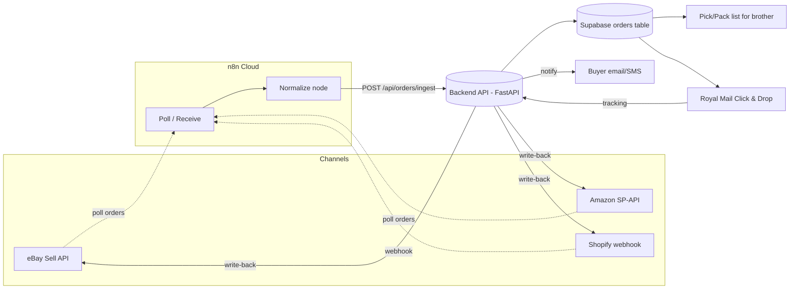

# Order & Fulfilment Automation (n8n)

The 10x engine: every channel order (eBay + Amazon + Shopify) flows into one queue, becomes one pick/pack list for the brother, one-click Royal Mail labels, then auto-marks dispatched, pushes tracking back, and notifies the buyer.

> [!info]
> The heart of the pitch. It replaces the dad's manual nightly loop (ask brother → hunt orders on eBay → buy postage → dispatch) with an automated order→pack→label→notify pipeline. The backend (FastAPI + Supabase, see [[01-system-architecture]]) owns the data and the business logic; **n8n (Cloud, fresh)** orchestrates by calling that API; the [[04-ops-dashboard]] is the human window onto the same data. Everything here is **net-new** — the screw business is greenfield (zero code, zero credentials on the machine).

---

## 1. Pipeline overview (the whole thing on one page)



**Division of labour (do not blur these — the boundary the old repo failed to keep):**

| Layer | Owns | Tech |
|---|---|---|
| **Backend API** | All business logic, dedupe, DB writes, label calls, write-back, notifications, auth | FastAPI + httpx/PostgREST Supabase ([[01-system-architecture]]) |
| **n8n** | Triggers, scheduling, the visual "when X then call endpoint Y" glue, on-the-wire retries | n8n Cloud workflows |
| **Dashboard** | Human view + manual buttons that hit the same endpoints | React/Vite ([[04-ops-dashboard]]) |

> [!warning] **Net-new, all of it.** eBay Sell API, Amazon SP-API, Royal Mail Click & Drop, the `orders` schema, and every endpoint below are built from scratch. Mirror the **patterns** of the L&D `/api/n8n/*` endpoints (POST action endpoint → does the work via `get_db()` → returns a structured JSON payload), not its lead-gen logic. n8n never touches Supabase directly.

---

## 2. Source ingestion — node-by-node per channel

All three sources converge on **one** backend endpoint: `POST /api/orders/ingest`. It is **idempotent**, so it does not matter if n8n delivers the same order twice.

### 2.1 The idempotency / dedupe key (define this first — everything depends on it)

```
dedupe_key = sha256(f"{channel}:{channel_order_id}")
```

- `channel` ∈ `ebay | amazon | shopify`
- `channel_order_id` = the order id native to that channel (eBay `orderId`, Amazon `AmazonOrderId`, Shopify `id`)
- The `orders` table has a **unique constraint on `dedupe_key`** (and on `(channel, channel_order_id)`). Ingest does an **upsert**: insert if new, update status/buyer fields if the row already exists. A duplicate POST is a no-op (returns `{"status":"duplicate"}`) — never a second order, never a second label.
- Line items get their own idempotency: `(order_id, channel_line_id)` unique.

> [!tip] Idempotency belongs at the **database** layer (unique constraint + upsert) — the only safe place. Do not rely on n8n "only delivering once": marketplaces re-send, polls overlap, retries fire. The constraint is the backstop.

### 2.2 Canonical schema — `orders` + `order_items` + `sync_state`

Goes in the **ONE canonical migrations file** (per [[01-system-architecture]] — the old repo's split schema broke fresh DB builds; do not repeat that).

```sql
create table orders (
  id               uuid primary key default gen_random_uuid(),
  channel          text not null,               -- ebay | amazon | shopify
  channel_order_id text not null,
  dedupe_key       text not null unique,        -- sha256(channel:channel_order_id)
  status           text not null default 'new', -- see status flow below
  buyer_name       text,
  buyer_email      text,
  buyer_phone      text,
  ship_to          jsonb not null,              -- name, line1, line2, city, postcode, country
  currency         text default 'GBP',
  total_gbp        numeric(10,2),
  placed_at        timestamptz,
  -- fulfilment
  rm_order_id      text,                         -- Royal Mail Click & Drop order id
  tracking_number  text,
  carrier          text default 'Royal Mail',
  label_url        text,
  packed_at        timestamptz,
  dispatched_at    timestamptz,
  -- write-back bookkeeping
  tracking_pushed_ebay    boolean default false,
  tracking_pushed_amazon  boolean default false,
  tracking_pushed_shopify boolean default false,
  buyer_notified   boolean default false,
  exception_reason text,
  raw              jsonb,                         -- original channel payload, for audit/replay
  created_at       timestamptz default now(),
  updated_at       timestamptz default now(),
  unique (channel, channel_order_id)
);

create table order_items (
  id              uuid primary key default gen_random_uuid(),
  order_id        uuid references orders(id) on delete cascade,
  channel_line_id text,
  sku             text not null,
  title           text,
  qty             integer not null,
  bin_location    text,                          -- where the brother finds it
  unique (order_id, channel_line_id)
);

-- per-channel poll watermark (so we only pull new orders)
create table sync_state (
  channel       text primary key,                -- ebay | amazon | shopify
  last_poll_at  timestamptz,
  updated_at    timestamptz default now()
);

create index on orders (status);
create index on orders (channel, placed_at);
```

**Order status flow** (mirrors the discipline of L&D's lead-status flow):

```
new → ingested → ready_to_pack → packed → label_purchased → dispatched → tracking_synced → done
                                                                  ↘ exception (any step can land here)
```

### 2.3 eBay — Sell API (Fulfillment)

- **Trigger in n8n:** **Schedule** node, every **5 min** (eBay has no reliable inbound push for new orders on a lean plan — poll). Backend calls `GET /sell/fulfillment/v1/order?filter=creationdate:[<since>..]&limit=50`.
- **Auth:** eBay OAuth user token. The **backend** holds the refresh token (server-side, in `config.py` `Settings`) and a helper `GET /api/channels/ebay/orders-since` mints a fresh access token (refresh ~18 months, access ~2h) and does the poll. n8n only calls the backend — secrets never enter n8n.
- **Key nodes:** `Schedule → HTTP (GET /api/channels/ebay/orders-since) → Split Out (orders[]) → Function(normalize, §2.6) → HTTP (POST /api/orders/ingest)`.
- **Watermark:** backend reads/advances `last_poll_at` from `sync_state` (channel `ebay`) and passes it as the `creationdate` lower bound; overlap the window by ~10 min (idempotency absorbs the duplicates).
- **Rate limits:** eBay caps daily call volume per app; 5-min polling ≈ 288 calls/day, comfortably inside limits.

### 2.4 Amazon — SP-API (Orders)

- **Trigger in n8n:** **Schedule** node, every **5 min**. Backend calls `GET /orders/v0/orders?CreatedAfter=<since>&MarketplaceIds=A1F83G8C2ARO7P` (UK), then per order `GET /orders/v0/orders/{AmazonOrderId}/orderItems`.
- **Auth:** SP-API uses **LWA (Login With Amazon) refresh token → access token**. Backend holds the refresh token and exposes `GET /api/channels/amazon/orders-since`. (The Orders API no longer requires AWS SigV4/role-assumption since the 2023 simplification — the LWA token is enough.)
- **Key nodes:** `Schedule → HTTP (GET /api/channels/amazon/orders-since) → Split Out → Function(normalize) → HTTP (POST /api/orders/ingest)`.
- **Rate limits:** SP-API Orders is token-bucket (≈ 0.0167 req/s restore, burst 20). 5-min polling is fine; respect `x-amzn-RateLimit-Limit` and back off on `429` (see §7).
- **Watermark:** `sync_state` channel `amazon`.

> [!warning] SP-API onboarding is the **longest-lead-time** item: it needs a Selling Partner developer registration tied to the dad's Amazon seller account. Start it in **Week 1** (see [[08-seven-week-timeline]]). Until it clears, Amazon orders enter via the **Click & Drop CSV fallback** (§4.5) so the demo is never blocked.

### 2.5 Shopify — order webhook (the easy one — it pushes)

- **Trigger in n8n:** **Webhook** node (n8n production URL). The existing Basic-plan Shopify store (see [[02-shopify-store]]) is configured — via the Shopify MCP / dev skills, or Admin → Settings → Notifications → Webhooks — to POST `orders/create` and `orders/paid` to that n8n URL.
- **Verify HMAC:** first node after the webhook is a **Function** node validating `X-Shopify-Hmac-Sha256` against the Shopify webhook secret (same signature-verification discipline as the L&D Stripe webhook, see [[01-system-architecture]]). Reject if invalid → 401.
- **Key nodes:** `Webhook → Function(HMAC verify) → Function(normalize) → HTTP (POST /api/orders/ingest) → Respond 200`.
- **No polling needed** — Shopify is realtime. This is the channel the dad eventually leans on because checkout + push are cleanest (the reason Shopify is the owned channel — see [[02-shopify-store]]).

### 2.6 The normalize step (identical contract for all three)

Each source's Function node maps the raw payload into **one** shape before hitting `/api/orders/ingest`:

```json
{
  "channel": "ebay",
  "channel_order_id": "12-34567-89012",
  "placed_at": "2026-06-25T19:42:00Z",
  "buyer": { "name": "...", "email": "...", "phone": "..." },
  "ship_to": { "name":"...", "line1":"...", "line2":"...", "city":"...", "postcode":"...", "country":"GB" },
  "currency": "GBP",
  "total_gbp": 41.50,
  "items": [ { "channel_line_id":"...", "sku":"BOLT-M6-50PK", "title":"...", "qty": 1 } ],
  "raw": { "...": "original payload kept for audit" }
}
```

The backend computes `dedupe_key`, upserts, and returns `{"status":"created|duplicate|updated","order_id":"..."}`.

---

## 3. Pick/pack list for the brother

**What it is:** the brother's nightly job, generated automatically the moment orders land — no asking, no eBay hunting. The deal stays exactly as pitched: **the brother still packs; the system removes everything around the packing.**

**Contents (per list, one per dispatch run):**
- One row per **order**, grouped, with a clear **pack code** (short human id, e.g. `#A7`).
- Per row: `pack code · channel badge (eBay/Amazon/Shopify) · item title · SKU · qty · bin_location`.
- A **consolidated "grab" summary** at the top: total units per SKU across all orders (pick once, pack many).
- Each row has a **checkbox** + a unique pack code he ticks when packed.

**How it's delivered (support both; the dashboard is the daily driver):**
- **Primary:** the **Pick/Pack view in the [[04-ops-dashboard]]** — live, filterable, tap-to-mark-packed on a phone/tablet at the bench.
- **Fallback / print:** `GET /api/fulfilment/packlist.pdf?status=ready_to_pack` returns a printable A4 pick sheet. The evening `dispatch-run` workflow (§5, WF-4) can email this PDF to the brother at a set time.

**Marking packed:** brother taps a row → `POST /api/fulfilment/{order_id}/packed` → sets `packed_at`, status `packed`. Only `packed` orders are eligible for label purchase (§4), so nothing ships before it is physically bagged.

> [!tip] Keep the brother's surface **dead simple**: a phone page that is just "what to bag tonight" with big tick boxes. The whole 10x story lives or dies on him finding it easier than the old way.

---

## 4. Royal Mail Click & Drop — labels, tracking, write-back, notify

The back half of the pipeline: `packed → label → dispatched → tracking pushed everywhere → buyer told`.

### 4.1 Label purchase (Click & Drop API)

- `POST /api/fulfilment/{order_id}/label` →
  - Calls Royal Mail Click & Drop **`POST /api/v1/orders`** to create/import the order, mapping `ship_to`, weight, and a default service (e.g. RM Tracked 24/48 — mirrors the dad's Royal Mail flow).
  - Triggers label generation and retrieves the **PDF label** + **tracking number**.
  - Saves `rm_order_id`, `tracking_number`, `label_url`; sets status `label_purchased`.
- **Auth:** Click & Drop API key (header `Authorization`), held server-side in `config.py` `Settings` — never in n8n.
- **Service/weight defaults:** screw bundles are small + uniform → a single default weight band and service make this near-zero-decision. Configurable per SKU later.
- **Idempotent on `rm_order_id`:** if a label already exists for the order, return it instead of buying a second.

### 4.2 Mark dispatched

- `POST /api/fulfilment/{order_id}/dispatch` → sets `dispatched_at`, status `dispatched`. Fired automatically once a label exists (n8n) or via a dashboard button. Tell Click & Drop the order is despatched so the dad's RM account stays in sync.

### 4.3 Write tracking back to each channel (the bit that closes the loop)

One endpoint fans out to whichever channel the order came from: `POST /api/fulfilment/{order_id}/sync-tracking`.

| Channel | Call | Flag set |
|---|---|---|
| eBay | Sell Fulfillment `POST /sell/fulfillment/v1/order/{orderId}/shipping_fulfillment` (tracking + carrier) | `tracking_pushed_ebay` |
| Amazon | SP-API confirm-shipment (`POST /orders/v0/orders/{id}/shipmentConfirmation`, or a Feeds confirm-shipment doc) | `tracking_pushed_amazon` |
| Shopify | Admin GraphQL `fulfillmentCreateV2` with tracking info | `tracking_pushed_shopify` |

Each is **idempotent on its flag** — if already `true`, skip. When all relevant channels are pushed, status → `tracking_synced`.

### 4.4 Notify the buyer

- `POST /api/fulfilment/{order_id}/notify` → sends "your order's on its way + tracking" via **email** (Gmail SMTP pattern reused from L&D, see [[01-system-architecture]]) and optionally **SMS** for high-value/Shopify orders.
- Gated by `safety.can_send("email")` / `safety.can_send("sms")` (reuse the L&D channel-cap layer) so a runaway loop cannot spam buyers.
- Marketplaces (eBay/Amazon) already email the buyer on tracking upload, so there the buyer notify is **optional/secondary**; Shopify is where the branded "on its way" email matters. Sets `buyer_notified = true`, status → `done`.

### 4.5 Week-1 Click & Drop **CSV fallback** (de-risk the whole label step)

> [!warning] If the Click & Drop **API** key/onboarding isn't ready, do **not** block — Royal Mail Click & Drop supports **bulk CSV import**. This is a fully working pipeline on day 1 that the API path later slots into with no change to the dashboard or the brother's workflow.

- Export: `GET /api/fulfilment/clickdrop.csv?status=packed` → a Click & Drop-formatted CSV (recipient, address, postcode, weight, service, your order reference) for all `packed` orders.
- Human path: download CSV → upload to Click & Drop web → it generates labels → print on the dad's existing label printer.
- Tracking back: ingest Click & Drop's despatch-export CSV via `POST /api/fulfilment/import-tracking` (match on order reference), which then fires the same §4.3 write-back + §4.4 notify.

---

## 5. The actual n8n workflows

Five workflows. Every "do work" step is an **HTTP Request → a backend endpoint** (n8n never touches Supabase — same boundary as L&D's `/api/n8n/*`). All HTTP nodes send the backend API token as a header credential.

### WF-1 — `ingest-ebay`
- **Trigger:** Schedule, every 5 min.
- **Nodes:** `Schedule → HTTP (GET /api/channels/ebay/orders-since) → Split Out → Function(normalize) → HTTP (POST /api/orders/ingest) → IF(status=created) → NoOp`.
- The poll proxy handles eBay token + `sync_state` watermark server-side; n8n just pulls and posts.

### WF-2 — `ingest-amazon`
- **Trigger:** Schedule, every 5 min.
- **Nodes:** `Schedule → HTTP (GET /api/channels/amazon/orders-since) → Split Out → Function(normalize) → HTTP (POST /api/orders/ingest)`.

### WF-3 — `ingest-shopify`
- **Trigger:** Webhook (realtime, from Shopify `orders/create` / `orders/paid`).
- **Nodes:** `Webhook → Function(HMAC verify) → Function(normalize) → HTTP (POST /api/orders/ingest) → Respond 200`.

### WF-4 — `dispatch-run` (the nightly 10x run; also runnable on demand)
- **Trigger:** Schedule (e.g. 18:00 Europe/London) **and** manual (dashboard "Run dispatch" hits the same webhook). Operates only on **already-packed** orders.
- **Nodes:**
  `Trigger → HTTP (GET /api/fulfilment/queue?status=packed) → Split Out → HTTP (POST /api/fulfilment/{id}/label) → HTTP (POST /api/fulfilment/{id}/dispatch) → HTTP (POST /api/fulfilment/{id}/sync-tracking) → HTTP (POST /api/fulfilment/{id}/notify)`
  with an **Error Trigger** branch that calls `POST /api/fulfilment/{id}/exception` and alerts the founder.

### WF-5 — `reconcile-and-alert`
- **Trigger:** Schedule, every 30 min.
- **Nodes:** `Schedule → HTTP (POST /api/fulfilment/reconcile) → IF(stuck > 0) → HTTP (alert)`. Catches orders stuck in any non-terminal state too long, retries failed write-backs, and pings the [[06-agents]] health heartbeat.

> [!tip] Keep n8n thin. The only smart nodes are **Function(normalize)** and the **IF/Error** routing. All real logic lives behind the endpoints so it is testable with pytest ([[01-system-architecture]]).

---

## 6. Backend endpoints these workflows call (mirror `/api/n8n/*`)

All under `/api`; POST-does-work / GET-reads; each returns a structured JSON payload (`{"ok":true,"action":"...",...}`); all behind the new build's **proper auth + safe error handling** (no raw exceptions in 500s — a named bug we must not inherit).

| Method + path | Purpose | Returns |
|---|---|---|
| `POST /api/orders/ingest` | Idempotent upsert from any channel (§2) | `{status: created\|duplicate\|updated, order_id}` |
| `GET /api/channels/ebay/orders-since` | Server-side eBay poll (token + watermark) | normalized orders[] |
| `GET /api/channels/amazon/orders-since` | Server-side SP-API poll | normalized orders[] |
| `GET /api/fulfilment/queue?status=` | Orders in a state (powers WF-4 + dashboard) | orders[] |
| `GET /api/fulfilment/packlist.pdf?status=ready_to_pack` | Printable pick/pack sheet (§3) | PDF |
| `POST /api/fulfilment/{id}/packed` | Brother marks bagged | order |
| `POST /api/fulfilment/{id}/label` | Buy Royal Mail label (§4.1) | `{tracking_number, label_url}` |
| `POST /api/fulfilment/{id}/dispatch` | Mark dispatched (§4.2) | order |
| `POST /api/fulfilment/{id}/sync-tracking` | Push tracking to source channel (§4.3) | `{pushed:[...]}` |
| `POST /api/fulfilment/{id}/notify` | Email/SMS the buyer (§4.4, safety-gated) | `{notified:true}` |
| `GET /api/fulfilment/clickdrop.csv?status=packed` | Week-1 CSV fallback export (§4.5) | CSV |
| `POST /api/fulfilment/import-tracking` | Ingest Click & Drop despatch CSV (§4.5) | `{matched, unmatched}` |
| `POST /api/fulfilment/reconcile` | Heal stuck orders, retry write-backs (WF-5) | `{stuck, retried}` |
| `POST /api/fulfilment/{id}/exception` | Park an order as `exception` + alert | order |

---

## 7. Error handling, retries, rate limits, idempotency

> [!warning] This pipeline moves **real orders and money**. Failure modes must be explicit, and **pytest + CI ship from week 1** (a named gap in the old platform — see [[01-system-architecture]]).

- **Idempotency (defence in depth):**
  1. DB unique `dedupe_key` / `(channel, channel_order_id)` + upsert (§2.1) — duplicate ingests are no-ops.
  2. Per-channel write-back flags (`tracking_pushed_*`) — tracking pushed at most once per channel.
  3. Label step keyed on `rm_order_id` (§4.1) — if a label exists, return it instead of buying a second.
- **Retries:**
  - n8n HTTP Request nodes: enable **retry on fail** (e.g. 3 attempts, exponential backoff) for transient 5xx/timeouts.
  - Backend: WF-5 `reconcile` re-drives any order stuck in a non-terminal state (e.g. `packed` with no `tracking_number` after N minutes, or `dispatched` with an unsent write-back).
- **Rate limits:**
  - **Amazon SP-API:** honour `x-amzn-RateLimit-Limit`; on `429`, back off and let the next 5-min poll catch up. Never tight-loop.
  - **eBay:** stay within daily app call quota (5-min poll is safe); on `429`/quota errors, skip the cycle.
  - **Royal Mail Click & Drop:** sequential label calls in WF-4 (not parallel bursts); nightly volume is tiny (~tens).
- **Poison messages:** an order that fails 3× lands in `exception` (`POST .../exception`) with the error in `exception_reason`/`raw`, surfaced on the dashboard, plus a founder alert — never silently lost, never blocks the rest of the run.
- **Safe errors:** endpoints return clean `{"ok": false, "error": "human message"}` with proper status codes — **no stack traces in responses** (inherited-bug guard).
- **Auth:** every ops/fulfilment endpoint requires the API token (n8n sends it as a header credential); no unauthenticated mutation endpoints (inherited-bug guard).

---

## 8. Before / after — the measurable 10x

> [!info] This table **is** the pitch slide. See [[07-metrics-and-proof]] for how the numbers get captured live (timestamps on every status change) and [[09-the-pitch-pack]] for how it is framed.

| Step | Dad's manual loop (now) | This system (after) |
|---|---|---|
| Know what's packed | Phone / ask the brother | Auto pick/pack list appears the second orders land |
| Find the orders | Hunt each one on eBay (+ Amazon separately) | One unified queue, all channels, deduped |
| Buy postage | Manually buy Royal Mail postage per order | One-click Click & Drop labels (or one CSV import) |
| Mark dispatched | Manually mark on each channel | Auto-marked + status tracked |
| Update tracking | Type tracking into eBay/Amazon by hand | Auto write-back to the source channel |
| Tell the buyer | Channel default / manual | Auto branded email/SMS (Shopify); channel emails elsewhere |
| **Per-night effort** | **Manual, error-prone, tens of minutes nightly, doesn't scale** | **Brother packs; one dispatch run does the rest — a few taps** |

**The claim:** the nightly grind collapses to **mark-packed → one dispatch run → done**. Measured as **active minutes per order** and **total nightly handling time** (logged automatically from status timestamps), this is the 10x.

---

## Acceptance criteria

- [ ] An order placed on **eBay, Amazon, and Shopify** each appears in `orders` within ≤5 min (Shopify within seconds), exactly **once**, even if the source/webhook fires twice.
- [ ] The `dedupe_key` unique constraint provably blocks duplicate orders and duplicate line items (covered by a pytest).
- [ ] The brother can open the **pick/pack list** on a phone, see grouped orders + a per-SKU grab summary, and tap **packed**; status moves to `packed` and `packed_at` is set.
- [ ] A `packed` order becomes a **Royal Mail label + tracking number** via one dispatch run (API path) **and** via the **CSV fallback** path — with no code change to the dashboard.
- [ ] On dispatch, **tracking is written back** to the correct source channel and the **buyer is notified**, each at most once (flags enforce it).
- [ ] All five n8n workflows exist, are **thin** (logic lives in endpoints), and every endpoint in §6 is implemented with auth + safe errors.
- [ ] Failures retry; a 3×-failed order lands in `exception` with a founder alert and never blocks the run.
- [ ] Before/after time per order is captured automatically from status timestamps and is renderable for the pitch ([[07-metrics-and-proof]]).

## Tasks

- [ ] Write the canonical `orders` + `order_items` + `sync_state` schema into the ONE migrations file ([[01-system-architecture]]).
- [ ] Build `POST /api/orders/ingest` (idempotent upsert + normalize contract) with a pytest for the dedupe path.
- [ ] Build the eBay poll proxy + token helper (`GET /api/channels/ebay/orders-since`); start eBay developer/OAuth setup.
- [ ] **Start Amazon SP-API developer registration in Week 1** (longest lead time) — see [[08-seven-week-timeline]].
- [ ] Wire the Shopify `orders/create` + `orders/paid` webhook to n8n with HMAC verify ([[02-shopify-store]]).
- [ ] Build the fulfilment endpoints: `packed`, `label`, `dispatch`, `sync-tracking`, `notify`, `queue`, `packlist.pdf`, `exception`, `reconcile`.
- [ ] Build the **Click & Drop CSV export + tracking import** fallback (week-1 path) before the live API path.
- [ ] Integrate Royal Mail Click & Drop **API** (create order → label → tracking) once the API key is provisioned.
- [ ] Implement the three write-back calls (eBay shipping fulfillment, Amazon shipment confirmation, Shopify `fulfillmentCreateV2`) with per-channel flags.
- [ ] Stand up **n8n Cloud** and build WF-1…WF-5 with retry-on-fail + Error Trigger branches.
- [ ] Gate `notify` behind `safety.can_send(...)`; gate scheduled jobs with `@safety.guarded(...)`.
- [ ] Add pytest coverage (idempotency, write-back flags, exception routing) + the CI workflow.
- [ ] Build the **Pick/Pack view** + **dispatch-run button** in the [[04-ops-dashboard]] hitting these endpoints.
- [ ] Capture status-change timestamps for the [[07-metrics-and-proof]] time-saved metric.
