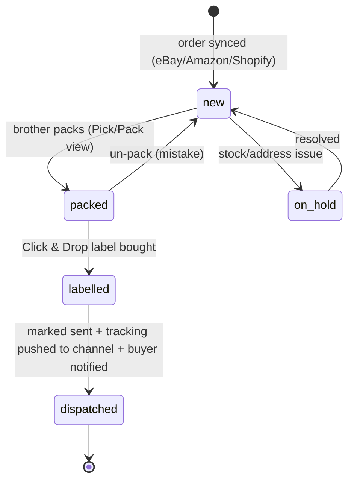

# Ops Dashboard

The single control panel for the screw-fastener ops: one queue for every channel's orders, a brother-friendly pick/pack view, one-click dispatch, inventory, money, and the time-saved proof — a NEW React/Vite SPA reusing the L&D shell, deployed on Vercel.

> [!info]
> A net-new React 18 + Vite 5 SPA that reuses the L&D dashboard shell **patterns** (shared axios client, inline-style JARVIS dark UI, `Sidebar`/`StatCard`). It is a thin read/act layer over the backend in [[01-system-architecture]] — every page calls `/api/*`; the dashboard holds no business logic. Two roles: **Dylan (owner, full control)** and **Brother (packer, pick/pack only)**. The Time-Saved page is the headline proof for [[09-the-pitch-pack]].

---

## Scope (this note only)

This note owns the **frontend dashboard**: pages, components, the exact endpoints each page calls, auth/roles, state, and the live-update strategy. It does **not** own:

- The order→label→notify engine, webhooks and `orders.status` definition → [[03-order-fulfilment-automation-n8n]]
- The backend stack, schema, JWT/role minting and safe-error model → [[01-system-architecture]]
- The agent roster + heartbeat that fill the queue and Health → [[06-agents]]
- What metrics mean and how they prove the pitch → [[07-metrics-and-proof]]
- Storefront / checkout / SKU source-of-truth → [[02-shopify-store]]
- The content/Higgsfield generation side → [[05-content-and-ads-engine]]
- Repo layout, build order, env and first-session prompt → [[10-claude-code-handoff]]

> [!warning] Net-new
> This entire SPA is **net-new**. We lift the L&D shell **patterns** (axios client, dark inline-style UI, sidebar, polling) but **none** of the L&D business pages (Leads, Outreach, Previews, Hub) carry over. Do **not** import L&D's `previews.js` / `leads.js` API modules, and point `VITE_API_URL` at the **new** screw backend, never the L&D one.

---

## Stack & reuse

| Layer | Choice | Source |
|---|---|---|
| Framework | React 18 + Vite 5 SPA | reuse L&D shell pattern |
| HTTP | `axios` wrapper in `src/api/client.js` | **copy** L&D `client.js` pattern, repoint `VITE_API_URL` |
| Routing | `react-router-dom` v6 | net-new |
| Server state | `@tanstack/react-query` (polling, cache, retries) | net-new (L&D hand-rolled `useEffect` — upgrade) |
| Styling | inline-style JARVIS dark system (`#0a0a0a` bg, `#00d4ff`/`#00ff88` accents, `rgba(0,212,255,0.1)` borders) | reuse L&D `index.css` + inline pattern |
| Shell components | `Sidebar.jsx`, `StatCard.jsx` | **copy + adapt** from L&D |
| Auth | Supabase Auth (email magic-link) + JWT in axios header | net-new |
| Host | Vercel | reuse L&D pattern |

> [!tip] Two L&D upgrades worth taking now
> 1. **react-query** instead of L&D's manual `useEffect` fetch loops — free polling, caching, retry/backoff and `isFetching` for the live indicators. 2. **Real auth from day one** — L&D shipped inconsistent/absent auth on ops endpoints (a documented bug to not inherit); this build is JWT-gated everywhere.

---

## Routes & roles

```
/login                 → magic-link sign-in            (public)
/                      → Orders queue (default)        (owner; packer → redirect to /packing)
/packing               → Pick/Pack brother view        (owner + packer)
/dispatch              → Dispatch & labels             (owner)
/inventory             → Inventory / SKUs              (owner)
/money                 → Revenue & margin              (owner)
/proof                 → Time-Saved metric             (owner)
/content               → Content pipeline              (owner)
/health                → System health                 (owner)
/settings              → channel creds status, users   (owner)
```

**Role gate (frontend):** the JWT carries an `app_role` claim (`owner` | `packer`), set on the Supabase user via a custom-access-token hook (the mint mechanism is owned by [[01-system-architecture]]). A `<RequireRole>` wrapper redirects:

- `packer` logging in lands on `/packing` and can reach only `/packing`; every other route → redirect to `/packing`.
- `owner` sees the full sidebar.

> [!warning] Frontend role-gating is UX only — never trust it for security
> The backend **must** re-check the role on every endpoint (the brother's token rejected on `/api/money/*`, `/api/inventory/*`, `/api/dispatch/*`, etc.). Frontend hiding is convenience; the API is the boundary. Backend enforcement lives in [[01-system-architecture]].

```jsx
// src/auth/RequireRole.jsx  — net-new
export function RequireRole({ allow, children }) {
  const { role, ready } = useAuth();            // reads JWT app_role claim
  if (!ready) return <FullScreenSpinner />;
  if (!role) return <Navigate to="/login" replace />;
  if (!allow.includes(role))
    return <Navigate to={role === 'packer' ? '/packing' : '/'} replace />;
  return children;
}
```

---

## Order status pipeline (the spine of the UI)

Every order, from every channel, normalises to ONE status enum. The Orders queue is a Kanban over these; the brother only ever advances to `packed`; Dylan owns `labelled`/`dispatched`. The canonical `orders.status` field and transition rules are owned by [[03-order-fulfilment-automation-n8n]] — the dashboard only renders and triggers transitions.



Status → colour (consistent everywhere, including `StatCard` accents):

| Status | Colour | Meaning |
|---|---|---|
| `new` | `#00d4ff` cyan | needs packing |
| `packed` | `#ffd166` amber | ready for a label |
| `labelled` | `#a78bfa` violet | label bought, not yet sent |
| `dispatched` | `#00ff88` green | done, tracking sent |
| `on_hold` | `#ff5d5d` red | blocked (stock/address) |

---

## Pages

### 1. Orders queue — `/` (owner)

Multi-channel command view. Kanban columns = the five statuses; cards = orders. Channel shown by a small badge (eBay / Amazon / Shopify). Dylan's "what's happening right now".

**Calls:**
- `GET /api/orders?status=&channel=&q=&page=` — paginated, filterable list
- `GET /api/orders/stats` — counts per status for the column headers + `StatCard`s
- `PATCH /api/orders/{id}/status` `{to: "on_hold"|"new"}` — manual move / un-block
- `GET /api/orders/{id}` — drawer detail (line items, buyer, `channel`, `channel_order_id`, address)

**Components:** `OrdersBoard` → `StatusColumn` × 5 → `OrderCard`; `OrderDrawer` (slide-in detail); `ChannelBadge`; `FilterBar` (status, channel, free-text); top row of 5 `StatCard`s from `/stats`.

**Live:** react-query `refetchInterval: 15000` on list + stats; `LiveDot` bound to `isFetching`.

**Acceptance criteria**
- Orders from all three channels appear on one board within the poll interval of being synced; no channel missing.
- Column header counts equal the cards in that column and match `/api/orders/stats`.
- Filtering by channel/status/text updates the board without a full reload.
- Opening a card shows line items, quantities, buyer name, `channel` and `channel_order_id`.
- An order can be put `on_hold` and back to `new` from the drawer.

- [ ] Copy L&D `client.js` pattern; add `orders` API module (`list`, `stats`, `get`, `setStatus`).
- [ ] Build `OrdersBoard` + `StatusColumn` + `OrderCard` with status colours.
- [ ] `FilterBar` wired to query params (URL-synced via `useSearchParams`).
- [ ] `OrderDrawer` with line items + buyer + `channel_order_id`.
- [ ] 5 `StatCard`s bound to `/api/orders/stats`.
- [ ] 15s polling + `LiveDot`.

---

### 2. Pick / Pack — `/packing` (owner + **packer**)

**The brother's entire app.** Deliberately dumb and big-buttoned — phone-first, one job: see what to pack, tick it, done. The human half of the 10x loop (replaces "ask the brother what's packed"). The **only** screen the `packer` role can reach.

**Calls:**
- `GET /api/pack/queue` — `new` orders only, oldest first, with a flattened **pick list** (`sku`, `name`, `qty`, `bin_location` if set)
- `POST /api/orders/{id}/pack` `{packed_by}` — mark `new → packed`
- `POST /api/orders/{id}/unpack` — revert a mistake (`packed → new`)
- `GET /api/pack/today` — count packed today (the brother's score)

**Components:** `PackQueue` → `PackTask` (one big card per order: buyer first name, line-item checklist, qty); sticky `PackProgress` header ("4 packed today / 6 to go"); fat `MARK PACKED` button per card; toast confirmations.

**UX rules (brother-grade):**
- One order on screen at a time on mobile (next/swipe), list on desktop.
- Tick each line item; `MARK PACKED` enables only once all lines are ticked.
- No prices, no margins, no channel jargon — buyer first name + items only.
- Big tap targets, high contrast on the dark theme.

**Live:** poll `/api/pack/queue` every 20s so newly synced orders appear without a refresh.

**Acceptance criteria**
- A `packer`-role login can open ONLY this page; all other routes redirect here.
- Each task shows every SKU + quantity to pick; multi-line orders are not collapsed.
- `MARK PACKED` enables only when all lines are ticked, then moves the order to `packed` and removes it from the queue.
- The today-count increments on pack and is visible at the top.
- Works one-handed on a 375px-wide phone with no horizontal scroll.

- [ ] `pack` API module (`queue`, `pack`, `unpack`, `today`).
- [ ] `PackTask` with per-line tick + gated `MARK PACKED`.
- [ ] Sticky `PackProgress` header bound to `/api/pack/today`.
- [ ] Mobile single-card mode; desktop list.
- [ ] Wire `<RequireRole allow={['owner','packer']}>` + packer-only redirects.
- [ ] 20s polling.

---

### 3. Dispatch & Labels — `/dispatch` (owner)

Turns `packed` orders into Royal Mail labels and marks them sent. Backed by **Royal Mail Click & Drop API**, with a **Click & Drop CSV bulk-import fallback** for week 1 (both owned by [[03-order-fulfilment-automation-n8n]]).

**Calls:**
- `GET /api/orders?status=packed` — ready-to-label list (multi-select)
- `POST /api/dispatch/label` `{order_ids:[...], service:"RM48"|"RM24"}` — buy label(s) via Click & Drop → returns label PDF URL(s) + tracking; moves `packed → labelled`
- `GET /api/dispatch/label/{order_id}/pdf` — re-download a label
- `POST /api/dispatch/mark-sent` `{order_ids:[...]}` — `labelled → dispatched`; triggers tracking push + buyer notify (server-side / n8n)
- `GET /api/dispatch/csv?status=packed` — **fallback**: download a Click & Drop-format CSV for manual bulk import

**Components:** `DispatchTable` (checkbox rows: buyer, items, channel, weight/service); `LabelBar` (sticky: service selector, "Buy N labels", "Print", "Mark sent"); `LabelPreviewModal` (embedded PDF); `CsvFallbackButton`.

**Flow:** select rows → choose service → **Buy labels** → labels open/print → **Mark sent** → rows turn green and drop off. One screen, two clicks per batch.

**Acceptance criteria**
- Only `packed` orders are selectable for labelling.
- Buying a label returns a printable PDF and a tracking number, and moves the order to `labelled`.
- "Mark sent" moves to `dispatched` and (server-side) pushes tracking to the originating channel + notifies the buyer — verifiable by the order's channel showing tracking.
- The CSV fallback downloads a file Click & Drop's import accepts (correct column headers).
- A failed label purchase leaves the order `packed` (no silent state loss) and surfaces a readable error (safe message, no raw stack trace — see error-handling rule).

- [ ] `dispatch` API module (`label`, `markSent`, `pdf`, `csv`).
- [ ] `DispatchTable` with multi-select.
- [ ] Sticky `LabelBar` with service selector + batch actions.
- [ ] `LabelPreviewModal` (PDF embed) + print.
- [ ] `CsvFallbackButton` for the manual path.
- [ ] Error toasts on label failure; row stays `packed`.

---

### 4. Inventory / SKUs — `/inventory` (owner)

Stock per SKU across the catalogue, with low-stock flags so we never sell air. SKU source-of-truth and Shopify sync rules are in [[02-shopify-store]]; this page reads/edits the normalised `inventory` table.

**Calls:**
- `GET /api/inventory?low_only=&q=` — SKUs with `on_hand`, `reorder_at`, and channel mapping (eBay/Amazon/Shopify listing IDs)
- `PATCH /api/inventory/{sku}` `{on_hand, reorder_at}` — manual adjust
- `GET /api/inventory/alerts` — SKUs at/under threshold (drives the badge + Health)

**Components:** `InventoryTable` (SKU, name, on-hand, reorder-at, channels, status pill); `StockEditCell` (inline qty edit); `LowStockBadge`; `ChannelMappingChips`.

**Acceptance criteria**
- Every SKU shows on-hand quantity and the channels it's listed on.
- SKUs at/under `reorder_at` are visually flagged and counted in `/api/inventory/alerts`.
- Editing on-hand persists via `PATCH` and updates the row without reload.
- The low-stock count here matches the badge on Health.

- [ ] `inventory` API module (`list`, `update`, `alerts`).
- [ ] `InventoryTable` + inline `StockEditCell`.
- [ ] `LowStockBadge` + threshold pills.
- [ ] Channel-mapping chips per SKU.

---

### 5. Revenue & Margin — `/money` (owner)

Revenue, COGS, postage, and **net margin** — by day and by channel. Feeds the 25%-of-**net**-profit deal maths in [[09-the-pitch-pack]]; metric definitions are owned by [[07-metrics-and-proof]] (render net profit here, don't redefine it).

**Calls:**
- `GET /api/metrics/revenue?from=&to=&group_by=day|channel` — revenue + order count
- `GET /api/metrics/margin?from=&to=` — revenue, COGS, postage, **net**, margin %
- `GET /api/metrics/summary` — headline `StatCard`s (revenue MTD, net MTD, orders, AOV)

**Components:** 4 `StatCard`s; `RevenueChart` (line, by day); `ChannelSplit` (bar/donut, revenue by channel); `MarginTable` (revenue − COGS − postage = net, margin %). Charts via Recharts, themed to the dark shell.

> [!tip] Chart palette
> Use the accent ramp (`#00d4ff`, `#00ff88`, `#a78bfa`, `#ffd166`) on `#0a0a0a` so charts match the JARVIS shell — no default Recharts colours.

**Acceptance criteria**
- Revenue, COGS, postage and **net** reconcile (revenue − COGS − postage = net) for the selected range.
- Channel split totals equal the period revenue.
- Date-range change re-queries and redraws all four widgets.
- Numbers match the definitions in [[07-metrics-and-proof]] (spot-checkable against Shopify/marketplace payouts).

- [ ] `metrics` API module (`revenue`, `margin`, `summary`).
- [ ] 4 `StatCard`s from `/summary`.
- [ ] `RevenueChart` + `ChannelSplit` (Recharts, dark theme).
- [ ] `MarginTable` with the net-profit breakdown.
- [ ] Date-range picker driving all widgets.

---

### 6. Time-Saved — `/proof` (owner) ⭐

The **headline proof for the pitch**. Quantifies the 10x: minutes the system saved vs the dad's manual nightly grind. Render-only — the model (baseline minutes/order, what counts as "saved") is defined in [[07-metrics-and-proof]].

**Calls:**
- `GET /api/metrics/time-saved?from=&to=` — `{orders_automated, minutes_saved, baseline_minutes_per_order, hours_saved, equiv_multiplier}`
- `GET /api/metrics/time-saved/timeline` — minutes saved per day (chart)

**Components:** one giant hero number ("**18.5 hours saved this month**"); a `MultiplierBadge` ("≈ 10× faster nightly dispatch"); `BeforeAfter` (manual loop vs automated loop, side by side); `SavedTimeline` chart. Built to **screenshot straight into the deck** ([[09-the-pitch-pack]]).

**Acceptance criteria**
- Shows total hours saved for the range and the per-order baseline it assumes.
- Before/after clearly contrasts the manual loop (ask brother → hunt orders on eBay → buy Royal Mail postage → dispatch) with the one-queue automated loop.
- Numbers derive from real `dispatched` orders, not hardcoded.
- The hero card is clean at screenshot resolution (no clipped text, dark bg).

- [ ] `time-saved` API module (`get`, `timeline`).
- [ ] Hero number + `MultiplierBadge`.
- [ ] `BeforeAfter` two-column comparison.
- [ ] `SavedTimeline` chart.
- [ ] Screenshot-clean layout pass.

---

### 7. Content pipeline — `/content` (owner)

A read/light-act view onto the content engine: queued/published TikTok/Reels assets, their status, and UTM-attributed performance back from Shopify. Generation (Higgsfield) and the TikTok formula live in [[05-content-and-ads-engine]]; this page only **lists, links, and shows results**.

**Calls:**
- `GET /api/content?status=` — content items (`hook`, `asset_url`/thumb, `platform`, `status: idea|generating|ready|posted`, `utm`, `posted_at`)
- `GET /api/content/performance` — per-UTM sessions/orders/revenue (from Shopify analytics)
- `PATCH /api/content/{id}` `{status}` — nudge status (e.g. mark `posted`)

**Components:** `ContentTable` (thumb, hook, platform, status pill, UTM); `PerfStrip` (top posts by attributed revenue); status filter. No generation UI here — an "Open content engine" link points at the [[05-content-and-ads-engine]] workflow/Higgsfield.

**Acceptance criteria**
- Lists content items with status and asset thumbnail.
- Performance strip ranks posts by attributed orders/revenue via UTM.
- Status can be advanced (e.g. `ready → posted`) and persists.
- No duplication of the generation pipeline — it links out to [[05-content-and-ads-engine]].

- [ ] `content` API module (`list`, `performance`, `update`).
- [ ] `ContentTable` with status pills + thumbs.
- [ ] `PerfStrip` ranked by UTM revenue.
- [ ] Link-out to the content engine note's workflow.

---

### 8. Health — `/health` (owner)

Is the machine alive? Channel-connection status, agent heartbeats, queue backlogs, error counts, low-stock — one glance. Mirrors the L&D CEO-heartbeat idea; the agents + heartbeat job are owned by [[06-agents]].

**Calls:**
- `GET /api/health` — `{db, channels:{ebay,amazon,shopify,royal_mail}, agents:[{name,last_run,status}], queues:{new,packed,labelled,on_hold}, errors_24h, low_stock_count}`
- `GET /api/health/agents` — per-agent last run / status detail

**Components:** `HealthGrid` of status tiles (green/amber/red) for each channel + DB; `AgentList` (name, last run, OK/stale); `QueueDepths` (counts per status); `ErrorCounter`. Reuse the `StatCard` colour semantics.

**Acceptance criteria**
- Each channel and the DB shows a clear OK/degraded/down state.
- Each agent shows last-run time and flags as stale past its expected interval.
- Queue depths match the Orders board counts.
- A connection drop (e.g. Royal Mail creds expired) shows red here within a poll.

- [ ] `health` API module (`get`, `agents`).
- [ ] `HealthGrid` channel/DB tiles.
- [ ] `AgentList` with stale detection.
- [ ] `QueueDepths` + `ErrorCounter`.
- [ ] 30s polling.

---

### 9. Settings — `/settings` (owner)

Low-frequency admin: which channel credentials are connected (status only, never secrets), and user/role management (invite the brother as `packer`).

**Calls:**
- `GET /api/settings/connections` — connected/expired per channel (eBay, Amazon, Royal Mail, Shopify, Stripe)
- `GET /api/settings/users` / `POST /api/settings/users` `{email, role}` — list/invite users (Supabase Auth invite)

**Components:** `ConnectionsPanel` (status pills + "reconnect" link, **no secret values**); `UsersPanel` (email + role, invite form).

**Acceptance criteria**
- Credential **status** is visible; raw keys/tokens are never rendered.
- Dylan can invite the brother as `packer` and that user is then restricted to `/packing`.

- [ ] `settings` API module (`connections`, `users`).
- [ ] `ConnectionsPanel` (status only).
- [ ] `UsersPanel` invite form (role select).

---

## Shared shell components

Copied/adapted from L&D, themed once, used everywhere:

- [ ] `Sidebar.jsx` — role-aware nav (owner sees all; packer sees only Pick/Pack). Reuse L&D layout/styles.
- [ ] `StatCard.jsx` — reuse as-is; drive with status colours.
- [ ] `LiveDot` — pulsing indicator bound to react-query `isFetching`.
- [ ] `StatusPill` — single source of truth for status→colour (table above).
- [ ] `ChannelBadge` — eBay/Amazon/Shopify glyph + colour.
- [ ] `ErrorToast` — renders the backend's **safe** error message (see below).
- [ ] `FullScreenSpinner` / `EmptyState` — loading + empty patterns.

---

## State, auth & live-update model

**Server state — react-query.** Each page = one or more `useQuery` hooks keyed by endpoint + filters. Mutations (`pack`, `label`, `setStatus`) use `useMutation` with `onSuccess: invalidateQueries` so the board/queue refresh instantly after an action.

**Polling (chosen over websockets for MVP):**

| Surface | Interval |
|---|---|
| Orders board + stats | 15s |
| Pick/Pack queue | 20s |
| Health | 30s |
| Money / Inventory / Content | on focus + manual refresh |

> [!tip] Why polling, not websockets
> Order volume is ~tens/day (≈£2k/month business). 15–30s polling is simpler, cheaper, plenty live at this scale, and dodges websocket infra on Railway. **Upgrade path:** if Dylan later wants instant pack→board updates, add a Supabase Realtime channel on the `orders` table and flip the board to subscribe — react-query keys stay the same. (Scope timing in [[08-seven-week-timeline]].)

**Auth flow:**
1. `/login` → Supabase magic-link email.
2. On callback, store the Supabase session; axios attaches `Authorization: Bearer <jwt>` (copy L&D's axios interceptor pattern in `client.js`).
3. `useAuth()` decodes the `app_role` claim → `owner` | `packer`.
4. `<RequireRole>` gates routes; `Sidebar` hides links by role.
5. **401 from any endpoint → bounce to `/login`** (interceptor).

> [!warning] Error handling — do NOT inherit the L&D bug
> The old backend **leaked raw exceptions in 500 responses**. This dashboard assumes the new backend returns a safe `{error: "<message>"}` shape (guaranteed in [[01-system-architecture]]) and renders only that in `ErrorToast`. Never blind-print response bodies; never surface stack traces — least of all to the brother.

---

## Environment & deploy (Vercel)

```bash
# .env (Vite) — net-new
VITE_API_URL=https://<screw-backend>.up.railway.app/api   # the NEW backend, NOT L&D
VITE_SUPABASE_URL=https://<project>.supabase.co
VITE_SUPABASE_ANON_KEY=<anon-key>                         # anon only; never the service key
```

- [ ] `npm create vite@latest` (React) — new repo per [[10-claude-code-handoff]] layout.
- [ ] Copy + repoint the L&D `src/api/client.js` pattern; add the Supabase JWT interceptor + 401 redirect.
- [ ] Install `react-router-dom`, `@tanstack/react-query`, `@supabase/supabase-js`, `recharts`.
- [ ] Port `index.css` + inline-style theme tokens from L&D.
- [ ] Build routes + `RequireRole` + role-aware `Sidebar`.
- [ ] Build the 9 pages above (Orders → Pack → Dispatch → Inventory → Money → Proof → Content → Health → Settings), in that priority order.
- [ ] Connect the Vercel project; set env vars; auto-deploy on push to `main` (mirror L&D).
- [ ] Smoke test: owner sees all pages; packer login is locked to `/packing`.

## Acceptance criteria (whole dashboard)

- One logged-in owner can run the full nightly loop from the dashboard: see new multi-channel orders → (brother packs) → buy Royal Mail labels → mark sent (tracking auto-pushed) — without touching eBay/Amazon/Royal Mail UIs directly.
- The brother can log in on a phone and pack with zero training, seeing nothing but the pick/pack queue.
- The Time-Saved page produces a screenshot-ready proof number for [[09-the-pitch-pack]].
- All money/inventory numbers reconcile with [[07-metrics-and-proof]] definitions.
- Backend errors render as safe messages; no stack traces, no leaked secrets, no unauthorised cross-role access.
- Deployed on Vercel, polling live, JWT-gated.
