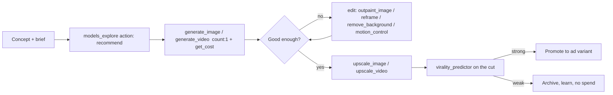
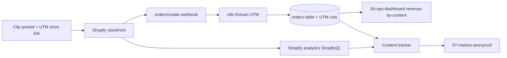

# Content & Ads Engine

The lo-fi, demo-led TikTok/Reels formula, Higgsfield render pipeline, product photography and UTM tracking that turn satisfying-packing footage into real Shopify orders on the stand-in fastener product.

> [!info]
> Organic-first demand engine for the fastener demo: vertical, sound-on, demo-led TikTok / Reels / Shorts built on real pack-and-sort footage and "which screw for X" trade tips. Higgsfield (via MCP) supplies hero images, hook stingers, b-roll and ad-format variants — credit-lean (`get_cost` preflight, single seed, ship one, scale winners). Every outbound click carries a UTM back to the [[02-shopify-store]] product page; winners get promoted to paid. AI never fakes the real product demo — that honesty is load-bearing for [[09-the-pitch-pack]].

---

## Why this note exists (scope)

This is the **demand** side of the proof-of-concept. The fulfilment 10x lives in [[03-order-fulfilment-automation-n8n]]; the storefront and checkout live in [[02-shopify-store]]; the worker that schedules and renders content lives in [[06-agents]] (Listing/Content + Analytics agents); what we measure for the pitch lives in [[07-metrics-and-proof]]; the week-by-week sits in [[08-seven-week-timeline]]. This note owns the **creative formula, the Higgsfield render pipeline, product photography, the posting calendar, and the UTM → Shopify → orders-table tracking loop**. Link, do not duplicate.

> [!warning] Net-new — everything here is greenfield
> Zero content exists today. No TikTok / Instagram / YouTube accounts, no shot library, no Higgsfield generations, no UTM scheme, no analytics wiring. The demo product is a small postable fastener kit (the bulky steam cleaner is RETIRED) and content must mirror the real nightly fulfilment so the pitch is honest. The only credentialed asset that touches this note is the existing **blank Shopify Basic store** ([[02-shopify-store]]) and the **Higgsfield MCP** connector — both confirmed in the system inventory. Nothing else below pre-exists.

---

## 1. The core formula (lo-fi, demo-led, sound-on)

The whole engine rests on one truth: **the dad's business is inherently satisfying to film.** Buying loose screws, a human packing them into neat bundles, and posting them is ASMR-grade content for free. We are not "doing marketing" — we are filming the real product being made and shipped, then adding a hook and a CTA.

Non-negotiables for every clip:

- **Vertical 9:16, 1080×1920.** Shot on a phone. Lo-fi is the aesthetic — polish kills trust in trade content.
- **Sound-on by default.** The real packing/sorting sound (screws cascading, tape pull, label snap) is the asset. Add a trending sound only when it doesn't bury the diegetic sound.
- **First 1 second is a hook.** No logos, no slow intro. Movement or a bold on-screen line in frame 1.
- **One idea per clip.** One screw problem, one kit, one tip.
- **Native captions burned in** (most watch muted first, then unmute for the ASMR).
- **CTA = the storefront, not a hard sell.** "Link's the kit." Pin a comment with the [[02-shopify-store]] link + UTM (see §5).

### The five content pillars (rotate these)

| # | Pillar | Why it works | Example angle |
|---|---|---|---|
| 1 | **Satisfying pack/sort** | ASMR + process porn; high replay / watch-time | Loose screws → counted → bagged → boxed, one take |
| 2 | **"Which screw for X"** | Saves the viewer a B&Q trip; high saves / shares | "Hanging a heavy mirror on plasterboard? Not these." |
| 3 | **The kit reveal** | Shows the actual SKU you can buy now | "£X gets you everything to mount a TV. Here's what's in it." |
| 4 | **Trade hook / myth-bust** | Pattern interrupt for the algorithm; pro credibility | "Stop buying screws in 100-packs. Here's why." |
| 5 | **Behind-the-bench** | Honest, real, builds the founder story for the pitch | "17, running this off one bench. Tonight's orders." |

### Shot structure (the repeatable 7-second skeleton)

Every clip, regardless of pillar, follows this beat sheet:

```
0.0–1.0s  HOOK      Strong visual or bold text. Hands already moving. State the problem/promise.
1.0–3.0s  PAYOFF    The satisfying bit — pour, count, sort, snap the label. Diegetic sound peaks.
3.0–6.0s  VALUE     The tip / the kit contents / the "why". One on-screen line max.
6.0–8.0s  CTA       "Link's the kit." Show the finished, postable parcel. Tap-out card.
```

Longer demo-led cuts (15–30s) just extend the **PAYOFF** block — more sorting, the full pack-to-parcel run — because that footage is the retention engine.

> [!tip] Batch-shoot the raw, edit many
> One filming session at the packing bench = a week of clips. Lock a phone on a cheap overhead tripod, film a full evening of real fulfilment in 1080p60 (slow-mo headroom), and harvest 10–15 raw clips. Volume comes from editing and hook variants, not re-shoots.

### Example first-1-second hooks (swipe-file seed)

Visual hooks (text overlay optional):
- A jar of mixed screws poured onto a tray in slow-mo — caption: "Don't grab the wrong one."
- A snapped screw on a workbench — caption: "This is why it failed."
- Hands sealing a parcel — caption: "Posted in 60 seconds. Here's how."

Spoken / text hooks:
- "If you've ever stripped a screw, this is for you."
- "Stop buying 100-packs you'll never finish."
- "Which screw holds a 20kg TV on plasterboard? Most people get this wrong."
- "I packed 30 of these tonight. Watch the satisfying bit."
- "£X. Everything you need to mount a shelf. No B&Q trip."
- "Plumber, sparky, chippy — you need this drawer, not that mess."
- "POV: it's 9pm and the orders are stacking up." → cuts to the pack/dispatch loop (bridges to [[03-order-fulfilment-automation-n8n]]).

> [!warning] Honesty rule (load-bearing for the pitch)
> The "behind-the-bench" and "9pm orders" hooks must reflect the REAL system. Never dramatise volume that doesn't exist. When sales are small, lean into the underdog / process story, not fake scale. The pitch in [[09-the-pitch-pack]] depends on this being credible, and the real numbers come from [[07-metrics-and-proof]].

---

## 2. Higgsfield pipeline (via MCP) — credit-lean

Higgsfield is connected via the MCP server (tools named `mcp__higgsfield__*`). It supplies the **synthetic** assets the phone can't easily produce: clean hero images for the Shopify product page, scroll-stopping hook stingers, b-roll inserts, and paid-ad format variants. It does **not** replace the real demo footage (see §6).

> [!warning] No "preview tier" flag exists — control cost explicitly
> There is no cheap-mode toggle on these tools. Credit control is: **(1)** `get_cost: true` to preflight credits before submitting, **(2)** `count: 1` (single seed) on `generate_image` / `generate_video`, **(3)** pick a lean model via `models_explore`, **(4)** edit an existing asset with a dedicated tool instead of regenerating. `upscale_image` and `upscale_video` target 2K/4K and are a separate, additional spend — only upscale a keeper.

### Credit-lean operating rules

> [!tip] Spend like the budget is real (because it is)
> 1. **Check balance first.** Call `mcp__higgsfield__balance` (credits + plan) before any batch; `mcp__higgsfield__show_plans_and_credits` only if a top-up is actually needed.
> 2. **Preflight every job.** Pass `get_cost: true` to see the credit cost before you commit to a real render.
> 3. **Single seed, then judge.** `count: 1` to lock composition before any variant fan-out or upscale.
> 4. **Start with ONE.** One hero image, one hook clip per concept. Never fan out variants on an unproven idea.
> 5. **Scale winners only.** A concept earns variant spend only after it beats the bar in §4 (organic retention/CTR/CVR or a virality signal).
> 6. **Edit, don't regenerate.** Use `upscale_image` / `upscale_video`, `outpaint_image`, `reframe`, `remove_background`, `motion_control` to fix an asset rather than burning credits on a fresh generation.
> 7. **Predict before you pay to promote.** Run `virality_predictor` on a near-final cut before allocating any ad budget.

### Asset → tool map (real signatures)

| Asset | Higgsfield tool | Real-signature notes / credit posture |
|---|---|---|
| Pick the model for a goal | `models_explore(action:'recommend')` | Call first when unsure; pass the goal + input context (text-only vs reference image). Use `action:'get'` for a model's `aspect_ratio` / param constraints |
| **Hero / product images** (Shopify PDP) | `generate_image` (model `marketing_studio_image`) → `upscale_image` | `count:1` + `get_cost` first; upscale the keeper (pass source `width`/`height`, target 2k/4k). Feeds the [[02-shopify-store]] gallery |
| On-white / kit-on-white cutout | `remove_background` (`media_id`, `media_type:'image'`) | Clean PDP shots + ad backgrounds. No prompt/style params |
| Expand / uncrop a hero for banners | `outpaint_image` (`image_id`, `aspect_ratio`) | Reuse one render across 9:16, 1:1, 16:9. `get_cost` supported |
| **Hook stingers / synthetic b-roll** | `generate_video` (model `marketing_studio_video`) | `count:1`, `get_cost` first. Synthetic intro stinger only — NOT the demo (see §6) |
| Recast motion onto a still | `motion_control` (`image_id`, `motion_video_id`) | Kling 3.0; stylise without re-shooting. 720p cheaper than 1080p |
| **Ad-format aspect ratios** | `reframe` (`medias`:[video], `aspect_ratio`) | One master cut → 9:16 / 1:1 / 4:3 etc. without re-render. `get_cost` supported |
| Upscale a winning cut for paid | `upscale_video` (`provider:'topaz'` or `'bytedance'`) | Only after it wins organically; `bytedance` needs source `width`/`height` |
| Hook voiceover (clearly-AI VO) | `generate_audio` (a `text2speech_v2_*` model) + `list_voices` | **TTS only** — pick a UK preset `voice_id`. Keep diegetic sound primary. No music/SFX tool exists; do not fake one |
| Pre-flight a cut before paid spend | `virality_predictor(action:'create', medias:[{role:'video', id:<job_id>}])` | Needs a completed/confirmed video; gates ad budget on hook/retention score |
| Inspect a render before spending more | `job_display` / `show_generations` / `show_medias` | Verify the output before paying to upscale |

### MCP media handling (do it right)

> [!warning] Higgsfield cannot read chat attachments
> It is a remote MCP server — it cannot see phone footage attached in chat. For a **local** clip/image, call `mcp__higgsfield__media_upload_widget` (Apps UI) so the browser uploads direct to Higgsfield and returns a confirmed `media_id`. For a **web URL**, call `mcp__higgsfield__media_import_url` first and pass the returned `media_id`; **never** paste a raw URL into `medias[].value` / `image_id` / `media_id`.

### Minimal repeatable flow (per concept)



---

## 3. Product photography for Shopify

The product page needs clean, trustworthy stills. Split the work: **real phone macro** for authenticity, **Higgsfield** for the polished hero and lifestyle scenes that are hard to stage on a bench. Full storefront/gallery requirements live in [[02-shopify-store]] — this section only covers producing the assets.

Required shot list (per SKU):

- [ ] **Hero on white** — the full kit laid out, top-down, even light (phone macro on white card, or `generate_image` → `remove_background`).
- [ ] **Macro detail** — thread close-up / head type, to prove quality (**real phone macro only** — an AI macro of a real product is a lie, see §6).
- [ ] **In-context / lifestyle** — screw in plasterboard / shelf mounted (`generate_image` is fine here — it is a scene, not a fake of the actual SKU's quality).
- [ ] **Scale reference** — kit next to a coin / hand for size.
- [ ] **The parcel** — the postable package (doubles as content and reassurance it ships small/cheap).
- [ ] **Square + 4:5 crops** for ads/social via `reframe` (video) / `outpaint_image` (image).

> [!tip] One light, one white card
> A window + a £5 white foam board beats a studio for trade gear. Shoot macro on a phone in pro/RAW mode; reserve Higgsfield credits for the hero and lifestyle scenes only.

---

## 4. Cadence, calendar & the organic→paid ladder

### Posting cadence

- **Volume target:** 1–2 short clips/day, every day, across TikTok + Instagram Reels (+ YouTube Shorts as a free repost). Trades content rewards consistency over polish.
- **Cross-post, don't re-make:** one master 9:16 export → TikTok, Reels, Shorts. Export a clean watermark-free master and post natively to each platform.
- **Pillar rotation (weekly skeleton):**

| Day | Primary pillar | Secondary |
|---|---|---|
| Mon | Satisfying pack/sort | — |
| Tue | Which screw for X | Kit reveal |
| Wed | Behind-the-bench (real orders) | — |
| Thu | Trade hook / myth-bust | Satisfying |
| Fri | Kit reveal (push the buy) | Which screw for X |
| Sat | Best raw clip of the week, re-hooked | — |
| Sun | Repost top performer to a new sound | — |

> [!tip] Re-hook the winner
> The cheapest growth lever: take this week's top organic clip, swap ONLY the first-1-second hook (new text/sound), repost. Same payoff footage, new entry point — free A/B testing on proven content before you ever pay.

### The organic → paid ladder (gate spend on evidence)

```
STAGE 0  Post organic.                 Cost: time only.
STAGE 1  Clip clears the bar?          ≥ baseline 3s-retention AND a saves/shares signal.
STAGE 2  Re-hook + repost organically. Confirm it's the content, not a fluke.
STAGE 3  Higgsfield variant pack.      reframe → 3–4 hook/format variants of the winner.
STAGE 4  Small paid test.              £-lean Spark Ads / boost, ONE variable at a time.
STAGE 5  Scale the winning ad.         Only the variant with the best UTM-tracked CVR (§5).
```

> [!warning] Never pay to amplify an unproven clip
> Paid is a multiplier on organic signal, not a substitute. Budget is lean and the spend cap lives in the [[06-agents]] safety layer; the Health/CEO heartbeat there watches spend. A clip must earn organic proof before any boost, and every boosted clip must pass `virality_predictor` first.

---

## 5. UTM + tracking back to Shopify

Every outbound click must be attributable so we can prove the content → sale loop in [[07-metrics-and-proof]] and decide what to scale.

### UTM scheme (canonical — use exactly this)

```
https://<store-domain>/products/<handle>
  ?utm_source=tiktok            (tiktok | instagram | youtube)
  &utm_medium=organic           (organic | paid)
  &utm_campaign=<pillar>        (packsort | whichscrew | kitreveal | tradehook | bench)
  &utm_content=<clip-id>        (e.g. 2026-06-26-packsort-01)
```

Rules:
- **One short link per clip** (a link shortener wrapping the full UTM) so the bio/pinned link stays clean while preserving the `utm_content` clip-id.
- `utm_content` = the exact clip-id used in the content tracker, so a sale maps to one specific creative.
- `paid` vs `organic` lives in `utm_medium` so boosted reposts don't pollute organic numbers.

### Where the data lands

- **Shopify analytics (built-in)** ingests UTM params on the landing session natively → sessions, conversion rate and revenue by `utm_source` / `utm_campaign` / `utm_content`. This is the source of truth for CVR. (Storefront config: [[02-shopify-store]].) Query it ad-hoc via the Shopify MCP `run-analytics-query` (ShopifyQL) when building the proof in [[07-metrics-and-proof]].
- **Backend mirror onto the canonical `orders` table.** Shopify gives the *session* attribution but not a clean per-order UTM by default, so we capture it ourselves: set the UTM values into Shopify **cart/checkout `note_attributes`** (or `landing_site` on the order payload), and have the Shopify order webhook → [[03-order-fulfilment-automation-n8n]] persist them onto the order row. Add these columns to the canonical orders schema (defined in [[01-system-architecture]] / [[03-order-fulfilment-automation-n8n]]):

  ```sql
  -- additive columns on the canonical orders table (no new analytics service)
  utm_source     text,
  utm_medium     text,
  utm_campaign   text,
  utm_content    text,   -- == clip-id, joins an order back to one creative
  landing_site   text
  ```

  This lets the [[04-ops-dashboard]] show **revenue-by-content** beside the fulfilment queue, and lets [[07-metrics-and-proof]] compute CAC against the 25%-of-net-profit deal math.
- **No new tracking server.** Reuse Shopify analytics + the existing webhook → `orders` table. Do not build a bespoke analytics service.

### n8n persistence path (concrete)

The Shopify order webhook is already a node in the ops engine; extend that workflow ([[03-order-fulfilment-automation-n8n]]) to carry UTMs through to the order row:

| n8n node | Type | Does |
|---|---|---|
| `Shopify Trigger` | Shopify Trigger (`orders/create`) | Fires on every new order |
| `Extract UTM` | Set / Code | Read `note_attributes[]` + `landing_site`; map to `utm_source/medium/campaign/content` |
| `Upsert Order` | HTTP Request → backend `POST /api/orders/ingest` | Idempotent dedupe by `channel + channel_order_id`; writes the UTM columns above |

> [!warning] note_attributes must be set at checkout, or there's nothing to read
> The UTM → order link only works if the storefront writes the landing UTMs into cart `note_attributes` (a small theme/checkout snippet — owned by [[02-shopify-store]]). Without that, fall back to `landing_site` parsing, which Shopify populates from the first landing URL on the order object.

### Content tracker (one source of truth)

Maintain one sheet/table — `clip_id, date, pillar, platform, hook, organic_views, 3s_retention, saves, link_clicks, sessions_utm, orders_utm, revenue_utm, promoted, spend, status`. The Listing/Content + Analytics agents in [[06-agents]] populate the performance columns; this table feeds the proof in [[07-metrics-and-proof]].



---

## 6. What AI does NOT do (hard boundaries)

> [!warning] Never fake the real product demo
> Higgsfield is for **scenes, heroes, stingers and ad polish** — never for faking the product working, the packing process, or volume/results we don't have. The entire pitch ([[09-the-pitch-pack]]) rests on a REAL, can-take-orders proof. Faking the demo is the one thing that destroys it.

Explicit no-go list:
- ❌ AI-generated footage presented as the **actual product being packed/used**. The satisfying pack/sort MUST be real phone footage.
- ❌ AI **macro** of the SKU's threads/quality (it would misrepresent the real item the customer receives).
- ❌ Synthetic **reviews, testimonials, or customer faces**.
- ❌ Fabricated **order counts, revenue, or "sold out" scarcity** that the real `orders` table can't back.
- ❌ AI **voice impersonating a real customer/tradesperson** as if it were a genuine testimonial.
- ✅ AI **is** fine for: clean hero/lifestyle scenes, abstract b-roll, intro stingers, format/aspect variants, banner backgrounds, and a clearly-AI VO (`generate_audio`) for hook narration.

---

## Acceptance criteria

- [ ] TikTok, Instagram Reels and YouTube Shorts accounts exist, branded to the demo product; bio link points to the [[02-shopify-store]] product page via a tracked short link.
- [ ] A documented shot library: ≥1 batch-shoot session captured, ≥10 raw clips harvested from real fulfilment, stored and labelled by `clip_id`.
- [ ] At least one clip published per pillar (5 pillars) using the 7-second skeleton — vertical 9:16, sound-on, captions burned in.
- [ ] Higgsfield balance checked via `balance`; ≥1 hero image and ≥1 hook clip produced with `get_cost` preflight + `count:1`, then `upscale_image` on the keeper; no concept fanned out before it earns it.
- [ ] PDP shot list complete for the launch SKU (hero-on-white, macro, lifestyle, scale, parcel, square/4:5 crops) — handed to [[02-shopify-store]].
- [ ] UTM scheme implemented exactly as §5; every live link carries `utm_source/medium/campaign/content`; `clip_id == utm_content`.
- [ ] Cart/checkout writes landing UTMs into `note_attributes` ([[02-shopify-store]]); the n8n `orders/create` flow persists `utm_*` + `landing_site` onto the `orders` table; revenue-by-content visible in [[04-ops-dashboard]].
- [ ] Shopify analytics (ShopifyQL via `run-analytics-query`) shows sessions/CVR by `utm_source` + `utm_campaign`.
- [ ] Content tracker live with the defined columns; the organic→paid ladder and the Stage-1 spend gate documented and agreed.
- [ ] `virality_predictor` run on any cut before it receives paid budget; no boosted clip lacks prior organic proof.
- [ ] "What AI does NOT do" rules pinned where the content agent ([[06-agents]]) can enforce them; zero faked-demo assets in the published set.

## Build tasks

- [ ] Create + brand the three social accounts; set the bio link to the tracked PDP short link.
- [ ] Buy the cheap overhead phone tripod; run the first batch-shoot at the packing bench on a real fulfilment night.
- [ ] Cut 5 launch clips (one per pillar) from the batch using the skeleton; burn captions; export clean 9:16 masters.
- [ ] Write a swipe-file of 20 first-1-second hooks (extend §1), tagged by pillar.
- [ ] `balance` check; produce the launch hero image (`generate_image` `marketing_studio_image` → `upscale_image`, `get_cost` first) and one synthetic hook stinger (`generate_video`, `count:1`).
- [ ] Produce the full PDP shot list (real macro + Higgsfield hero/lifestyle) and hand to [[02-shopify-store]].
- [ ] Define the short-link + UTM convention; mint per-clip links; document the naming standard.
- [ ] Add `utm_*` + `landing_site` columns to the canonical `orders` schema ([[01-system-architecture]]); wire the `note_attributes` checkout snippet ([[02-shopify-store]]) and the n8n Extract-UTM → upsert path ([[03-order-fulfilment-automation-n8n]]); surface revenue-by-content in [[04-ops-dashboard]].
- [ ] Stand up the content tracker with all columns; assign population to the [[06-agents]] Content + Analytics agents.
- [ ] Define the organic→paid ladder thresholds (Stage-1 bar) against the [[06-agents]] spend cap; write the boost runbook.
- [ ] Run a re-hook test: repost week-1's top clip with a swapped 1-second hook; log both `clip_id`s.
- [ ] Pin the "What AI does NOT do" list into the content workflow so the agent and Dylan both enforce it.
