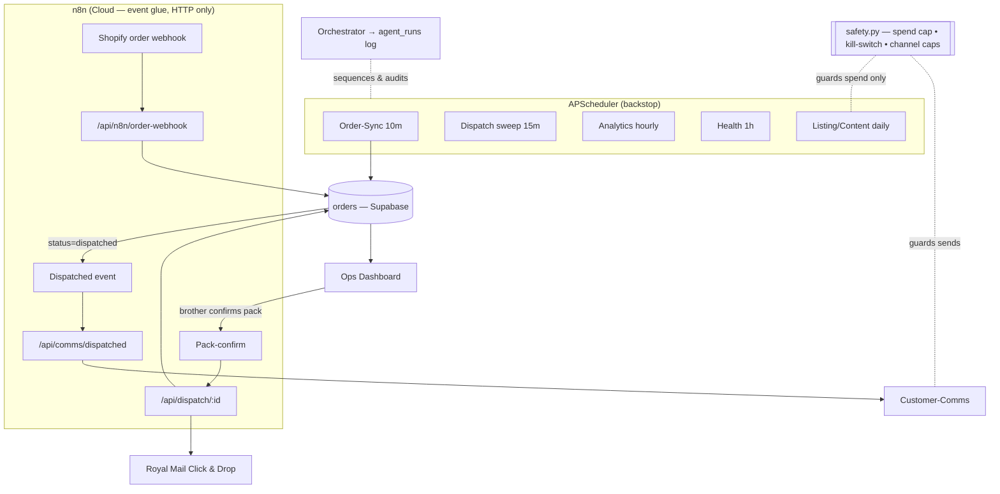

# Agents

The AI/automation worker roster that runs the screw-business ops, plus the safety and orchestration layer that keeps it cheap, idempotent, and unbannable.

> [!info] Defines the small, focused roster — Order-Sync, Dispatch/Label, Customer-Comms, Listing/Content, Analytics/Reporting, Health/CEO — running on the **proven APScheduler + `safety.py`** pattern lifted from L&D Designs. Agents own the scheduled "muscle"; **n8n** ([[03-order-fulfilment-automation-n8n]]) owns the visual event wiring via HTTP; the [[04-ops-dashboard]] is the human control surface. This is **NOT** OpenClaw — that stack is dead and nothing here depends on it.

## Scope

This note covers **the worker roster and how it is orchestrated and guarded.** It does not redefine the data flow (see [[01-system-architecture]]), the n8n workflows ([[03-order-fulfilment-automation-n8n]]), the dashboard ([[04-ops-dashboard]]), the content engine ([[05-content-and-ads-engine]]), or metric definitions ([[07-metrics-and-proof]]). Repo layout and build order live in [[10-claude-code-handoff]].

> [!warning] **Net-new.** Every agent, table, and endpoint below is written from scratch for the screw business — the screw business is greenfield (zero code, zero credentials). Only the *pattern* is reused: FastAPI + a hand-rolled httpx/PostgREST Supabase client + APScheduler + `safety.py`. **Port `safety.py` verbatim** but do NOT lift any L&D business logic. The eBay Sell API, Amazon SP-API, Royal Mail Click & Drop integrations and all order/inventory/shipping/fulfilment code are net-new.

---

## Design principles (from the proven L&D pattern)

- **Thin agents, fat API.** Each agent is a small Python module with one `async def run() -> dict` entry point. Real work (DB writes, label calls, channel pushes) lives in backend *service functions* exposed by endpoints, so logic is testable and n8n can drive the same paths over HTTP.
- **Idempotent or it doesn't ship.** Every re-run on the same data is a no-op. Orders dedupe on `(channel, channel_order_id)`; dispatch guards on `orders.status` + a stored `royalmail_label_id`; comms guard on a unique `(order_id, type)`. This handles real money and real parcels — double-dispatch or double-charge is unacceptable.
- **Fail open on internal errors, fail closed on real money.** A DB blip must never halt fulfilment. Only a **measured** spend-cap breach or a channel-volume cap blocks — and only for the agents that actually spend.
- **Every paid call is logged.** Any LLM call ends with `safety.record_spend(agent, model, tokens_in, tokens_out)`. Credit-lean by default (Higgsfield preview tier, one credit at a time).
- **One orchestrator logs every handoff.** No agent calls another agent directly. The orchestrator sequences them and writes an `agent_runs` row per step — the clean audit trail the pitch screenshots. Replaces OpenClaw's daily handoff chain with plain, debuggable Python.

> [!warning] **`safety.guarded(...)` is not free to sprinkle.** In the real `safety.py`, `guarded` runs `preflight()`, which **blocks** the job when the daily spend cap is hit *or* the kill-switch trips. The L&D kill-switch (`check_kill_switch`) queries `leads`/`deployed_websites` for recent revenue — in this repo those become the screw-business `orders`/`spend_log`, and a brand-new pre-revenue system must **not** trip it (see the porting note below). **Never wrap a deterministic order/label path in a guard that could stop fulfilment when no LLM money is at stake** — guard the *spend*, not the parcels.

> [!tip] Reuse `safety.can_send(channel)`, `safety.record_spend(...)`, `safety.preflight(...)` and `safety.alert_founder(key, title, body)` exactly as written. `can_send` returns a `Guard(allowed, reason)` namedtuple and already enforces per-channel daily caps; `alert_founder` de-dupes **once per day per key, in-process only** (a restart re-arms it — fine for our scale, but don't rely on it for audit; the DB `notifications`/`agent_runs` rows are the source of truth).

### Porting `safety.py` to the greenfield repo

- [ ] Copy `platform/backend/safety.py` unchanged; keep the `Guard` namedtuple, `guarded`, `preflight`, `can_send`, `record_spend`, `alert_founder` API.
- [ ] Rewire `check_kill_switch()` to the screw-business tables: "system age" from the earliest `orders.created_at`; "recent revenue" from `orders` with `status IN ('paid','dispatched')` (or a `payments` row) inside the window. It must return `Guard(True, "no orders yet")` for a fresh DB so it never trips pre-launch.
- [ ] Add Higgsfield + the channel APIs to `PRICE_GBP_PER_1M` *or* record their spend as a flat `est_cost_gbp` (Higgsfield bills credits, not tokens — pass `tokens_*=0` and write the credit's £ cost directly; see the Listing/Content agent).
- [ ] Confirm Railway vars: `SAFETY_ENABLED`, `DAILY_SPEND_CAP_GBP`, `SAFETY_KILL_SWITCH_DAYS`, `SAFETY_KILL_SWITCH_MODE`, `MAX_EMAILS_PER_DAY` (+ any channel caps actually used).

**Acceptance criteria**
- A fresh DB with zero orders never trips the kill-switch.
- `guarded` only wraps agents that spend LLM/API credit money; deterministic order/label code is guarded by **idempotency keys**, not `preflight`.

---

## The roster at a glance

| Agent | Trigger | Cadence | Model | Spends? | Guard mechanism |
|---|---|---|---|---|---|
| **Order-Sync** | APScheduler + Shopify webhook via n8n | every 10 min | none (deterministic) | channel API quota only | idempotency key `(channel, channel_order_id)` |
| **Dispatch/Label** | n8n event → API; APScheduler sweep | on pack-confirm + 15-min sweep | none (deterministic) | Royal Mail postage £ | `royalmail_label_id` guard + `dispatch_intent` row |
| **Customer-Comms** | n8n event → API; APScheduler retry | on dispatch + 30-min retry | optional LLM (templated default) | LLM only if AI copy on | `can_send("email")` + `(order_id,type)` unique |
| **Listing/Content** | APScheduler draft + manual approve | daily draft, on-demand | Higgsfield MCP + Haiku | Higgsfield credits | `@guarded("content")` + approval row + per-run credit cap |
| **Analytics/Reporting** | APScheduler | hourly rollup + 07:30 digest | Haiku (summary only) | small LLM | read-only; `record_spend` |
| **Health/CEO** | APScheduler | every 1 h + heartbeat | Haiku (only when fixing) | tiny | `alert_founder`; self-heal re-checks `preflight`/`can_send` |

> [!warning] **Order-Sync and Dispatch/Label MUST be deterministic — no LLM in the order or money path.** LLMs draft *content and customer copy* only; they never decide what to ship, to whom, or what to charge. This keeps the fulfilment core auditable and cheap.

---

## 1. Order-Sync agent

**Purpose.** Pull every order from all three channels (eBay Sell API, Amazon SP-API, Shopify) into one normalized `orders` table so the brother has a single pick/pack queue. The front door of the 10x loop ([[03-order-fulfilment-automation-n8n]]).

- **Trigger.** APScheduler every 10 min as the reliable backstop; **plus** a real-time path where the Shopify `orders/create` webhook hits n8n, which `POST`s the payload to `/api/n8n/order-webhook` (same service function, no double-write thanks to dedupe).
- **Model.** None. Pure API + mapping. Deterministic.
- **Data in.** eBay Sell `getOrders` (Fulfillment API), Amazon SP-API `getOrders`, Shopify Admin order / webhook payload.
- **Data out.** Upsert into `orders` + `order_items`, status `new`. Writes an `agent_runs` row.
- **Idempotency.** Unique key `(channel, channel_order_id)`; conflict → update, never insert. Re-running mid-import is safe.
- **Guard.** Idempotency, **not** `@guarded` — it spends no LLM money and must never be blocked by the spend cap or kill-switch. Channel rate-limit/backoff lives in the channel client. The global off-switch for ingestion is `SAFETY_ENABLED` (checked in the orchestrator), not `preflight`.

```python
# agents/order_sync.py
from services.channels import ebay, amazon, shopify
from services.orders import upsert_order
from services.runs import log_run

async def run() -> dict:
    pulled, errors = 0, []
    for src in (ebay, amazon, shopify):
        try:
            for raw in await src.fetch_recent_orders():
                await upsert_order(src.normalize(raw))   # idempotent on (channel, channel_order_id)
                pulled += 1
        except Exception as e:                            # fail open: one channel down ≠ all down
            errors.append({src.NAME: str(e)})
    result = {"agent": "order_sync", "pulled": pulled, "errors": errors}
    await log_run("order_sync", trigger="scheduler", result=result, status="error" if errors else "success")
    return result
```

**Acceptance criteria**
- [ ] Running `order_sync` twice in a row yields **zero** duplicate `orders` rows.
- [ ] A Shopify webhook order and the 10-min sweep produce exactly one row for the same order.
- [ ] One channel's API failure logs an error and still imports the other two (fail open).

- [ ] Build `services/channels/{ebay,amazon,shopify}.py`, each with `NAME`, `fetch_recent_orders()`, `normalize()`.
- [ ] Build `services/orders.upsert_order()` with `(channel, channel_order_id)` conflict handling.
- [ ] Register `run()` on APScheduler (10 min); wire Shopify `orders/create` webhook → n8n → `POST /api/n8n/order-webhook`.
- [ ] pytest: dedupe, partial-channel-failure, webhook-vs-sweep collision.

---

## 2. Dispatch/Label agent

**Purpose.** Turn packed orders into Royal Mail labels and close the loop: generate the label via **Click & Drop API**, mark the order dispatched, and push tracking back to each channel. The single biggest time-saver in the pitch ([[07-metrics-and-proof]]).

- **Trigger.** Primarily **n8n event**: when the brother confirms a pack in the [[04-ops-dashboard]], the dashboard/n8n calls `POST /api/dispatch/{order_id}`. APScheduler also runs a 15-min **sweep** over `status = packed` as a safety net.
- **Model.** None. Deterministic. The only "intelligence" is mapping order → service/weight → label.
- **Data in.** `orders` rows where `status = packed`, plus `weight_grams`, dimensions, buyer address.
- **Data out.** Royal Mail label PDF URL + `tracking_number` stored on the order; `status → dispatched`; tracking pushed to eBay (`createShippingFulfillment`), Amazon (`createShipmentConfirmation` / feed) and Shopify (fulfilment with tracking).
- **Idempotency.** Refuses to act if `orders.royalmail_label_id` is already set; the label-buy is wrapped so a retry never purchases a second label.
- **Guard.** A `dispatch_intent` row is written **before** any postage call (mirrors L&D's live-viewer intent-alert pattern) so spend is traceable. **No `@guarded`** — blocking real dispatch on a kill-switch/spend-cap trip would strand paid customer orders. **Fallback:** if the API path errors, drop the order into a **Click & Drop CSV bulk-import** batch ([[03-order-fulfilment-automation-n8n]]) and flag it in the dashboard so week-1 dispatch never blocks.

> [!warning] Royal Mail label generation is **real spend**, but it is **customer-paid fulfilment**, not discretionary LLM spend — so it is guarded by **idempotency** (`royalmail_label_id`) + the `dispatch_intent` audit row, never by `preflight`. The deterministic guard is what stops a retry storm from buying duplicate postage.

**Acceptance criteria**
- [ ] Calling dispatch twice on the same order generates **one** label and **one** tracking number.
- [ ] After dispatch, the order shows `dispatched` and the tracking number is visible on the originating channel.
- [ ] If Click & Drop API is down, the order lands in the CSV fallback batch and the dashboard flags it, rather than erroring out.

- [ ] Build `services/shipping/royalmail.py` (`create_label`, `get_tracking`) over the Click & Drop API.
- [ ] `POST /api/dispatch/{order_id}` — guard on existing `royalmail_label_id`, write `dispatch_intent` first.
- [ ] Tracking push-back adapters for eBay / Amazon / Shopify.
- [ ] APScheduler 15-min sweep over `status = packed`.
- [ ] CSV bulk-import fallback writer + dashboard "needs manual label" flag.
- [ ] pytest: double-dispatch guard, fallback path, per-channel tracking push-back.

---

## 3. Customer-Comms agent

**Purpose.** Keep the buyer informed automatically — order-received and dispatched-with-tracking — so the dad's "good service" reputation holds without him touching it.

- **Trigger.** **n8n event** on dispatch → `POST /api/comms/dispatched`; APScheduler 30-min **retry** sweep over `comms_log` rows with `status = failed`.
- **Model.** Optional, off by default. Ships with **deterministic templates**; Claude Haiku can polish tone when `COMMS_AI_COPY=true`. Marketplace orders mostly ride each channel's own buyer-notification rails, so AI copy matters most on the Shopify owned channel.
- **Data in.** `orders` (status, buyer, `tracking_number`), message templates.
- **Data out.** A `comms_log` row per message (`order_id`, `type`, `channel`, `status`, `sent_at`); the send goes via the channel's messaging API / Shopify notification.
- **Idempotency.** One message per `(order_id, type)`; a unique constraint stops re-sends on retry.
- **Guard.** `safety.can_send("email")` before any email send (reuses the per-channel cap so a bug can't spam buyers — check `Guard.allowed`); `safety.record_spend("customer_comms", model, tokens_in, tokens_out)` after any LLM polish. Honour `SAFETY_ENABLED`.

> [!warning] `can_send` in the ported `safety.py` reads the L&D `outreach_messages` table. Repoint it (or its query) at `comms_log` so the cap counts *our* sends. Until repointed it returns `Guard(True, ...)` for unknown channels — verify "email" is wired before relying on the cap.

**Acceptance criteria**
- [ ] A buyer receives exactly one "dispatched" message with a working tracking link.
- [ ] With AI copy off, no LLM call is made and `record_spend` is not invoked.
- [ ] A failed send is retried by the sweep and never duplicates a successful one.

- [ ] Templates: `order_received`, `dispatched` (plain + AI-polish variant).
- [ ] `POST /api/comms/dispatched`; `comms_log` table with `(order_id, type)` uniqueness.
- [ ] Gate email with `safety.can_send("email")`; gate LLM polish behind `COMMS_AI_COPY`.
- [ ] APScheduler 30-min retry over `status = failed`.
- [ ] pytest: single-send guarantee, retry-no-dup, AI-off path makes no LLM call.

---

## 4. Listing/Content agent (Higgsfield)

**Purpose.** Feed the content/ads machine: draft product copy and generate hero images + short b-roll/ad variants via **Higgsfield (MCP)** for the demo product, ready for the TikTok/Reels formula in [[05-content-and-ads-engine]].

- **Trigger.** APScheduler **daily draft** + on-demand from the dashboard. Output is **staged for founder approval** — it never auto-publishes.
- **Model.** Higgsfield image/video/audio (MCP) for assets; Claude Haiku for copy/hooks.
- **Data in.** Product/SKU details ([[02-shopify-store]]), a content brief, winning-variant signals from Analytics.
- **Data out.** An `assets` row (`url`, `type`, `prompt`, `cost_gbp`) + a `content_approvals` row the founder actions in the dashboard. UTM-tagged links for tracking ([[05-content-and-ads-engine]]).
- **Idempotency.** Drafts keyed by `(product_id, brief_hash, day)` so the daily job doesn't regenerate identical paid assets.
- **Guard.** `@safety.guarded("content")` — this IS discretionary LLM/credit spend, so the spend cap *should* stop it. Start with **one Higgsfield preview credit per run**; log every generation with `safety.record_spend("listing_content", "higgsfield", 0, 0)` and write the credit's £ value to `assets.cost_gbp` (Higgsfield bills credits, not tokens). Require human approval before anything spends ad money.

> [!tip] Credit-lean rule: generate a single low-cost **preview** first (`generate_image` / `generate_video` preview tier via MCP), get approval, only then `upscale_image` / `upscale_video` the winner. This keeps credits from draining during week-1 experiments. Check the balance with the `balance` MCP tool before a batch.

> [!warning] Higgsfield generations and any paid promotion are real discretionary spend — `@guarded("content")` + the per-run credit cap + the human approval gate are all mandatory before this agent can cost money.

**Acceptance criteria**
- [ ] A daily run produces at most the configured number of preview assets and never publishes without approval.
- [ ] Every generation appears in `spend_log` via `record_spend` and in `assets.cost_gbp`.
- [ ] Re-running the same brief on the same day does not regenerate paid assets.

- [ ] `agents/listing_content.py` calling Higgsfield MCP (preview tier) + Haiku copy.
- [ ] `assets` + `content_approvals` tables; dashboard approval view ([[04-ops-dashboard]]).
- [ ] `@safety.guarded("content")` + per-run credit cap + `record_spend` on every generation.
- [ ] Draft idempotency key `(product_id, brief_hash, day)`.
- [ ] pytest: approval gate blocks publish, spend logged, daily no-regenerate.

---

## 5. Analytics/Reporting agent

**Purpose.** Compute the numbers that win the pitch — revenue, margin, units, and especially **time-saved per dispatch** — and send a short daily digest. Feeds [[07-metrics-and-proof]] and [[09-the-pitch-pack]].

- **Trigger.** APScheduler **hourly rollup** into `metrics_daily`; **07:30 Europe/London digest** email to the founder.
- **Model.** Claude Haiku for the natural-language digest only; all figures computed deterministically from the DB.
- **Data in.** `orders`, `dispatch_intent` / labels, `spend_log`, content/UTM data.
- **Data out.** `metrics_daily` rows; a digest email; JSON the dashboard charts read.
- **Idempotency.** Upsert per `metric_date`; recomputation overwrites cleanly.
- **Guard.** Read-only on ops tables (cannot move money or parcels). `safety.record_spend("analytics", model, tokens_in, tokens_out)` after the digest LLM call. No `@guarded` needed — it's reporting — but it still respects `SAFETY_ENABLED`.

> [!warning] **Time-saved is the headline pitch metric.** Compute it explicitly: `manual_minutes_per_order` (Dylan's measured baseline of the nightly loop) − `automated_minutes_per_order`, summed across dispatched orders. Surface it on the dashboard and in the digest. The **definition is owned by [[07-metrics-and-proof]]** — this agent only computes it.

**Acceptance criteria**
- [ ] The 07:30 digest contains revenue, units, margin, and cumulative time-saved for the prior day.
- [ ] Re-running the hourly rollup never double-counts a day.
- [ ] The dashboard time-saved figure matches the agent's `metrics_daily` value.

- [ ] `agents/analytics.py` — deterministic figures + Haiku digest wrapper.
- [ ] `metrics_daily` table, upsert on `metric_date`.
- [ ] 07:30 digest reusing the founder-email path.
- [ ] `record_spend("analytics", ...)` after the digest call.
- [ ] pytest: rollup idempotency, time-saved formula, digest fields present.

---

## 6. Health/CEO agent (heartbeat)

**Purpose.** The watchdog. Confirm the system is alive and orders are flowing; alert the founder fast when they aren't. Replaces the old CEO/Chief heartbeat on the clean APScheduler pattern — **no OpenClaw `chief`, no Telegram/WhatsApp-agent dependency.**

- **Trigger.** APScheduler **every 1 hour**. Doubles as the heartbeat (writes a `health_check` row each run, so silence is itself a signal).
- **Model.** None for monitoring; Claude Haiku only when proposing/applying a known auto-fix.
- **Data in.** Recent `agent_runs`, order flow (anything stuck in `new`/`packed` past threshold), `spend_log`, channel API reachability.
- **Data out.** A `health_check` row (`status`, `findings`); a founder alert on degrade; an optional self-heal action (e.g. re-trigger a missed sweep).
- **Idempotency.** Alerts de-dupe via `safety.alert_founder(key, ...)` — **once per day per key, in-process only** (a restart re-arms; the `notifications` row is the durable record).
- **Guard.** Notifications via `safety.alert_founder("health_*", title, body)`. Any auto-fix that would send or spend re-enters the normal guards (`preflight` / `can_send`) — it cannot bypass caps.

> [!warning] **This is not OpenClaw.** No `scout → gap → judge → maker → reach → executor → closer → profit → chief` chain, no LLM agents calling the backend over HTTP on cron, no "WAR ROOM". Health/CEO is one scheduled Python function with an alert path. Any doc/task referencing OpenClaw, `~/.openclaw/*`, `openclaw cron`, `/api/team/*`, SOUL/TOOLS/HEARTBEAT files, or "Baz" is stale — ignore it (the old auto-loading CLAUDE.md is a known trap; see the system inventory).

**Acceptance criteria**
- [ ] A stalled order (stuck in `packed` past threshold) or a missing scheduled run triggers exactly one founder alert that day.
- [ ] A missed Order-Sync run is detected within one health cycle.
- [ ] No health alert can trigger a send or spend that exceeds the configured caps.

- [ ] `agents/health.py` — checks: agent freshness (from `agent_runs`), stuck orders, channel reachability.
- [ ] `health_check` table + heartbeat write each run.
- [ ] Founder alerts via `safety.alert_founder` (once/day/key).
- [ ] Route any self-heal action back through `preflight`/`can_send`.
- [ ] pytest: stuck-order alert, missed-run detection, cap respected on auto-fix.

---

## Orchestration: agents, n8n, and the dashboard

Three planes, each doing what it's best at:

- **APScheduler (in the backend)** — the reliable clock. Runs every agent's backstop schedule even if nothing else is up. The proven L&D mechanism (`tasks/scheduler.py`), reused via FastAPI lifespan.
- **n8n (Cloud, fresh)** — the **event** layer and visual glue. Webhooks (Shopify order, pack-confirm, dispatched) `POST` to backend endpoints that share the agents' service functions. Mirrors the existing L&D `/api/n8n/*` pattern (n8n drives the backend over HTTP — it never touches the DB directly). Detail in [[03-order-fulfilment-automation-n8n]].
- **Dashboard (React/Vite on Vercel)** — the human surface: orders queue, pick/pack view, dispatch buttons, approvals, metrics. Detail in [[04-ops-dashboard]].

A thin **orchestrator** (`agents/orchestrator.py`, reusing the L&D idea) owns sequencing and **logs every handoff** to `agent_runs`. Agents never call each other directly.

### `agent_runs` schema (net-new — the audit trail the pitch leans on)

```sql
-- one row per agent run / orchestrated step
create table agent_runs (
  id            uuid primary key default gen_random_uuid(),
  agent         text not null,                       -- 'order_sync' | 'dispatch' | ...
  trigger       text not null check (trigger in ('scheduler','n8n','manual')),
  started_at    timestamptz not null default now(),
  finished_at   timestamptz,
  status        text not null default 'running'      -- 'running'|'success'|'error'|'blocked'
                check (status in ('running','success','error','blocked')),
  result_json   jsonb,                               -- {"pulled":3,...} or {"blocked":true,"reason":...}
  error         text
);
create index on agent_runs (agent, started_at desc);
```

> [!tip] The L&D platform logged to an `agent_logs` table (`agent_name`, `action`, `status`, `details`). Keep the *idea*, but standardise this build on the `agent_runs` shape above so the dashboard handoff view and the pitch screenshots read cleanly. One canonical table — don't split logging across two.



> [!tip] When an event and a backstop sweep race (a Shopify webhook fires mid-Order-Sync), **idempotency, not locking, is the answer.** Both paths hit the same idempotent service function, so the second is a clean no-op on `(channel, channel_order_id)`.

---

## Explicitly NOT OpenClaw

> [!warning] The OpenClaw / "Baz" / 9-agent WhatsApp stack is **removed and dead**. This roster does **not** use `~/.openclaw/*`, `openclaw cron`, the `/api/team/*` endpoints, SOUL/TOOLS/HEARTBEAT files, the `scout→…→chief` handoff chain, or any LLM-agent-over-HTTP-on-cron design. The replacement is exactly the above: a handful of plain Python `run()` agents on APScheduler, guarded by `safety.py`, sequenced by one orchestrator, with n8n for events and a React dashboard for humans.

---

## Cross-cutting acceptance criteria

- [ ] Every agent exposes one `async def run() -> dict` and is registered on APScheduler with a sane cadence.
- [ ] Every **discretionary-spend** agent passes through `safety.preflight`/`@guarded`; every **send** passes `safety.can_send(...)`; every LLM call logs `record_spend`.
- [ ] Order-Sync and Dispatch/Label contain **no LLM calls** and are **never** blocked by the spend cap / kill-switch (guarded by idempotency only).
- [ ] Re-running any agent on the same input is a no-op (idempotent).
- [ ] Every run writes an `agent_runs` row; the dashboard renders the full handoff history.
- [ ] The kill-switch never trips on a fresh, pre-revenue DB.
- [ ] No file, table, endpoint, or cron references OpenClaw / Baz / `/api/team/*`.
- [ ] pytest + a CI workflow cover all agents from week 1 (per the system inventory — this handles real money).

## Build tasks (roster-level)

- [ ] Create the `agents/` package: `order_sync.py`, `dispatch.py`, `customer_comms.py`, `listing_content.py`, `analytics.py`, `health.py`, `orchestrator.py`.
- [ ] Port `safety.py` from L&D; rewire `check_kill_switch` + `can_send` to the screw-business tables (see porting note); confirm Railway vars.
- [ ] Stand up `tasks/scheduler.py` (APScheduler via FastAPI lifespan) registering all six agents.
- [ ] Create the `agent_runs` table + `services/runs.log_run()` orchestrator handoff logging.
- [ ] Wire n8n event endpoints (`/api/n8n/order-webhook`, `/api/dispatch/{id}`, `/api/comms/dispatched`) to shared service functions ([[03-order-fulfilment-automation-n8n]]).
- [ ] Add pytest coverage + a CI workflow for all agents from week 1.
- [ ] Dashboard panels: agent health, handoff log, approvals queue ([[04-ops-dashboard]]).
