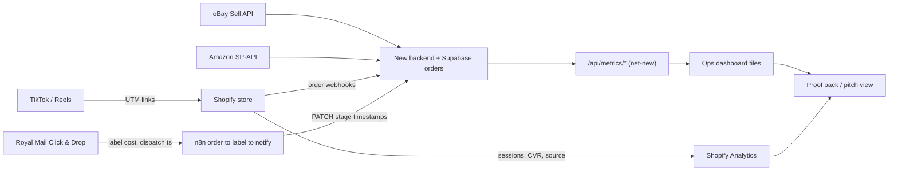

# Metrics & Proof

Defining what to measure across the 7 weeks and packaging it into undeniable evidence for the pitch.

> [!info]
> The measurement and evidence layer. It fixes the KPI set (revenue, units, margin, conversion, sessions-by-source, orders processed, time-per-order, dispatch SLA, error rate, content funnel), the exact plumbing that captures each number, realistic 7-week targets for a solo 17-year-old on a lean budget, and the "proof pack" you walk in with. Two headline proofs: a REAL store that took real money across eBay + Amazon + Shopify, and the **10x time-per-order** drop on the nightly grind. Metrics are computed by the new backend ([[01-system-architecture]]), rendered in the dashboard ([[04-ops-dashboard]]), and carry the close ([[09-the-pitch-pack]]).

---

## 1. The two numbers that win the deal

Everything else is supporting evidence. The pitch is carried by two proofs:

1. **It's real and it sells** — a live storefront ([[02-shopify-store]]) plus the existing eBay/Amazon channels, with orders unified into one queue and dispatched on real Royal Mail labels. Money in, parcels out.
2. **The 10x** — operator time-per-order on the nightly dispatch loop drops from minutes of manual hunting to seconds of one-click flow. This is the heart of the pitch: the dad keeps 75% for doing *far less* ([[00-north-star-and-pitch]]).

> [!tip]
> If you only get two screenshots in front of the dad, make them: (a) the sales/orders number with real money, and (b) the **before-vs-after time-per-order** bar. Hold both; cut everything else if you have to.

---

## 2. The KPI set

Four scoreboards. The first three prove the *business* works; the fourth (Ops) proves the *system* you're selling him.

### 2.1 Sales scoreboard

| KPI | Definition | Why it matters to the dad |
|---|---|---|
| Revenue (GBP) | Gross sales, all channels, 7-week total | Proof real money moved |
| Units sold | Count of items dispatched | Volume, not a one-off fluke |
| Average order value (AOV) | Revenue / orders | Mirrors his GBP 40-45 bundle economics |
| Orders | Distinct paid orders, deduped by `channel + channel_order_id` | The denominator for everything |
| Repeat / return rate | Orders from a returning buyer / orders | Hints at retention upside |

### 2.2 Margin scoreboard (the 25% lives here)

| KPI | Definition | Capture |
|---|---|---|
| COGS | Buy price of stock for units sold | `order_items.unit_cost_pence` x qty; cost set per SKU in `products` |
| Channel + payment fees | eBay/Amazon final-value fees, Shopify/Stripe fees | `orders.fees_pence`; pulled per order where the API exposes it, else estimated by channel rate |
| Postage cost | Royal Mail label cost per order | `orders.postage_pence` from the Click & Drop label response |
| **Net profit** | Revenue - COGS - fees - postage - ad spend | Derived field, computed by the backend metrics endpoint (net-new, see §4) |
| **Net margin %** | Net profit / revenue | The headline for the 25% deal in [[09-the-pitch-pack]] |

> [!warning]
> Net profit is the number the **25%-of-NET-profit deal** is built on — define it byte-identically here and in [[09-the-pitch-pack]] and [[00-north-star-and-pitch]] so there is zero ambiguity when you pitch. Revenue is *not* profit. Show the revenue-vs-profit gap explicitly so the dad sees you're being straight with him.

### 2.3 Funnel / traffic scoreboard

| KPI | Definition | Capture |
|---|---|---|
| Sessions | Visits to the Shopify store | Shopify Analytics |
| Sessions by source | Sessions split by channel (TikTok/Reels/organic/direct) | `utm_source` -> Shopify Analytics report |
| Conversion rate (CVR) | Orders / sessions | Shopify "Online store conversion rate" |
| Add-to-cart / reached-checkout | Funnel mid-steps | Shopify conversion funnel |

> [!warning]
> Funnel metrics only exist for the **Shopify** channel. eBay and Amazon do not expose session/CVR data, so this scoreboard covers the owned channel only — label it that way and never imply marketplace CVR.

### 2.4 Ops scoreboard — **the system you're selling**

| KPI | Definition | Target feel |
|---|---|---|
| Orders processed | Orders pulled into the unified queue and dispatched via the system | 100% of orders |
| **Time-per-order (before)** | Manual nightly loop (ask brother -> hunt order on eBay -> buy postage -> dispatch), measured per order | baseline minutes |
| **Time-per-order (after)** | Operator touch: order auto-lands -> pick/pack tick -> one-click label (tracking auto-pushed) | target seconds |
| **Time-saved ratio (the 10x)** | before / after | >= 10x |
| Dispatch SLA | % of orders labelled within the same working day of payment | >= 95% |
| Error rate | Failed syncs, mis-picks, label failures, mismatched tracking / orders processed | < 2% |
| Sync freshness | Minutes between a marketplace order being placed and appearing in the queue | < 15 min |

See [[04-ops-dashboard]] for the tiles that render these, and [[03-order-fulfilment-automation-n8n]] for the order -> label -> notify engine that writes the timestamps.

### 2.5 Content scoreboard (views -> clicks -> sales)

| KPI | Definition | Capture |
|---|---|---|
| Views / impressions | Per TikTok/Reel | Native platform analytics (manual log) |
| Engagement rate | (likes + comments + shares + saves) / views | Native analytics |
| Link clicks | Clicks on bio/link -> store | UTM landing hits in Shopify Analytics |
| Click-through to store | Clicks / views | Computed |
| Content-attributed orders | Orders carrying a content `utm_source/medium/campaign` | Shopify Analytics by UTM |
| Cost per acquisition (paid only) | Ad spend / attributed orders | Ad spend / orders |

Full content method and the Higgsfield pipeline live in [[05-content-and-ads-engine]] — link, don't duplicate.

---

## 3. The 10x: exactly how time-per-order is measured

The most contestable number, so make it bulletproof and **honest**.

### 3.1 Establish the "before" baseline (Week 1)

- [ ] Time the dad's real nightly loop with a stopwatch for one batch (or have him estimate per the four steps). Record per-order seconds, not a vague "couple hours".
- [ ] Break it into the four real steps so it's credible: (1) ask brother what's packed, (2) hunt each order on eBay, (3) buy Royal Mail postage, (4) dispatch + mark sent.
- [ ] Store the baseline as `BASELINE_SECONDS_PER_ORDER` in the backend `config.py` `Settings` (env-overridable), labelled in the UI as "measured manual baseline".

> [!warning]
> Net-new measurement. Nothing in the reused L&D stack tracks fulfilment time. The "after" timing must be **instrumented in the new backend** — the n8n workflow ([[03-order-fulfilment-automation-n8n]]) PATCHes the order row at each stage transition.

### 3.2 Capture the "after" automatically

Stamp every order as it moves through the system. These columns live on the normalized `orders` table (idempotent, deduped by `channel + channel_order_id`) and become the dispatch-SLA and time-saved evidence:

```text
order_placed_at    -> from channel webhook (Shopify) / poll (eBay Sell, Amazon SP-API)
queued_at          -> row upserted into the unified orders table
packed_at          -> brother ticks the pick/pack item (dashboard PATCH)
label_created_at   -> Royal Mail Click & Drop label returned
dispatched_at      -> auto-marked dispatched + tracking pushed back to the channel
```

```python
# operator-touch time per order, "after" — derived in the backend metrics endpoint (net-new)
active_seconds = (label_created_at - queued_at).total_seconds()  # human-touch window
time_saved_x   = settings.BASELINE_SECONDS_PER_ORDER / median(active_seconds_all_orders)
```

> [!tip]
> Compare **operator-touch time**, not wall-clock. The fair "after" number is the human seconds spent per order (queue lands -> click label), because the dad's "before" was also human seconds. Use the **median** across all real orders so one weird order can't skew it, and always quote the sample size ("median across N real orders").

### 3.3 Present it three ways

- [ ] A single ratio: "**Nx faster per order**".
- [ ] A before/after bar (manual baseline vs system median).
- [ ] A short screen-recording: order lands -> pick list -> one click -> label + tracking pushed, timed on-screen.

---

## 4. How each metric is captured (the plumbing)

> [!warning]
> Net-new: the `GET /api/metrics/*` endpoints below do **not** exist yet. They are part of this build — FastAPI routes on the new backend ([[01-system-architecture]]), behind the same auth as the rest of the ops API (no anonymous metrics, no raw exceptions leaked). They read the Supabase `orders` / `order_items` / `products` tables via the hand-rolled PostGREST client; they do not call marketplace APIs at request time.



| Metric family | Source of truth | Path to the number |
|---|---|---|
| Sessions, CVR, sessions-by-source | **Shopify Analytics** (owned channel only) | Native dashboard + saved report split by `utm_source` |
| Revenue, units, orders, AOV | **Supabase `orders` / `order_items`** | `GET /api/metrics/sales`; deduped across channels; cross-check Shopify for the owned channel |
| COGS, fees, postage, net profit/margin | **Supabase rows + per-SKU cost + label cost** | `GET /api/metrics/margin` |
| Orders processed, time-per-order, SLA, error rate, sync freshness | **Backend stage timestamps** | `GET /api/metrics/ops` |
| Content views/engagement | **Native TikTok/Reels analytics** | Screenshot + logged manually into a content tab |
| Clicks -> store, content-attributed orders | **UTMs -> Shopify Analytics** | `utm_source/medium/campaign` on every link |

> [!warning]
> UTMs are the only thread linking content -> sales. A link sent **without** a UTM makes that order unattributable and breaks the content scoreboard. Make "no UTM, no post" a hard rule ([[05-content-and-ads-engine]]).

### Acceptance criteria — capture layer

- [ ] Every outbound content/ad link carries a complete UTM (`source`, `medium`, `campaign`).
- [ ] Shopify Analytics shows a working sessions-by-source split and a non-null conversion rate.
- [ ] The `orders` table enforces uniqueness on `(channel, channel_order_id)` so re-polling never double-counts.
- [ ] All five stage timestamps populate for >= 95% of real orders; the n8n workflow PATCHes each transition.
- [ ] `BASELINE_SECONDS_PER_ORDER` is set from a real measurement and rendered labelled "measured manual baseline".
- [ ] `GET /api/metrics/sales|margin|ops` return revenue, units, orders, AOV, net profit, net margin, median operator time-per-order, SLA %, error rate, and sync freshness — each behind auth, each surfaced as a dashboard tile ([[04-ops-dashboard]]).
- [ ] Numbers reconcile: dashboard revenue/orders match Shopify + marketplace records within a small rounding tolerance (spot-checked).

---

## 5. Realistic 7-week targets (solo, 17, lean budget)

Honesty beats hype — a small but **real** number with a working system out-pitches a big fake one. Stretch-but-believable for a stand-in product (a small, postable item mirroring the dad's fulfilment) with organic-first content.

| KPI | 7-week target | Floor (still a win) |
|---|---|---|
| Real paid orders | 15-30 | >= 5 (proves the loop end-to-end) |
| Revenue | GBP 300-800 | >= GBP 100 |
| AOV | GBP 20-45 (mirror the bundle) | — |
| Net margin % | 30-45% | clearly positive |
| Store conversion rate (Shopify) | 1.5-3% | >= 1% |
| Sessions (Shopify, organic-led) | 1,000-3,000 | >= 300 |
| **Time-saved ratio** | **>= 10x** | **>= 5x and clearly demonstrated** |
| Dispatch SLA (same-day) | >= 95% | >= 90% |
| Error rate | < 2% | < 5% |
| Content posts shipped | 20-40 lo-fi clips | >= 10 |
| One break-out clip | 1 clip > 10k views | — |

> [!tip]
> The proof bar is **"real, repeatable, faster"**, not "big". Five real orders dispatched through the unified queue with a measured 10x and a clean dashboard beats a hypothetical with no system behind it. Frame any modest sales number as: "week-one traction on a stand-in product with zero ad budget — imagine it on your proven product."

> [!warning]
> Budget reality: organic content is the volume driver; paid is a small test on proven winners only. Higgsfield is credit-lean (start with one preview). Do not set targets that assume an ad budget you don't have ([[05-content-and-ads-engine]]).

### Acceptance criteria — targets

- [ ] Each target above has a live tile in [[04-ops-dashboard]] showing current vs target.
- [ ] The "floor" column is treated as the genuine pass/fail line for the pitch.
- [ ] At least one full week of data exists before the pitch so trends (not just totals) can be shown.

---

## 6. The proof pack (what you walk in with)

Tangible artefacts assembled from this note's metrics; *used* in [[09-the-pitch-pack]].

### 6.1 Live demo (in the room)

- [ ] Open the real Shopify store on your phone and **place or show a real order**.
- [ ] Watch it land in the unified queue live, generate a pick/pack list, click **one** Royal Mail label, and show tracking auto-pushed — all timed on screen.
- [ ] Keep a recorded backup of the flow in case the venue Wi-Fi is bad.

### 6.2 The numbers (one screen)

- [ ] A single dashboard "pitch view": revenue, units, orders, net profit & margin, CVR, sessions-by-source, time-saved ratio, dispatch SLA, error rate.
- [ ] The **before-vs-after time-per-order** bar with the headline "Nx faster".

### 6.3 Screenshots / exhibits (printed + on phone)

- [ ] Shopify Analytics: sessions, conversion rate, sales.
- [ ] Orders queue showing real eBay + Amazon + Shopify orders unified in one place.
- [ ] A real Royal Mail Click & Drop label + tracking pushed back to the buyer.
- [ ] A buyer-facing dispatch/tracking notification.
- [ ] The top clip's analytics -> the UTM clicks -> the attributed order (the full views->clicks->sales chain in one strip).
- [ ] The margin breakdown (revenue -> COGS -> fees -> postage -> **net profit**) that the 25% sits on.

### 6.4 The narrative one-pager

- [ ] One page: "Here's the same nightly job, but Nx faster, it runs itself, and it already took real money. You keep 75% for doing less." Numbers + the two headline screenshots. Hand it to the dad to keep.

> [!tip]
> Make the proof pack a **saved dashboard view + an exported PDF/screenshot bundle**, not something you rebuild by hand the night before. One click to refresh the pitch view = you re-pull fresh numbers the morning of the meeting.

### Acceptance criteria — proof pack

- [ ] A dedicated "pitch view" exists in [[04-ops-dashboard]] containing every KPI in §2.
- [ ] The live demo runs end-to-end on real data with a recorded fallback.
- [ ] Every claim in [[09-the-pitch-pack]] traces to a metric defined in this note (no orphan claims).
- [ ] The before-vs-after time figure is reproducible from stage timestamps, not asserted.
- [ ] All money figures reconcile with Shopify + marketplace records.
- [ ] The margin -> net-profit exhibit uses the exact same `net profit` definition as the 25% deal.

---

## 7. Anti-vanity guardrails

> [!warning]
> Vanity metrics (raw views, follower counts, total page loads) **do not win this pitch** and can make you look naive. Lead with real orders, net profit/margin, the 10x time-saved, and dispatch SLA. Views only count once chained through to clicks and attributed sales.

- [ ] No metric enters the proof pack unless it is (a) money, (b) the 10x/SLA, or (c) a content number with the full views->clicks->sales chain attached.
- [ ] Every headline number states its sample size and time window ("median across N orders over W weeks").
- [ ] Where data is estimated (e.g. a channel fee), label it an estimate — credibility over polish.
