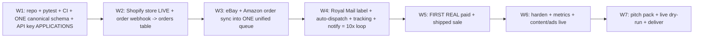

# 7-Week Timeline

The week-by-week build plan, dependencies, and critical path to a pitch-ready proof-of-concept.

> [!info]
> Seven weeks, solo, around school (~12–15 hrs/week). Front-loads PROOF: Shopify store live (W2), the order→pick/pack→Royal Mail label→dispatch→notify loop working end-to-end (W4), and a first REAL paid+shipped sale (W5). Weeks 6–7 are hardening, metrics, content/ads, and the pitch pack. The critical path runs through marketplace/Royal Mail API access → order ingestion → dispatch automation, so every slow external application is filed in Week 1.

## How to read this note
- Each week has **Goals**, **Tasks** (`- [ ]`, linked to the owning note), a **Done when** bar, and a **Dependency / critical-path** call-out.
- This note is the *schedule*. The *how* lives in the sibling notes — follow the links, don't re-read build steps here:
  [[00-north-star-and-pitch]] · [[01-system-architecture]] · [[02-shopify-store]] · [[03-order-fulfilment-automation-n8n]] · [[04-ops-dashboard]] · [[05-content-and-ads-engine]] · [[06-agents]] · [[07-metrics-and-proof]] · [[09-the-pitch-pack]] · [[10-claude-code-handoff]].

> [!warning] Solo + school reality
> Assume ~2–3 focused hrs on weeknights plus one longer weekend block (~12–15 hrs/week). The plan is sequenced so the **slow, external, can't-be-rushed** items — eBay Sell API keyset, Amazon SP-API app review, Royal Mail Click & Drop API onboarding, sourcing a postable demo product, and landing a first real customer — start as early as possible. If a week slips, protect the critical path and push content/polish, never the proof.

---

## Critical path (the spine — everything else flexes around this)

> [!warning] The three things that can sink the timeline (mitigate from Day 1)
> 1. **Marketplace API access is gated and slow.** The eBay Sell API keyset and especially **Amazon SP-API** (developer registration + app review) can take days–weeks. Both are **net-new — no credentials exist on the machine**. Apply in **Week 1**, before any order-sync code. See [[01-system-architecture]].
> 2. **Royal Mail Click & Drop API onboarding** (account + API key) is the dispatch linchpin and is **net-new**. Start it Week 1; if the API stalls, fall back to **Click & Drop CSV bulk import** (defined in [[03-order-fulfilment-automation-n8n]]) so the 10x demo still ships in Week 4.
> 3. **A real sale needs a real, postable demo product in stock.** Source the stand-in item (small, postable, mirrors the dad's buy-cheap/pack/post flow — the bulky steam cleaner is RETIRED) in Week 1 so it's listable and dispatchable by Week 5. See [[02-shopify-store]] and [[00-north-star-and-pitch]].

---

## Week 1 — Foundations, credentials, and the canonical base

**Goals:** Stand up the **new** backend repo on the proven L&D *stack* (not its business logic) with **pytest + CI from the first commit**, land **one canonical DB schema** that builds clean on a fresh DB, and file every slow external application so those clocks start now.

- [ ] Create the **new backend repo** (FastAPI, Python 3.11 + hand-rolled httpx PostgREST client over Supabase + APScheduler + `safety.py` spend-cap/kill-switch) — lift the *patterns*, none of the L&D preview/outreach logic. Repo layout in [[10-claude-code-handoff]], stack rationale in [[01-system-architecture]].
- [ ] Add **pytest** + a **GitHub Actions CI workflow** (lint + tests on every PR, block merge on red) on commit #1 — this build handles real orders and money, and the old platform had no tests/CI. See [[01-system-architecture]] and [[10-claude-code-handoff]].
- [ ] Write the **single canonical schema file** — `channels`, `orders`, `order_items`, `skus`, `inventory`, `shipments` — with the idempotent dedupe constraint `UNIQUE (channel, channel_order_id)` on `orders`. One file, run once in Supabase (fixes the old split-schema bug where a fresh build errored). Field-level spec in [[01-system-architecture]].
- [ ] Implement **auth on every endpoint** + **safe error handling** (no raw exceptions in 500 bodies) as baseline middleware *before* any feature code — both are inherited bugs from the old platform. See [[01-system-architecture]].
- [ ] Deploy the empty-but-healthy backend to **Railway** and provision the **Supabase** Postgres DB; confirm `GET /health` returns green and CI auto-deploys on merge.
- [ ] **Apply for the eBay Sell API** developer keyset (sandbox + production). NET-NEW. See [[01-system-architecture]].
- [ ] **Register for Amazon SP-API** (developer profile + app registration → review). Longest lead time — file it first. NET-NEW. See [[01-system-architecture]].
- [ ] **Open/claim the Royal Mail Click & Drop account** and request **Click & Drop API access**; note CSV bulk-import as the documented fallback. NET-NEW. See [[03-order-fulfilment-automation-n8n]].
- [ ] **Source the demo product** (small, postable, mirrors the dad's fulfilment; steam cleaner retired) and confirm supplier + unit economics (buy vs sell, postage, fees). See [[02-shopify-store]] and [[00-north-star-and-pitch]].
- [ ] **Revive n8n** (Cloud, fresh instance — the old `~/.n8n` workflows are dormant) and confirm **Higgsfield** MCP access with a one-credit preview budget, so both are ready when needed. See [[03-order-fulfilment-automation-n8n]] and [[05-content-and-ads-engine]].

> [!tip] Start the slow clocks first. The three API approvals and a physical demo product are the only things you genuinely cannot speed up later. Every "apply"/"source"/"register" line is on the critical path even though no code depends on it yet — file them on Day 1, then build while they bake.

> [!warning] Net-new this week: the entire repo, the canonical schema, all order/inventory/SKU/shipment tables, and the eBay/Amazon/Royal Mail accounts. Only the FastAPI + `safety.py` + dashboard *patterns* are reused — the screw business is greenfield (zero code, zero credentials).

**Done when:** the new repo is live on Railway + Supabase with **green CI** and a passing smoke test; the **one** canonical schema applies to a **fresh** DB with no errors; auth + safe-500 middleware are in place; and the eBay, Amazon, and Royal Mail applications are **submitted with reference numbers**, demo-product sourcing confirmed.

---

## Week 2 — Storefront LIVE + first order signal

**Goals:** Turn the existing blank Shopify Basic store ("My Store", GBP/UK) into a **real, can-take-orders storefront** for the demo product, and prove **order ingestion** by receiving a live Shopify order webhook into the unified `orders` table. First piece of visible proof.

- [ ] Build the **Shopify storefront**: product page, SKUs, payments via Shopify checkout, brand basics, CRO essentials — full spec in [[02-shopify-store]].
- [ ] Register the **Shopify `orders/create` webhook → backend** and write `POST /api/orders/ingest` (Shopify adapter) that normalizes the payload into `orders` + `order_items` with the `UNIQUE (channel, channel_order_id)` dedupe. See [[03-order-fulfilment-automation-n8n]] and [[01-system-architecture]].
- [ ] Place a **real low-value checkout** through the live store and confirm it lands **exactly once** (no dupes) in `orders`.
- [ ] Stand up the **ops dashboard shell** (React 18 + Vite 5 + shared axios client) on **Vercel** with **auth**, plus a read-only **orders queue** view fed by the table. See [[04-ops-dashboard]].
- [ ] Scaffold the **Stripe checkout + signature-verified webhook** pattern (copied from L&D) for any direct/off-Shopify order path — wire it only if needed; Shopify checkout is the owned default. See [[01-system-architecture]] and [[02-shopify-store]].
- [ ] Load the **demo product's real inventory** into `skus` + `inventory`; confirm it is in stock and listable.

> [!warning] Net-new: the storefront content, the `/api/orders/ingest` endpoint, and the orders schema are built from scratch. Only the FastAPI/dashboard *patterns* and the Shopify store *shell* pre-exist (the shell is blank).

**Done when:** the Shopify store is **publicly live** and takes a real payment for the demo product; a real checkout produces **exactly one** normalized row in `orders`; and that order is visible in the dashboard orders queue.

---

## Week 3 — Multi-channel order sync into ONE queue

**Goals:** Bring **eBay** and **Amazon** orders into the same unified queue as Shopify — normalized and deduped — via the **Order-Sync agent**. This proves the "all channels → one queue" half of the 10x story (the priority is *syncing orders from* the marketplaces, not migrating off them).

- [ ] Wire the **eBay Sell API** order pull (`getOrders` / Fulfillment API, assumes keyset granted in W1) → normalize into `orders`. See [[03-order-fulfilment-automation-n8n]].
- [ ] Wire the **Amazon SP-API** order pull (Orders API `getOrders`, assumes access granted) → normalize into `orders`. If SP-API is still in review, **ship eBay + Shopify** and treat Amazon as a drop-in fast-follow. See [[03-order-fulfilment-automation-n8n]] and the buffer note.
- [ ] Build the **Order-Sync agent** on the APScheduler + `safety.py` pattern: scheduled poll, idempotent writes, rate-limit aware. See [[06-agents]].
- [ ] Verify **idempotent dedupe across all three channels** — the same order pulled twice never creates a second row (`UNIQUE (channel, channel_order_id)`).
- [ ] Surface **channel + status** in the dashboard orders queue (filter by channel, by status). See [[04-ops-dashboard]].
- [ ] Build the **n8n orchestration skeleton**: a workflow that triggers on new-order and calls the backend (mirrors the L&D `/api/n8n/*` receiver pattern), wiring the visual layer Dylan wants. Nodes in [[03-order-fulfilment-automation-n8n]].

> [!tip] Keep the channel **adapter interface identical** across eBay/Amazon/Shopify so a stalled Amazon SP-API approval is a drop-in later — eBay + Shopify already make the multi-channel point with two.

> [!warning] Critical-path risk: this week assumes the W1 eBay/Amazon applications were granted. If not, do NOT block — proceed on the channels you have and slot the missing one in the moment access lands (even post-pitch).

**Done when:** orders from **at least two channels** (Shopify + eBay, Amazon as soon as access allows) flow automatically into one normalized, deduped queue on a schedule, visible and filterable in the dashboard.

---

## Week 4 — The 10x dispatch engine (the heart of the pitch)

**Goals:** Close the loop end-to-end — unified queue → **auto pick/pack list** for the brother → **one-click Royal Mail label** → **auto-mark dispatched + push tracking back to the channel + notify the buyer**. This loop *is* the pitch (replaces the dad's manual nightly grind).

- [ ] Build the **pick/pack list** view/export grouped for the packer (the brother). See [[04-ops-dashboard]] and [[03-order-fulfilment-automation-n8n]].
- [ ] Integrate the **Royal Mail Click & Drop API** to generate a label from an order in one click — **CSV bulk-import fallback** if the API isn't live yet. Build the **Dispatch/Label agent** (APScheduler + `safety.py`). See [[03-order-fulfilment-automation-n8n]] and [[06-agents]].
- [ ] On label creation: **auto-set the order to dispatched**, write the carrier `tracking_number` to `shipments`, **push tracking back** to the originating channel (eBay Fulfillment / SP-API shipment confirmation / Shopify fulfilment), and trigger the **Customer-Comms** buyer notification. See [[06-agents]] and [[03-order-fulfilment-automation-n8n]].
- [ ] Orchestrate the full **order → pack → label → notify** sequence in **n8n**, calling the backend at each step. See [[03-order-fulfilment-automation-n8n]].
- [ ] Add the **dispatch / labels** view to the dashboard (states: new → picked → labelled → dispatched, with tracking). See [[04-ops-dashboard]].
- [ ] Add **time-saved instrumentation** — stage timestamps on each order — so [[07-metrics-and-proof]] can quantify the speed-up against the manual loop.
- [ ] **Record a clean screen-capture** of one order going new → dispatched + buyer notified in a few clicks — the demo asset for [[09-the-pitch-pack]].

> [!warning] This is THE proof. If only one thing works perfectly by end of W4, it must be this end-to-end loop on at least one channel + Royal Mail (API *or* CSV). Everything earlier exists to make this possible.

**Done when:** a single order goes from the unified queue to **packed → labelled → marked dispatched → tracking pushed back → buyer notified** with one-click labelling on an APScheduler/n8n-driven flow, captured on video as a repeatable demo.

---

## Week 5 — First REAL sale, end-to-end

**Goals:** Get a **genuine paying customer** through the live store (or a real marketplace listing of the demo product) and fulfil that real order with the Week-4 engine. Proof shifts from "works in a demo" to "took real money and shipped a real parcel."

- [ ] Publish the **demo product live for sale** on the owned Shopify store and, if practical, as a **real eBay listing** to exercise the marketplace path. See [[02-shopify-store]] and [[05-content-and-ads-engine]].
- [ ] Launch the **organic content push** (lo-fi, demo-led TikTok/Reels) with **UTM tracking → Shopify** to drive first real traffic. See [[05-content-and-ads-engine]].
- [ ] Fulfil the **first real order** through the unified queue → Royal Mail label → dispatched → tracking → buyer notified; confirm the **real Royal Mail tracking** updates.
- [ ] Capture the **proof artefacts**: real order screenshot, real label, dispatch confirmation, buyer notification — feed [[07-metrics-and-proof]] and [[09-the-pitch-pack]].
- [ ] Verify **margin maths on the real sale** (buy vs sell, postage, fees) so the deal economics in [[00-north-star-and-pitch]] are evidenced, not estimated.

> [!tip] A real sale can come from a friend/family buyer or a cold one — both prove the system takes money and ships. Don't gate W5 on going viral; **one** real, fully-fulfilled order is the bar.

**Done when:** at least **one real order has been paid for and fully dispatched** through the system (real Royal Mail tracking live, buyer notified), with screenshots and margin numbers captured.

---

## Week 6 — Harden, measure, and turn on content/ads

**Goals:** Make it robust and observable, finish the **metrics / time-saved** story, and get the **content/ads engine** producing winners so the pitch shows traction, not just plumbing.

- [ ] **Harden** the order/dispatch pipeline: retries, error states, edge cases (refunds, cancellations, out-of-stock); confirm `safety.py` spend-cap + kill-switch + channel caps behave. See [[01-system-architecture]] and [[06-agents]].
- [ ] Stand up the **Health/CEO heartbeat agent** and an **Analytics/Reporting agent** (daily snapshot). See [[06-agents]].
- [ ] Finish the **metrics dashboard**: orders, revenue, margin, and the headline **time-saved-per-night** vs the manual loop. See [[07-metrics-and-proof]] and [[04-ops-dashboard]].
- [ ] Build the **Higgsfield content pipeline** (hooks / b-roll / ad variants / hero images) and ship **organic-first** content; spin **paid variants of any organic winner**, credit-lean (start with one). See [[05-content-and-ads-engine]].
- [ ] Add the **Listing/Content agent** to assist listing copy/creative. See [[06-agents]].
- [ ] Run a **full multi-channel regression**: place test orders on every connected channel, fulfil each, confirm tracking + notifications + metrics all update.
- [ ] Expand **pytest coverage** on the money paths — order-ingest, dedupe, and dispatch. See [[10-claude-code-handoff]].

**Done when:** the pipeline survives a multi-channel regression run cleanly; the dashboard shows live revenue/margin/**time-saved**; and the content engine has shipped organic content with at least one tracked result to point at.

---

## Week 7 — Pitch pack, live dry-run, deliver

**Goals:** Package everything into a **walk-in-ready pitch**: the live system, the proof, the numbers, the deal terms, and a rehearsed delivery. Freeze the build — no risky changes this week.

- [ ] Assemble the **pitch deck + deal terms + objection handling + the close** — full content in [[09-the-pitch-pack]] (built on [[00-north-star-and-pitch]]).
- [ ] Lock the **proof reel**: the W4 dispatch demo + the W5 real-sale artefacts + the time-saved/margin numbers from [[07-metrics-and-proof]].
- [ ] Write the **deal one-pager**: **25% of NET profit** (precisely defined), the revenue-vs-profit trade-off, and **risk-reversal for the dad** (he keeps 75% for doing far less). See [[00-north-star-and-pitch]] and [[09-the-pitch-pack]].
- [ ] **Full live dry-run** of an order start-to-dispatch on the actual system (not a recording) so it can be shown live without surprises.
- [ ] Prepare a **safe live-demo path** (a known-good test order ready to fire) **and** a **recorded fallback** in case Wi-Fi/API hiccups on the day.
- [ ] Do **one rehearsed run-through** of the full pitch end-to-end (story → live demo → numbers → deal → close).

> [!warning] Code-freeze week. Only fix show-stoppers. A broken "improvement" the night before the pitch is the worst-case outcome — stability beats one more feature. (And: always fetch before any merge — a concurrent session can be pushing to main.)

**Done when:** the full pitch can be delivered end-to-end — live system demo + proof reel + real-sale evidence + a clear 25%-of-net deal with risk-reversal — rehearsed at least once, with a recorded fallback ready.

---

## Week 7 pitch-ready checklist (the "can I walk in?" gate)

- [ ] **Store live** and able to take a real order (owned Shopify store, demo product listed).
- [ ] **Multi-channel order sync** into one unified queue (Shopify + eBay; Amazon if access landed).
- [ ] **One-click dispatch demo** (queue → pick/pack → Royal Mail label → auto-dispatch → tracking pushed back → buyer notified) — live-runnable **and** recorded.
- [ ] **At least one real, paid, fully-dispatched sale** with real Royal Mail tracking and captured artefacts.
- [ ] **Time-saved metric** quantified vs the manual nightly loop (the 10x headline). See [[07-metrics-and-proof]].
- [ ] **Margin/economics** evidenced on a real sale (buy vs sell, postage, fees).
- [ ] **Content/ads** engine shown working with at least one tracked organic result. See [[05-content-and-ads-engine]].
- [ ] **Deal one-pager**: 25% of NET profit, defined, with the revenue-vs-profit trade-off and **risk-reversal**. See [[09-the-pitch-pack]].
- [ ] **System healthy** (Health/CEO agent green, `safety.py` caps active) and a **safe live-demo path + recorded fallback** ready.
- [ ] **Pitch rehearsed** end-to-end at least once.

---

## Buffer & risk note (realistic for solo + school)

> [!warning] Where the slack lives, and what to cut first
> - **No dedicated buffer week** — the buffer is *baked in* by front-loading proof (live store W2, dispatch demo W4, real sale W5) so Weeks 6–7 absorb slippage. If you're ahead, pull W6 hardening forward.
> - **If a week slips, protect the critical path** (store → order sync → dispatch → real sale). Cut/defer in this order: **paid ads → extra content polish → non-essential agents (Listing/Content, Analytics) → Amazon channel** (if SP-API is still stuck).
> - **Amazon SP-API is the most likely casualty.** The build is valid with **Shopify + eBay** alone — "many channels → one queue" is made with two. Keep the channel adapter interface identical so Amazon drops in whenever approval lands, even post-pitch.
> - **Royal Mail API risk** is covered by the **Click & Drop CSV bulk-import** fallback (defined in [[03-order-fulfilment-automation-n8n]]) — the 10x demo ships in W4 either way.
> - **Real-sale risk:** if cold traffic is slow, a friend/family purchase still proves the money-and-ship loop. Don't let "needs to be a stranger" delay the proof.
> - **School crunch / exam weeks** land where they land — flag them on this timeline and shift *content/polish*, never the critical-path weeks. ~12–15 hrs/week is the planning assumption; a bad week means you ship that week's **Done when** minimum and nothing extra.

## Acceptance criteria (for this timeline as a plan)
- [ ] Every week has explicit **Goals**, **Tasks**, and a binary **Done when** bar.
- [ ] The **critical path** is stated and proof is front-loaded (store W2, dispatch demo W4, real sale W5).
- [ ] Every slow external dependency (eBay, Amazon, Royal Mail, demo product) is **filed/started in Week 1**.
- [ ] Each net-new or risky item is flagged with a fallback (`> [!warning]` / `> [!tip]`).
- [ ] The plan is **achievable solo around school** (~12–15 hrs/week) with a defined cut-order if a week slips.
- [ ] Tasks **link** the owning sibling note and **do not duplicate** its build detail.
- [ ] All `[[wikilinks]]` resolve to exact manifest filenames; no reference to removed assets (OpenClaw/Baz, the retired steam cleaner).
