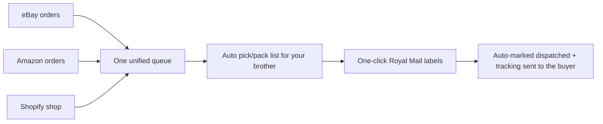
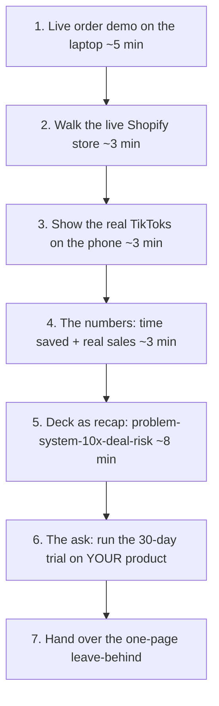

# The Pitch Pack

The deck, deal terms, objection handling and delivery plan to close the dad on letting Dylan run and automate his business for 25% of net profit.

> [!info]
> This is the closing document: a slide-by-slide deck, the exact deal (25% of NET profit), objection handling, and how to deliver it live (dashboard + store + TikToks + numbers + a one-page leave-behind). It assembles proof built elsewhere — it does not rebuild it. The mission and deal-at-a-glance live in [[00-north-star-and-pitch]]; the numbers in [[07-metrics-and-proof]]; the system across [[01-system-architecture]] and [[03-order-fulfilment-automation-n8n]].

---

## How this note fits

This is the last note. It assembles the proof built everywhere else into one ~20-minute pitch. Do not rebuild the numbers or the architecture here — pull them in:

- The mission, the deal at a glance, value-to-the-dad: [[00-north-star-and-pitch]]
- The live demo store you'll show: [[02-shopify-store]]
- The 10x order to label to notify engine (the centrepiece): [[03-order-fulfilment-automation-n8n]]
- The dashboard you'll screen-share: [[04-ops-dashboard]]
- The TikToks/ads and real sales: [[05-content-and-ads-engine]]
- Every metric quoted in the deck: [[07-metrics-and-proof]]
- When this pitch happens (end of Week 7): [[08-seven-week-timeline]]
- The system handover promised on exit: [[10-claude-code-handoff]]

> [!warning] Net-new
> The whole pitch event is net-new — there is nothing to inherit. Deck, leave-behind and deal sheet must be authored fresh. Do NOT reuse any L&D Designs sales material: that was a website sold to a tradesman for a fixed price; this is one person, a family member, a product business, a profit-share. Different audience, different offer, different document.

---

## The one-sentence pitch (say this first, memorise it)

> "I rebuilt your business on a system that takes your nightly dispatch grind down to about ten minutes, I've already had it taking real orders on a test product — here's it running live — and I want to run the whole thing for you for 25% of the profit. You keep 75% and do less."

Everything in the deck exists to make that sentence believable.

---

## Pitch framing rules (tone + staging)

> [!tip] This is a family pitch, not a boardroom
> The dad is not a startup investor. He's a guy with a ~£2k/month side-business he won't grow himself, and Dylan is his daughter's 17-year-old boyfriend. Wins are: low-risk, he keeps control, he does less, he loses nothing if it flops. Lead with the live demo, not slides.

- **Show, then tell.** Open the laptop and run a real order through the live system before slide 1. Proof first, narrative second.
- **Plain English.** No "API", "ingestion", "idempotent", "SP-API". Say "all your orders land in one place automatically".
- **Make the maths his, not yours.** Frame 25% as "you were going to do all this work for 100% of a business you've capped at ~£2k — now you do almost none of it and keep 75% of a bigger number."
- **Never oversell the figures.** Use the real numbers from [[07-metrics-and-proof]]. If real sales are small, say so and lean on the time saved and the system, which are undeniable.
- **De-risk everything.** Every claim is paired with "and if it doesn't work, here's what you lose: nothing."

---

## Part 1 — The deck (slide by slide)

10 slides + 1 backup section. Target 8–12 minutes of slides *after* the live demo. Each slide has: the headline on screen, what Dylan says, and what to show.

> [!tip] Build the deck with the slides skill
> Render as a clean HTML/Chart.js deck (the `slides` / `design` skill — dark, minimal, one big number per slide). Charts pull the exact figures from [[07-metrics-and-proof]]. Export to PDF for the leave-behind. One idea per slide — he's reading it on a sofa, not a projector.

### Slide 0 — LIVE DEMO (no slide; do this before opening the deck)
- **On screen:** the actual ops dashboard ([[04-ops-dashboard]]) and the live Shopify store ([[02-shopify-store]]).
- **Dylan says:** "Before I show you anything, watch this. I'm going to place an order on a real shop I built, and you'll see it turn into a posted parcel."
- **Do:** place a live test order → it lands in the unified queue → generate the pick/pack list → one-click Royal Mail label → buyer gets tracking. Narrate the old way alongside it. (Full script in Part 4.)
- **Why first:** it earns the right to everything else. If the live demo lands, the deal is half-closed before slide 1.

### Slide 1 — The problem (his nightly grind)
- **Headline:** "Every night, you do this by hand."
- **On screen:** the current loop — *ask brother what's packed → hunt the orders on eBay → buy Royal Mail postage → mark dispatched → repeat.*
- **Dylan says:** "Right now every order is manual. You ask your brother what he's packed, you go find those orders on eBay one by one, you buy the postage, you mark them sent. Across eBay and Amazon. Every single night. That's the bit that caps the whole business — you can't sell more than you can hand-dispatch."
- **Goal:** he nods. This is his pain, named precisely.

### Slide 2 — Why it stays small
- **Headline:** "The admin is the ceiling."
- **On screen:** "~£2k/month — capped by hands, not demand." A single bar that stops at a wall labelled *manual dispatch*.
- **Dylan says:** "It's not that there's no demand. It's that more orders means more hours of this every night, so you've parked it at about two grand a month. The work scales, the profit doesn't."
- **Goal:** he agrees the bottleneck is fulfilment time, not the product.

### Slide 3 — What I built (the system, one picture)
- **Headline:** "One system. All channels in, parcels out."
- **On screen:** the architecture-lite diagram (a friendly version of the mermaid in [[01-system-architecture]]):

- **Dylan says:** "I rebuilt the whole thing as one system. Every order from eBay, Amazon and a proper shop I built you all lands in one place automatically. It prints your brother a pick list, you click once for the Royal Mail label, and it tells the customer it's on the way — automatically. No hunting, no copy-paste."
- **Cross-ref:** detail lives in [[03-order-fulfilment-automation-n8n]] — don't read it out, just point that the engine is built and running.

### Slide 4 — The 10x (the money slide)
- **Headline:** "[X] mins a night → [Y] mins a night."
- **On screen:** two bars side by side — *Before* vs *After* — sourced from the time-saved measurement in [[07-metrics-and-proof]]. Under it: "≈ [Z] hours/week back."
- **Dylan says:** "This is the whole pitch in one number. The nightly grind goes from about [X] minutes to about [Y]. Same orders, a fraction of the work — and now nothing stops you taking more orders."
- **Goal:** this is the slide he remembers. Make the number real and conservative.

> [!warning] Use measured numbers only
> The before/after figures are placeholders ([X]/[Y]/[Z]). Replace every bracketed value with the timed before/after from [[07-metrics-and-proof]] before the meeting. If you only have an estimate, say "about" and show your working — never present a guessed figure as measured.

### Slide 5 — Live proof (it's real, it took money)
- **Headline:** "This isn't a mock-up. It's live."
- **On screen:** the real Shopify store URL, a real order screenshot, a real Royal Mail label, and the sales/UTM numbers from [[05-content-and-ads-engine]] and [[07-metrics-and-proof]].
- **Dylan says:** "I didn't just design slides. I built a working shop on a test product, posted a couple of TikToks, and it's actually taken real orders and posted them through this system. Small numbers — it's a 7-week test on a stand-in product — but it works end to end with real money."
- **Goal:** kill the "nice idea, but would it actually work" objection with evidence.

> [!warning] Demo product is a stand-in, not the dad's product
> The demo runs on a small, postable item that MIRRORS the dad's fulfilment (the bulky steam cleaner is retired). Never imply the test sales are his product or his market — the whole power of Slide 9 is "now imagine this on *yours*, where the demand already is."

### Slide 6 — The content engine (free reach)
- **Headline:** "And I make the videos that bring the orders."
- **On screen:** thumbnails of the real TikToks/Reels + a tiny views to clicks to orders funnel (from [[05-content-and-ads-engine]]).
- **Dylan says:** "Half the reason it stays small is nobody's marketing it. I run a content engine — lo-fi demo videos, AI-generated ad variants — that drives traffic to the shop. Organic first, then I put money behind whatever's already working. That's growth you're not doing today, and I do it."
- **Goal:** show he gets growth, not just efficiency.

### Slide 7 — The deal
- **Headline:** "I run it. You keep 75%."
- **On screen:** the deal at a glance (the table from Part 2), big and simple.
- **Dylan says:** "Here's what I'm asking. I run the whole operation — orders, dispatch system, the shop, the marketing. You and your brother keep doing the packing and the supplier side. I take 25% of the net profit. You keep 75% — for doing a lot less than you do now."
- **Goal:** state the number plainly and immediately move into risk-reversal (next slide) so the 25% never sits there unanswered.

### Slide 8 — Risk-reversal (what he loses if it flops: nothing)
- **Headline:** "If it doesn't work, you lose nothing."
- **On screen:** four guarantees as tick-boxes (full version in Part 3):
  - You fund nothing up front — I build it on my own time.
  - 25% only comes out of profit — no profit, I get paid nothing.
  - 30-day trial, then either of us can walk, no hard feelings.
  - Everything stays in your accounts and your name — you own it all.
- **Dylan says:** "And the whole thing is built so you can't lose. You don't pay me a wage, you don't fund the build. I only get paid when you get paid. We do 30 days, and if you don't like it, you keep everything I built and we shake hands. It's your eBay, your Amazon, your shop, your bank — always."
- **Goal:** remove every reason to say "let me think about it." This slide does the heavy lifting.

### Slide 9 — The ask / the close ("imagine this on YOUR product")
- **Headline:** "You just watched this on a stand-in product. Now picture it on yours."
- **On screen:** split — left: the test product running through the system; right: a placeholder for *his* product/logo in the same dashboard.
- **Dylan says:** "Everything you saw tonight, I built in a few weeks on a product I picked to prove it. Imagine it pointed at your product, your suppliers, your brand — where I already know the demand's there. Give me 30 days to plug your real business in. Worst case you get a free system and a few videos. Best case we both make a lot more than two grand a month. Shall we run the 30 days?"
- **Goal:** a clear, low-stakes yes/no. The ask is "30-day trial", not "sign your business over."

### Backup slides (only if asked — don't present)
- **B1 — Net profit, defined:** exactly what's deducted before the split (the worked example in Part 2).
- **B2 — Revenue vs profit:** why 25% of profit is fairer to him than 25% of revenue (the comparison in Part 2).
- **B3 — How it's secured:** "your accounts, your access, I never own your money" (security model in [[01-system-architecture]]).
- **B4 — The 7-week build:** what got done and when (summary of [[08-seven-week-timeline]]).
- **B5 — What you keep on exit:** the code, dashboard and a plain-English runbook are yours (handover in [[10-claude-code-handoff]]).

---

## Part 2 — The deal terms (define 25% precisely)

> [!info]
> Recommendation: 25% of NET profit, paid monthly, after a 30-day trial. The dad funds stock/ads/fees; Dylan funds his own time and builds. Everything stays in the dad's accounts. Either side can exit clean. This section is the spec behind slides 7–8 and backup B1–B2.

### The recommendation, in one line
**Dylan takes 25% of monthly NET PROFIT. The dad keeps 75% and funds the business inputs (stock, ads, fees). Dylan funds his own labour and the build.**

### Why NET profit, not revenue (recommend net — and here's the honest reason)

> [!warning] Revenue-share would quietly punish the dad — don't propose it
> On bundles bought at ~£20 and sold at ~£40–45, the margin is roughly half. A revenue share takes a cut before costs, so on a thin month it can eat the dad's actual profit. Net-profit share means Dylan only earns when the business earns. It's the version the dad should prefer — so propose it, and explain why it's better for him. That builds trust.

**Worked example (illustrative — replace with real figures from [[07-metrics-and-proof]]):**

| | 25% of REVENUE | 25% of NET PROFIT *(recommended)* |
|---|---|---|
| Monthly sales (revenue) | £2,000 | £2,000 |
| Cost of stock (~50%) | –£1,000 | –£1,000 |
| Marketplace + payment fees (~15%) | –£300 | –£300 |
| Ads / postage / other | –£100 | –£100 |
| **Net profit** | **£600** | **£600** |
| **Dylan's cut** | £500 (25% of £2,000) | **£150** (25% of £600) |
| **Dad keeps** | £100 | **£450** |
| Dad's effective share of *profit* | 17% | **75%** |

- Under revenue share the dad nets **£100** and Dylan takes **£500** — absurd and trust-destroying.
- Under net-profit share the dad keeps **£450** of his **£600** profit — genuinely 75/25.
- **Say this out loud:** "I could've asked for a slice of the sales, but that'd be taking money before your costs are even covered. I only want a cut of the actual profit — so I only win when you win."

### What counts in "net profit" (define it so there's no argument later)

**Net profit = total sales received − (cost of stock + marketplace/platform fees + payment processing fees + shipping/postage + ad spend + the lean software/hosting cost for the ops).**

- [ ] **Sales received** = money actually landed from eBay, Amazon and Shopify (after refunds/chargebacks), not gross listings.
- [ ] **Stock** = what the dad pays the supplier for the screws/fasteners + packing materials.
- [ ] **Fees** = eBay/Amazon final-value fees, Shopify + Stripe processing fees.
- [ ] **Shipping** = Royal Mail postage actually paid (Click & Drop).
- [ ] **Ads** = any paid TikTok/Meta spend (see [[05-content-and-ads-engine]]) — only spent with the dad's say-so.
- [ ] **Software** = the lean monthly running cost (Railway + Supabase + n8n Cloud + domain) — keep this tiny and transparent (see [[01-system-architecture]]).
- [ ] **NOT deducted:** Dylan's time/labour (that's what the 25% pays for) and the dad's/brother's own packing time.
- [ ] The dashboard ([[04-ops-dashboard]]) shows revenue, costs and margin live, so "net profit" is a number on a screen both can see — the split is computed from real data, not a handshake guess.

### Who funds what

| Item | Who pays | Note |
|---|---|---|
| Stock from supplier | **Dad** | His existing supplier relationship; his cash flow. |
| Packing materials | **Dad** | Pennies; folds into stock cost. |
| Marketplace/Stripe fees | **Dad** (from the business) | Comes out before the split anyway. |
| Royal Mail postage | **Dad** (from the business) | Pre-split cost. |
| Ad spend | **Dad** (capped, agreed) | Only spent on proven winners; Dylan never spends the dad's money without a yes. |
| Software/hosting (lean) | **Dad** (from the business) | Railway + Supabase + n8n Cloud + domain — kept minimal, see [[01-system-architecture]]. |
| **The build + all the work + content** | **Dylan** | His 25% pays for this. Dad pays Dylan nothing as a wage. |

> [!tip] Cash-flow framing for the dad
> "You're already paying for stock and postage today — that doesn't change. The only new spend is a few quid of hosting and any ad money you approve. You never write me a cheque — my cut comes out of profit at the end of the month."

### Payment cadence
- [ ] **Monthly settlement.** At month-end the dashboard produces the profit figure; Dylan invoices/takes 25% of that month's net profit.
- [ ] **Profit first, pay second** — Dylan is paid after costs are covered, so the business is never in the red because of his cut.
- [ ] **Loss months = £0 to Dylan.** No profit, no payment. No clawback against the dad.
- [ ] One shared monthly P&L view (from [[04-ops-dashboard]]) is the single source of truth — both look at the same screen.

### Trial period
- [ ] **30-day trial**, starting the day the dad's real business is plugged in.
- [ ] Success bar for the trial = the metrics in [[07-metrics-and-proof]] (e.g. dispatch time per order down materially; orders flowing through one queue; nothing lost).
- [ ] During the trial Dylan takes **0%** (or a token amount the dad's comfortable with) — strip out money risk entirely while trust is built.
- [ ] End of trial: either side can walk with no obligation, or roll into the standing 25% deal.

### Data & account ownership (critical for trust)
- [ ] **The dad owns everything.** eBay, Amazon, Shopify, Royal Mail, the bank account and Stripe payout account are all in his name. Money only ever lands in his accounts.
- [ ] Dylan operates via his own logins / limited access (and the dad's API credentials stay in the dad's name), never as the account holder; access can be revoked instantly.
- [ ] The code, dashboard and automations are the dad's to keep — handed over on exit (repo + a plain-English runbook; see [[10-claude-code-handoff]]).
- [ ] No customer data leaves the dad's accounts. (Security posture: [[01-system-architecture]].)

### Clean exit
- [ ] **Either party, 30 days' notice, any time.**
- [ ] On exit, Dylan hands over: all accounts/access, the live system, the code, and the docs — the dad keeps a working business (see [[10-claude-code-handoff]]).
- [ ] Final month settled pro-rata; no penalties, no lock-in, no IP held hostage.
- [ ] Put it in one plain-English page, signed by both (and, because Dylan is 17, a parent/guardian acknowledged) — not a scary legal contract. The leave-behind doubles as this (Part 4).

> [!warning] Net-new + minor (age 17)
> The whole agreement is net-new — write it fresh. Because Dylan is 17, a formal company/contract may need a parent involved. Keep it a simple written understanding for the trial; formalise (and get an adult to co-sign) only when real money is flowing. Flag this to Dylan; don't pretend it's a non-issue.

#### Acceptance criteria — the deal sheet is ready when
- [ ] A one-page deal sheet exists stating: 25% of net profit, the net-profit definition, who funds what, monthly cadence, 30-day trial, ownership stays with the dad, 30-day clean exit.
- [ ] The worked profit example uses real numbers from [[07-metrics-and-proof]], not the placeholders above.
- [ ] The dashboard ([[04-ops-dashboard]]) can show the exact net-profit figure the split is calculated from.
- [ ] The 17-year-old/parent point is acknowledged in writing.

---

## Part 3 — Objection handling

> [!info]
> Five objections the dad will actually raise. Each = the worry, the one-line answer, and the proof to point at. Rehearse these until they're reflexes — the close usually dies or lands here, not on the slides.

### Objection 1 — "Why wouldn't I just do this myself / get someone cheaper?"
- **The real worry:** "Why give away 25% for something I could pay a developer once to build?"
- **Answer:** "Because I'm not selling you a one-off build — I'm running it every day and growing it. You've had years to automate this and you haven't, because it's not your job and you don't want to. A dev would charge you thousands up front, hand you software you'd have to operate yourself, and never make you a single sale. I cost you nothing up front, I run it, I make the videos that bring orders, and I only get paid from profit. The 25% is for me doing the bit you've already decided you won't."
- **Point at:** the live system (proof you can and will), the content engine [[05-content-and-ads-engine]] (the growth a dev won't do), and the £0-upfront term.

### Objection 2 — "What if it flops?"
- **The real worry:** wasting time, looking foolish, losing money.
- **Answer:** "Then you've lost nothing. You don't pay for the build, my cut only comes out of profit, and we do a 30-day trial. If it doesn't work you keep the entire system I built and we shake hands. The downside for you is literally zero — the only person taking a risk here is me, because I've already put weeks into this."
- **Point at:** risk-reversal slide (Slide 8), the trial term, and the fact the test product already took real orders ([[07-metrics-and-proof]]) — it's not theoretical.

### Objection 3 — "I don't want to lose control of my business."
- **The real worry:** a 17-year-old "taking over", money going somewhere he can't see, getting locked in.
- **Answer:** "You never lose control. It stays your eBay, your Amazon, your shop, your bank — money only ever lands in your account, never mine. I work through limited logins you can switch off any second. You see every order, every cost and every penny of profit on one screen, live. And you can walk with 30 days' notice and keep everything. You're not handing over your business — you're handing over the admin."
- **Point at:** the ownership/exit terms (Part 2), the live dashboard ([[04-ops-dashboard]]) showing he can see everything, and the security note in [[01-system-architecture]].

### Objection 4 — "I don't have time for this / to manage you."
- **The real worry:** this becomes more work, or babysitting a teenager.
- **Answer:** "The whole point is you do less, not more. Right now you and your brother do the packing and the nightly dispatch. After this, your brother packs off a printed list, you click to print labels, done in minutes — or I do the dispatch end too. You don't manage me; you glance at one dashboard whenever you want. I come to you, with the numbers already done."
- **Point at:** Slide 4 (the time-saved number), the auto pick/pack flow ([[03-order-fulfilment-automation-n8n]]), and the one-screen dashboard ([[04-ops-dashboard]]).

### Objection 5 — "You're 17 — can I take this seriously?"
- **The real worry:** flakiness, no experience, will he disappear.
- **Answer:** "Fair — so don't take my word for it, take the proof. I built a real, working, money-taking system in a few weeks, on my own, with no budget. That's the experience. And the deal protects you anyway: you risk nothing, you own everything, you can end it in 30 days. If a grown-up consultant pitched you this exact system, they'd charge you up front and you'd still be running it yourself."
- **Point at:** the entire live demo (the work is the credibility), the 7-week build ([[08-seven-week-timeline]]), and every risk-reversal term.

> [!tip] Universal de-escalator
> Whatever the objection, route back to: "You risk nothing, you own everything, you can walk in 30 days, and I only get paid when you do." That sentence answers most fears at once.

### Acceptance criteria — objection prep is ready when
- [ ] Dylan can deliver all five answers from memory without notes.
- [ ] Each answer has a thing on the laptop he can point at as proof.
- [ ] The "you're 17" objection is rehearsed calmly, not defensively.

---

## Part 4 — How to deliver it

> [!info]
> The pitch is a demo, supported by slides — not a slideshow. Order: live demo → store → TikToks → numbers → slides as recap → hand over the one-page leave-behind. Bring a charged laptop, a phone, a backup video, and one printed page.

### The running order (≈20–25 minutes)

### 1) The live dashboard + store demo (the centrepiece)
- [ ] Have the ops dashboard ([[04-ops-dashboard]]) and live store ([[02-shopify-store]]) already open and logged in before you sit down.
- [ ] Place a real test order live (or have one staged seconds before). Narrate: "Watch — order's in."
- [ ] Show it land in the one unified queue alongside (seeded) eBay/Amazon orders.
- [ ] Generate the pick/pack list — "this is what your brother gets, no guessing."
- [ ] Hit one-click Royal Mail label ([[03-order-fulfilment-automation-n8n]]).
- [ ] Show it auto-mark dispatched + the buyer get tracking — "and the customer's just been told it's posted, automatically."
- [ ] Narrate the contrast live: "The old way, that's you on eBay for the next hour. That was about 40 seconds."

> [!warning] Have a fallback recording
> Live demos fail (wifi, an API hiccup, a Royal Mail sandbox blip). Record a clean screen-capture of the full order to label to notify flow beforehand and keep it on the phone and laptop. If live breaks, play the recording without missing a beat. Test the live path the morning of. (Resilience of the engine: [[03-order-fulfilment-automation-n8n]].)

### 2) Walk the live store
- [ ] Open the real Shopify storefront on the laptop — "this is a proper shop, not a mock-up. Real checkout, real payments."
- [ ] Show a product page and the checkout (the CRO/build detail is in [[02-shopify-store]] — don't narrate it, just let it look legit).

### 3) Show the TikToks
- [ ] On the phone (where they belong), play 2–3 of the real TikToks/Reels from [[05-content-and-ads-engine]].
- [ ] "These are mine, they're live, and they sent real people to the shop." Show the views if they're decent.

### 4) The numbers
- [ ] Pull up the metrics view ([[07-metrics-and-proof]]): time saved per dispatch, orders through the system, real sales/revenue, traffic to order funnel.
- [ ] Keep it honest and conservative. "Small numbers — 7 weeks, stand-in product, no budget — but every one of them is real."

### 5) The deck (recap, not reveal)
- [ ] Run the 10 slides as a recap of what they just saw live — problem → system → 10x → proof → deal → risk-reversal → ask.
- [ ] Slides exist mainly so there's something to leave behind; the demo already did the convincing.

### 6) The ask
- [ ] Deliver Slide 9: "You just watched this on a stand-in product. Imagine it on yours. Give me 30 days."
- [ ] Then stop talking. Let him answer. The next person to speak loses.

### The one-page leave-behind (hand over at the end)
A single printed A4 he can sit with after Dylan leaves. Also the basis of the written agreement (Part 2 exit).

- [ ] **Top:** "Run your business on autopilot. You keep 75%."
- [ ] **The problem** (1 line): the nightly manual dispatch caps you at ~£2k/month.
- [ ] **What I built** (3 bullets): one queue for all orders • auto pick/pack + one-click Royal Mail • content engine that brings the orders.
- [ ] **The 10x** (one big stat): "[X] mins a night → [Y] mins" *(real figure from [[07-metrics-and-proof]])*.
- [ ] **Proof** (1 line): "Already live and taking real orders on a stand-in product — store + TikToks links/QR."
- [ ] **The deal** (the at-a-glance table from Part 2): 25% of net profit, you keep 75%, you fund stock/ads, I fund the build + work.
- [ ] **Your guarantees** (4 ticks): £0 upfront • I'm only paid from profit • 30-day trial • you own every account and all the code.
- [ ] **The ask** (1 line): "Give me 30 days on your real product."
- [ ] **Contact:** Dylan's name + number. One page, clean, the same dark style as the deck.

> [!tip] Make the leave-behind clickable
> Put a QR code to the live store and a QR to a TikTok on the page. After Dylan leaves, the dad scans, sees it's real on his own phone, and shows his brother — the pitch keeps selling without Dylan in the room.

### Pre-flight checklist (the morning of)
- [ ] Live demo path tested end-to-end today; a real test order goes through cleanly.
- [ ] Fallback screen-recording on the laptop and phone.
- [ ] Dashboard + store logged in and open; tabs in order.
- [ ] TikToks downloaded to the phone (don't rely on signal/wifi).
- [ ] Deck exported to PDF + on screen.
- [ ] One-page leave-behind printed (bring 2 copies — one for the dad, one for the brother).
- [ ] Laptop + phone fully charged; bring a charger.
- [ ] Numbers in deck/leave-behind = the real measured figures from [[07-metrics-and-proof]].
- [ ] All five objection answers rehearsed.

### Acceptance criteria — ready to pitch when
- [ ] A 10-slide deck (HTML + PDF) exists, built from real figures, in the dark/minimal style.
- [ ] A one-page A4 leave-behind exists (printed, with QR codes), doubling as the written-agreement basis.
- [ ] The live order to label to notify demo runs end-to-end on the real store, with a tested fallback recording.
- [ ] The deal sheet (Part 2) is finalised with real numbers and the 17-year-old/parent note.
- [ ] Dylan can deliver the one-sentence pitch, Slide 9 close, and all objection answers from memory.
- [ ] Running order rehearsed at least once start to finish under ~25 minutes.
