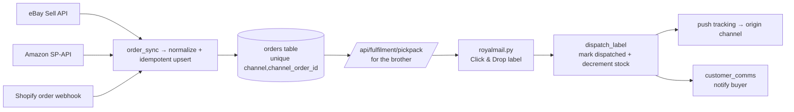

# Claude Code Handoff

The build manual: how to start a fresh repo from this vault, in dependency order, with the exact conventions, integrations, env-var names, and a paste-ready first-session prompt.

> [!info]
> A NEW repo (`fastener-ops`) reusing the proven L&D stack (FastAPI + httpx/PostgREST Supabase + APScheduler + `safety.py`) builds the order → pick/pack → label → notify engine. This note is the contract for Claude Code: repo layout, dependency-ordered tasks each with an acceptance test, day-1 conventions (one schema file, pytest + CI, auth + safe errors, clean secrets), the integrations + env-var names, how to drive the existing tooling (Shopify MCP, Higgsfield MCP, `~/.codex` Shopify skills), and the first prompt. Scope = the handoff only — architecture lives in [[01-system-architecture]], the build sequence in [[08-seven-week-timeline]], the per-domain detail in [[02-shopify-store]], [[03-order-fulfilment-automation-n8n]], [[04-ops-dashboard]], [[05-content-and-ads-engine]], [[06-agents]].

> [!warning] Net-new build, real money
> Everything here is greenfield — zero code/credentials exist for the screw business. This handles real orders and real cash from week 1, so the conventions below (canonical schema, tests + CI, auth, safe errors) are non-negotiable, not nice-to-haves. Reuse the L&D **patterns**, never the L&D **business logic** (no leads/outreach/preview code).

---

## 1. The new repo: `fastener-ops`

One repo, two deployables (backend → Railway, dashboard → Vercel), a separate Supabase project, and a fresh n8n Cloud workspace. Do **not** fork or branch L&D — copy the patterns into a clean tree so none of the L&D leads/outreach/preview logic comes along. Full data flow is in [[01-system-architecture]]; the loop in one picture:



```
fastener-ops/
├── README.md                     # what it is, dev commands, deploy targets
├── CLAUDE.md                     # fresh + accurate (see §3); supersedes any old auto-loading one
├── .github/
│   └── workflows/
│       └── ci.yml                # ruff + pytest on every push/PR (day 1)
├── docs/                         # this Obsidian vault, committed for reference
├── backend/
│   ├── main.py                   # FastAPI app + lifespan-started APScheduler + global exc handler (L&D main.py pattern)
│   ├── config.py                 # pydantic-settings Settings, loaded from .env (L&D config.py pattern)
│   ├── safety.py                 # spend cap + kill-switch + channel/volume caps (copy + retune for ops)
│   ├── auth.py                   # API-key dependency for every write/ops route (NEW — see §3)
│   ├── requirements.txt          # pin like L&D: fastapi, uvicorn[standard], httpx, pydantic[-settings], apscheduler, stripe, pytest, ruff
│   ├── runtime.txt               # python-3.11.9 (match L&D pin exactly)
│   ├── Procfile                  # web: uvicorn main:app --host 0.0.0.0 --port $PORT
│   ├── .env.example              # every var name from §4, no secrets
│   ├── db/
│   │   ├── client.py             # COPY VERBATIM from L&D — httpx PostgREST client (supports .upsert(on_conflict=...))
│   │   └── schema.sql            # THE single canonical schema (see §3) — run once in Supabase
│   ├── models/                   # pydantic request/response models per resource
│   │   ├── orders.py
│   │   ├── shipments.py
│   │   └── inventory.py
│   ├── api/                      # routers, each registered under /api (L&D include_router pattern)
│   │   ├── orders.py             # unified order queue: list/get/normalize
│   │   ├── fulfilment.py         # pick/pack lists, dispatch, Royal Mail labels + tracking
│   │   ├── inventory.py          # SKU + stock levels
│   │   ├── channels.py           # eBay / Amazon / Shopify connection status + manual sync trigger
│   │   ├── webhooks.py           # Shopify orders + Stripe webhooks (signature-verified)
│   │   ├── n8n.py                # action (POST) + read (GET) endpoints n8n calls (L&D n8n.py pattern)
│   │   ├── metrics.py            # revenue, margin, time-saved (feeds [[07-metrics-and-proof]])
│   │   ├── content.py            # Higgsfield content pipeline status (feeds [[05-content-and-ads-engine]])
│   │   └── health.py             # /api/health + CEO heartbeat
│   ├── integrations/             # one thin client per external API (NET-NEW, see §4)
│   │   ├── ebay.py               # Sell API + OAuth user-token refresh
│   │   ├── amazon.py             # SP-API (LWA + signed requests)
│   │   ├── royalmail.py          # Click & Drop API (+ CSV bulk-import fallback)
│   │   ├── shopify.py            # Admin API (orders read, fulfilment write)
│   │   └── stripe_client.py      # checkout + webhook verify (L&D payments.py pattern)
│   ├── agents/                   # APScheduler workers, each with a run() entrypoint (see [[06-agents]])
│   │   ├── order_sync.py         # pull eBay+Amazon+Shopify → normalized orders (idempotent)
│   │   ├── dispatch_label.py     # generate Royal Mail labels, mark dispatched, push tracking
│   │   ├── customer_comms.py     # dispatch/tracking notifications
│   │   ├── listing_content.py    # Higgsfield asset jobs for listings/ads
│   │   ├── analytics.py          # daily revenue/margin/time-saved rollup
│   │   └── health_ceo.py         # hourly heartbeat + self-heal + founder alert
│   ├── tasks/
│   │   └── scheduler.py          # APScheduler wiring; guarded jobs via @safety.guarded (L&D pattern)
│   ├── utils/
│   │   └── money.py              # pure margin/profit/time-saved maths (unit-tested)
│   └── tests/
│       ├── __init__.py
│       ├── test_smoke.py         # pure-logic, no DB (L&D test_smoke.py pattern; sys.path shim to import backend)
│       ├── test_money.py         # margin/profit/25%-of-net maths
│       ├── test_order_normalize.py  # channel payload → normalized order, dedupe key
│       └── test_auth.py          # protected routes 401 without key, 200 with
└── frontend/                     # React 18 + Vite 5 SPA, axios client (COPY L&D shell)
    ├── package.json
    ├── vite.config.js            # proxy /api → localhost:8000 in dev (L&D pattern)
    ├── vercel.json
    ├── tailwind.config.js
    └── src/
        ├── main.jsx
        ├── App.jsx
        ├── api/client.js         # axios wrapper, VITE_API_URL → backend, falls back to /api (COPY from L&D)
        ├── components/           # Sidebar, StatCard (reuse L&D shells, restyle)
        └── pages/
            ├── Orders.jsx        # unified queue
            ├── PickPack.jsx      # the brother's pick/pack view
            ├── Dispatch.jsx      # labels + mark dispatched
            ├── Inventory.jsx
            ├── Metrics.jsx       # revenue/margin/time-saved
            ├── Content.jsx       # content pipeline
            └── Health.jsx
```

> [!tip] Copy these L&D files almost verbatim
> `backend/db/client.py` (the httpx PostgREST client — do **not** swap for `supabase-py`; it already supports `.upsert(data, on_conflict="...")`), `backend/safety.py` (retune caps for ops; keep `record_spend()`, `can_send()`, `guarded()`), the `config.py` `Settings` shape, the `main.py` lifespan + `include_router(prefix="/api")` wiring, the `api/n8n.py` action+read split, the `Procfile`/`runtime.txt`/`.mise.toml` triplet, and the whole `frontend/` shell incl. `src/api/client.js`. Everything in `integrations/` and `agents/` is written fresh.

---

## 2. Build order (dependency-ordered — do top to bottom)

Each task has an acceptance test you can actually run. Full weekly milestones and the critical path are in [[08-seven-week-timeline]]; this is the strict technical dependency chain. Treat each checkbox as one PR with its acceptance test green in CI.

**Phase A — skeleton you can deploy**
- [ ] **A1. Scaffold repo + CI.** Create the tree in §1; add `ci.yml` (ruff then pytest), `requirements.txt`, `runtime.txt` (`python-3.11.9`), `Procfile`, `.env.example`. *Accept:* `ruff check` clean and `pytest -q` passes (even with 1 trivial test); CI goes green on the first push.
- [ ] **A2. Config + secrets.** `config.py` `Settings` loads from `.env`; app refuses to boot if a required var is missing. *Accept:* `python -c "from config import settings"` succeeds with a filled `.env` and raises a clear error with a deliberately blank `SUPABASE_URL`.
- [ ] **A3. DB client + canonical schema.** Copy `db/client.py` verbatim; author `db/schema.sql` (ALL tables — §3); run it once in Supabase. *Accept:* `get_db().table("orders").select("id").limit(1).execute()` returns without error against the live project, and the same `schema.sql` re-run is a no-op (`create table if not exists`).
- [ ] **A4. App boots + health + auth dependency.** `main.py` registers routers under `/api`, lifespan starts the (empty) scheduler, and installs the global exception handler; `api/health.py` exposes `GET /api/health`; `auth.py` provides the API-key dependency. *Accept:* `uvicorn main:app` serves `200 {"ok":true}` on `/api/health`, `/docs` renders, and a protected probe route returns `401` without the key, `200` with it (`test_auth.py`).

**Phase B — data backbone**
- [ ] **B1. Order model + normalizer.** `models/orders.py` + a pure `normalize(channel, payload) -> NormalizedOrder` with a dedupe key `(channel, channel_order_id)`. *Accept:* `test_order_normalize.py` turns a saved eBay, Amazon, and Shopify sample payload into the same normalized shape and produces a stable dedupe key — **no DB or network** in the test.
- [ ] **B2. Idempotent order upsert.** `api/orders.py` writes via `client.upsert(rows, on_conflict="channel,channel_order_id")`; `GET /api/orders` lists the unified queue with a status filter. *Accept:* posting the same sample order twice yields exactly one DB row; `GET /api/orders?status=new` returns it once.
- [ ] **B3. Inventory + SKU.** `api/inventory.py` + `models/inventory.py`: list SKUs, adjust stock, decrement on dispatch. *Accept:* dispatching an order for SKU X reduces X's quantity by the ordered amount; quantity never goes below 0 (guarded).

**Phase C — ingest from the channels (NET-NEW integrations)**
- [ ] **C1. Shopify orders in.** `integrations/shopify.py` + `api/webhooks.py` Shopify order webhook (HMAC-verified with `SHOPIFY_WEBHOOK_SECRET`) → normalize → upsert. *Accept:* a real test order placed in the existing Shopify store appears in `GET /api/orders` within seconds; an unsigned/forged webhook is rejected `401`.
- [ ] **C2. eBay orders in.** `integrations/ebay.py` (OAuth user-token refresh + Sell `getOrders`); `order_sync` pulls + normalizes. *Accept:* `order_sync.run()` ingests a sandbox eBay order; re-running ingests **zero** duplicates.
- [ ] **C3. Amazon orders in.** `integrations/amazon.py` (SP-API: LWA token + `getOrders`/`getOrderItems`); `order_sync` pulls + normalizes. *Accept:* `order_sync.run()` ingests a sandbox Amazon order with line items into the same unified queue.
- [ ] **C4. Order-Sync agent + schedule.** Wire `agents/order_sync.py` into `scheduler.py` (e.g. every 10 min) under `@safety.guarded("order_sync")`. *Accept:* the job writes a `run_logs` row each cycle and is a no-op (no new rows, no errors) when there are no new orders.

**Phase D — the 10x fulfilment loop (the heart of the pitch — see [[03-order-fulfilment-automation-n8n]])**
- [ ] **D1. Pick/pack list.** `api/fulfilment.py` `GET /api/fulfilment/pickpack` groups un-dispatched orders into a printable pick list for the brother (SKU, qty, per-order grouping). *Accept:* given 3 orders across 2 SKUs, the response aggregates totals **and** itemises per order; renders cleanly in `PickPack.jsx`.
- [ ] **D2. Royal Mail labels.** `integrations/royalmail.py` Click & Drop API: create a shipment + buy a label, store tracking. **Fallback:** a Click & Drop **CSV bulk-export** endpoint for week-1 manual import. *Accept:* `POST /api/fulfilment/{order_id}/label` returns a label URL + tracking number for a test order; the CSV export imports cleanly into Click & Drop.
- [ ] **D3. Dispatch + tracking push-back.** `agents/dispatch_label.py`: mark order dispatched, push tracking to the origin channel (Shopify fulfilment / eBay / Amazon), decrement stock. *Accept:* labelling a Shopify test order flips it to *Fulfilled* with the tracking number visible in Shopify admin; the order's status in our queue becomes `dispatched`.
- [ ] **D4. Customer comms.** `agents/customer_comms.py` sends a dispatch/tracking notification, gated by `safety.can_send(...)`. *Accept:* a dispatched test order triggers exactly one notification; a second dispatch attempt sends nothing (idempotent).

**Phase E — orchestration, control panel, money, content**
- [ ] **E1. n8n endpoints + workflows.** `api/n8n.py` action (POST) + read (GET) endpoints mirroring L&D's split; build the order→pack→label→notify workflow in fresh n8n Cloud calling these. *Accept:* triggering the n8n workflow runs the full loop end-to-end on a test order and writes a `run_logs` row; a read endpoint returns that run's status. Node graph: [[03-order-fulfilment-automation-n8n]].
- [ ] **E2. Stripe checkout (Shopify-owned channel).** `integrations/stripe_client.py` + `api/webhooks.py` Stripe webhook (signature-verified with `STRIPE_WEBHOOK_SECRET`) for the demo product. *Accept:* a Stripe **test** payment fires the webhook, creates an order in the unified queue, and never crashes on a replayed/invalid signature. (Detail in [[02-shopify-store]].)
- [ ] **E3. Ops dashboard.** Build the pages in §1 against the live API: Orders, PickPack, Dispatch, Inventory, Metrics, Health — behind auth. *Accept:* from a browser you can see a real order, generate a pick list, buy a label, and watch it flip to dispatched. (Detail in [[04-ops-dashboard]].)
- [ ] **E4. Metrics + time-saved.** `api/metrics.py` + `utils/money.py`: revenue, margin (buy ~£20 / sell ~£40–45 per bundle), 25%-of-**net**, and the nightly **time-saved** metric vs the manual loop. *Accept:* `test_money.py` covers margin + 25%-of-net (pure, no DB); `Metrics.jsx` shows orders, margin, and minutes saved for a day. (Feeds [[07-metrics-and-proof]] and [[09-the-pitch-pack]].)
- [ ] **E5. Content/ads pipeline.** `agents/listing_content.py` + `api/content.py` drive Higgsfield (via MCP) for hero images / hooks / ad variants; UTM-tag back to Shopify. *Accept:* one credit-lean Higgsfield job produces a usable hero asset attached to a listing; the UTM link resolves to the product. (Detail in [[05-content-and-ads-engine]].)
- [ ] **E6. Health/CEO heartbeat.** `agents/health_ceo.py` hourly: checks the loop ran, self-heals where safe, alerts the founder otherwise. *Accept:* with order-sync deliberately failing, the health check reports it and emits one founder alert (not a flood).

### Acceptance criteria (whole build)
- [ ] A real order from **each** channel (Shopify + eBay + Amazon) lands in **one** unified queue with no duplicates (enforced by `unique (channel, channel_order_id)`).
- [ ] One click produces a Royal Mail label, marks the order dispatched, pushes tracking back to its channel, decrements stock, and notifies the buyer.
- [ ] The dashboard shows the order queue, pick/pack view, dispatch, inventory, and the time-saved metric, all behind auth.
- [ ] `ruff` + `pytest` are green in CI on every PR; no route leaks a raw exception; every write/ops route requires the API key; webhooks verify the provider signature.
- [ ] All secrets are env vars (none committed); `db/schema.sql` builds a fresh Supabase project in one top-to-bottom run.

---

## 3. Conventions to enforce (day 1, non-negotiable)

> [!warning] These exist because the old L&D platform got them wrong — do not inherit the bugs
> Split schema (a fresh DB build errored on missing tables), a stale misleading `CLAUDE.md`, raw exceptions in 500s, and inconsistent auth on ops endpoints. Fix all four here from the first commit.

- [ ] **ONE canonical schema file.** `backend/db/schema.sql` holds **every** table — `orders`, `order_items`, `skus`, `inventory`, `shipments`, `channel_connections`, `spend_log`, `run_logs`, `notifications`, `metrics_daily`. No second migrations file, no tables defined inline in Python. A fresh Supabase project must build by running this one file top-to-bottom. Use `create table if not exists`, explicit PKs, and a `unique (channel, channel_order_id)` constraint on `orders` for idempotent dedupe.
- [ ] **pytest + CI from day 1.** `ci.yml` runs `ruff check` then `pytest -q` on every push and PR. Pure-logic tests (normalizer, money maths, auth) need no DB or network — keep them that way (mirror L&D `tests/test_smoke.py`, including the `sys.path.insert(0, <backend>)` shim so tests import the package). Real money + real orders means no merge without green tests.
- [ ] **Proper auth on every write/ops route.** `auth.py` exposes a FastAPI dependency that checks an `X-API-Key` header (or `Authorization: Bearer`) against `OPS_API_KEY`; webhooks authenticate by **provider signature** instead (Shopify HMAC, Stripe signature). Reads that expose customer/order data are also protected. No endpoint that mutates data or returns PII is public.

  ```python
  # backend/auth.py
  from fastapi import Header, HTTPException, status
  from config import settings

  async def require_key(x_api_key: str = Header(None)):
      if not settings.OPS_API_KEY or x_api_key != settings.OPS_API_KEY:
          raise HTTPException(status.HTTP_401_UNAUTHORIZED, "invalid or missing API key")
  ```
  ```python
  # usage on a router
  from fastapi import APIRouter, Depends
  from auth import require_key
  router = APIRouter(prefix="/orders", tags=["orders"], dependencies=[Depends(require_key)])
  ```
- [ ] **Safe error handling — never leak raw exceptions.** Register a global exception handler that logs the stack server-side and returns a generic JSON body to the client. No internal detail in HTTP responses.

  ```python
  # backend/main.py
  import logging
  from fastapi import Request
  from fastapi.responses import JSONResponse
  logger = logging.getLogger(__name__)

  @app.exception_handler(Exception)
  async def unhandled(request: Request, exc: Exception):
      logger.exception("Unhandled error on %s", request.url.path)
      return JSONResponse(status_code=500, content={"error": "internal_error"})
  ```
- [ ] **Clean env / secrets management.** All config via `config.py` `Settings` from `.env` (pydantic-settings). `.env` is git-ignored; commit only `.env.example` with the §4 names and no values. Production secrets live in Railway (backend) and Vercel (frontend) project settings, never in code or the repo. Use **sandbox/test** credentials and **Stripe test mode** until the pitch is real.
- [ ] **Money + idempotency discipline.** All margin/profit/25%-of-net maths live in `utils/money.py` and are unit-tested. Every external write that can be retried (order upsert, label purchase, channel fulfilment, customer comms) is idempotent or guarded so a re-run cannot double-charge, double-ship, or double-notify.
- [ ] **Fresh, accurate `CLAUDE.md`.** Write a new `fastener-ops/CLAUDE.md` describing *this* repo only (the L&D two-agent-system confusion and L&D-specific rules do not apply). Point future sessions at `docs/` (this vault) as the source of truth.

### Acceptance criteria (conventions)
- [ ] Deleting and re-running `db/schema.sql` rebuilds the DB with zero errors; no table is defined anywhere but that file.
- [ ] Every router that mutates data or returns PII carries `Depends(require_key)`; `test_auth.py` proves `401`/`200`.
- [ ] A forced exception on any route returns `{"error":"internal_error"}` with the stack only in server logs.
- [ ] `git grep` finds no secret values; only `.env.example` ships names.

---

## 4. Integrations to obtain + env-var NAMES

All NET-NEW (the screw business has zero credentials). Get sandbox/test keys first; promote to production only for the real pitch. Put every name in `.env.example` (no values); set real values in Railway. Cross-ref the full data-flow in [[01-system-architecture]].

> [!warning] Lead times — start the slow approvals in week 1
> **Amazon SP-API** (developer registration + app authorisation) and **eBay** production keyset can take days to approve. Begin both immediately; build against sandbox while you wait. The Royal Mail **Click & Drop API** key is requested from inside the Click & Drop account settings.

| Integration | What to get | Env var names |
|---|---|---|
| **Supabase** | New project → Settings → API | `SUPABASE_URL`, `SUPABASE_ANON_KEY`, `SUPABASE_SERVICE_KEY` |
| **eBay (Sell API)** | Developer account → app keyset (App ID/Client ID, Cert ID/Client Secret, Dev ID) + OAuth **user** token (refresh-token flow, Sell scopes) | `EBAY_CLIENT_ID`, `EBAY_CLIENT_SECRET`, `EBAY_DEV_ID`, `EBAY_REFRESH_TOKEN`, `EBAY_REDIRECT_URI`, `EBAY_ENV` (`sandbox`/`production`) |
| **Amazon SP-API** | Register as a developer; create an SP-API app; LWA client + seller refresh token; seller/marketplace ids | `AMAZON_LWA_CLIENT_ID`, `AMAZON_LWA_CLIENT_SECRET`, `AMAZON_SP_REFRESH_TOKEN`, `AMAZON_SELLER_ID`, `AMAZON_MARKETPLACE_ID` (UK = `A1F83G8C2ARO7P`), `AMAZON_SP_REGION` (`eu`) |
| **Royal Mail Click & Drop** | Click & Drop account → Settings → integrations → generate API key | `ROYALMAIL_CLICKDROP_API_KEY`, `ROYALMAIL_CLICKDROP_BASE_URL` |
| **Shopify Admin API** | Existing "My Store" → custom app → Admin API access token (read/write orders, fulfilments, products) + webhook signing secret | `SHOPIFY_STORE_DOMAIN` (`my-store.myshopify.com`), `SHOPIFY_ADMIN_TOKEN`, `SHOPIFY_API_VERSION`, `SHOPIFY_WEBHOOK_SECRET` |
| **Stripe** | Dashboard (test mode first) → API keys + webhook signing secret | `STRIPE_SECRET_KEY`, `STRIPE_WEBHOOK_SECRET`, `STRIPE_SUCCESS_URL`, `STRIPE_CANCEL_URL` |
| **n8n (Cloud)** | New n8n Cloud workspace → an API key (and inbound webhook URLs per workflow) | `N8N_API_KEY`, `N8N_BASE_URL`, `N8N_WEBHOOK_BASE_URL` |
| **App / ops auth** | Generate: `python -c "import secrets; print(secrets.token_hex(32))"` | `OPS_API_KEY`, `APP_ENV` (`development`/`production`), `BACKEND_BASE_URL`, `FRONTEND_BASE_URL` |
| **Higgsfield** | Used via MCP (no code keys needed for the build); if a server token is ever required, name it | `HIGGSFIELD_API_KEY` *(only if MCP later needs a server-side key)* |

> [!tip] Webhooks authenticate by signature, not by `OPS_API_KEY`
> Shopify order webhooks → verify the HMAC with `SHOPIFY_WEBHOOK_SECRET`. Stripe webhooks → verify with `STRIPE_WEBHOOK_SECRET`. Never gate these with the API key — the provider can't send it.

---

## 5. Use the existing tooling (don't rebuild what you already have)

- [ ] **Shopify MCP** — drive the existing Basic store directly from the session: `get-shop-info`, `list-orders` / `get-order`, `create-product` / `update-product`, `get-inventory-levels` / `set-inventory`, `create-discount`, and `graphql_query` / `graphql_mutation` for anything without a dedicated tool (metafields, fulfilments, webhooks). Use `search_docs_chunks` + `validate_graphql_codeblocks` to get the Admin GraphQL right **before** writing `integrations/shopify.py`. The store already exists ("My Store", GBP, UK) — configure it, don't recreate it. (Storefront/CRO detail: [[02-shopify-store]].)
- [ ] **`~/.codex` Shopify dev skill set** — the deeper Shopify development skills. Use them when standing up the storefront, product page, SKUs, and the custom app / Admin token in [[02-shopify-store]]. Pair with the Shopify MCP: skills for *how*, MCP for *doing it live*.
- [ ] **Higgsfield MCP** — content/ads generation: `generate_image` (hero/product/ad stills), `generate_video` (lo-fi demo b-roll / Reels), `generate_audio`, plus `virality_predictor` to screen hooks. Call `models_explore(action:'recommend')` when unsure which model fits, and check `balance` / `show_plans_and_credits` first — credit-lean, start with **one** preview. Wire outputs through `agents/listing_content.py`. (Formula + tracking: [[05-content-and-ads-engine]].)
- [ ] **L&D code patterns to copy** (lift the pattern, not the L&D logic):
  - `db/client.py` → copy **verbatim** (custom httpx PostgREST client; never `supabase-py`; already supports `.upsert(data, on_conflict=...)`).
  - `safety.py` → copy and retune: keep `record_spend(agent, model, tokens_in, tokens_out)` + `guarded("<job>")` for LLM/Higgsfield spend; repurpose channel caps to ops volumes (e.g. max labels/comms per run) via `can_send(channel, n)`; kill-switch can watch order flow.
  - `config.py` → same `Settings`/pydantic-settings shape, populated with §4 vars.
  - `main.py` → lifespan-started scheduler + `app.include_router(<r>.router, prefix="/api")` for every router + the global exception handler from §3.
  - `api/n8n.py` → the **action (POST) + read (GET)** split is the template for `fastener-ops` `api/n8n.py`.
  - `tasks/scheduler.py` → APScheduler wiring; wrap spending/sending jobs in `@safety.guarded("<job>")`.
  - `api/payments.py` (L&D) → the Stripe checkout-session + signature-verified-webhook shape for `integrations/stripe_client.py`.
  - `tests/test_smoke.py` → the pure-logic, no-DB test style (with the `sys.path` shim) for `test_money.py` / `test_order_normalize.py`.
  - `frontend/` (incl. `src/api/client.js`) → copy the React/Vite/axios shell (`VITE_API_URL` → backend, fallback `/api`); restyle for ops. (Dashboard spec: [[04-ops-dashboard]].)

> [!warning] Do NOT plan around OpenClaw / Baz
> That stack is removed. No `~/.openclaw`, no 9-agent roster, no WhatsApp-agent relay. The agent roster for this build is the small APScheduler set in [[06-agents]].

---

## 6. First-session prompt for Claude Code (ready to paste)

> [!tip] Run this from an empty `fastener-ops/` directory, with this vault present in `docs/`
> It bootstraps Phase A only. Build the rest by walking §2 task-by-task, one PR per checkbox, each with its acceptance test green in CI.

```text
You are building `fastener-ops`: a NEW e-commerce ops platform that unifies orders from
eBay + Amazon + Shopify into one queue and automates Royal Mail dispatch. Read the vault
in ./docs first — start with docs/10-claude-code-handoff.md (this build manual),
docs/01-system-architecture.md, and docs/08-seven-week-timeline.md. Treat the the system inventory
there as authoritative.

Stack (reuse the proven L&D patterns, NOT its business logic):
FastAPI (Python 3.11) + a hand-rolled httpx PostgREST client over Supabase + APScheduler +
a safety.py spend-cap/kill-switch layer; React 18 + Vite 5 SPA with a shared axios client.
Backend → Railway, frontend → Vercel, DB → a new Supabase project, orchestration → fresh
n8n Cloud. This handles REAL orders and money.

Hard rules (from §3 of the handoff):
- ONE canonical schema file: backend/db/schema.sql (every table; fresh Supabase builds in one run).
- ruff + pytest in .github/workflows/ci.yml from day 1; pure-logic tests need no DB/network.
- Auth on every write/ops route (X-API-Key vs OPS_API_KEY); webhooks verify provider signatures.
- A global exception handler that logs server-side and returns generic JSON — never leak raw errors.
- All secrets via config.py Settings from .env; commit only .env.example (names, no values).
- Copy backend/db/client.py verbatim from the L&D pattern — never use supabase-py.

Do ONLY Phase A of the build order now (handoff §2), each as its own commit with its
acceptance test:
A1 Scaffold the repo tree (handoff §1) + ci.yml (ruff then pytest) + requirements.txt
   + runtime.txt (python-3.11.9) + Procfile + .env.example with every env var name from handoff §4.
A2 config.py Settings loading from .env; app refuses to boot if a required var is missing.
A3 Copy backend/db/client.py from the L&D pattern; author backend/db/schema.sql with the full
   canonical schema (orders, order_items, skus, inventory, shipments, channel_connections,
   spend_log, run_logs, notifications, metrics_daily) — orders has unique (channel, channel_order_id);
   all tables use create table if not exists.
A4 main.py registers routers under /api with a lifespan-started (empty) APScheduler and the global
   exception handler; add api/health.py (GET /api/health) and auth.py (the API-key dependency) with
   test_auth.py proving 401 without the key and 200 with it.

After each task: run `ruff check` and `pytest -q`, show me the diff, and stop for review before
the next. Write a fresh, accurate fastener-ops/CLAUDE.md describing THIS repo only. Do not bring
across any L&D leads/outreach/preview code, and do not plan around OpenClaw/Baz (removed).
```

### Acceptance criteria (handoff is "done")
- [ ] A new engineer (or Claude session) can create `fastener-ops` from §1, run the §6 prompt, and reach a deployable Phase-A skeleton with green CI.
- [ ] Every integration in §4 has a clear "what to get" and exact env-var names, with the slow approvals (Amazon, eBay) flagged to start in week 1.
- [ ] The conventions in §3 are unambiguous and each maps to a specific old-bug it prevents.
- [ ] Every sibling concern is **linked** ([[01-system-architecture]], [[02-shopify-store]], [[03-order-fulfilment-automation-n8n]], [[04-ops-dashboard]], [[05-content-and-ads-engine]], [[06-agents]], [[07-metrics-and-proof]], [[08-seven-week-timeline]], [[09-the-pitch-pack]]), not duplicated here.
